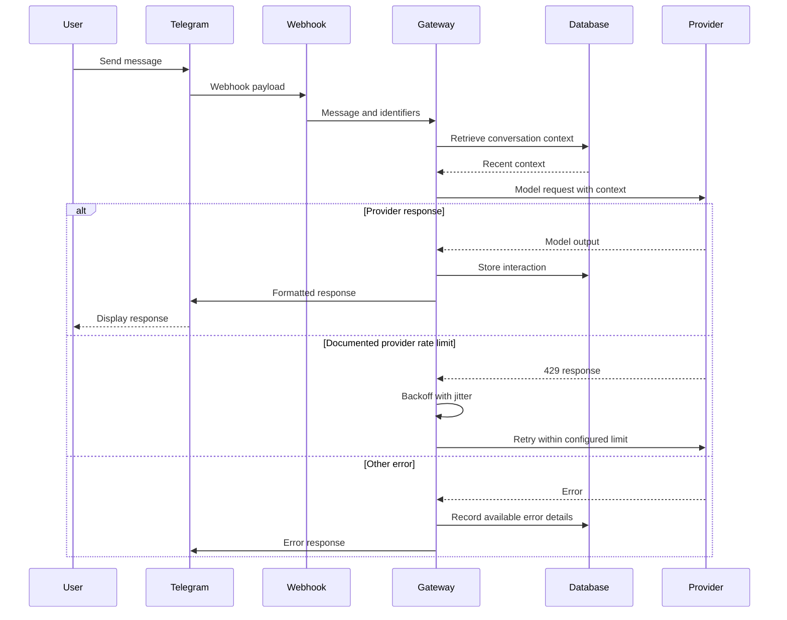

# AI Assistant Data Flow

## Request Flow



## Data at Each Stage

### Webhook Input

The Telegram payload supplies message text, chat identifiers, and user identifiers used by the application. Origin validation is a recommended control; its implementation is not established by this documentation.

### Context Assembly

The gateway retrieves recent messages associated with the conversation and truncates older context to fit the selected model's input limit.

### Provider Selection

Routing chooses from configured providers and models based on application rules. The documentation does not establish an optimal selection algorithm, cost optimization, or automatic cross-provider fallback.

### Provider Call

The gateway formats the request for the selected provider and uses provider credentials from environment configuration. For the documented OpenAI `429` case, it applies bounded exponential backoff with jitter. This is provider-error handling, not application-level request throttling.

### Persistence

The interaction model includes user input, AI output, model identifier, timestamps, lengths, and conversation identifiers. Some provider metrics are optional or inconsistently populated.

```typescript
interface Interaction {
  id: number;
  userIdentifier: number;
  conversationContext: number;
  userInput: string;
  aiOutput: string | null;
  modelUsed: string;
  timestamp: Date;
  responseLength: number | null;
  inputLength: number | null;
}
```

## Documented Error Behavior

- Provider `429` responses can trigger up to three retries with exponential backoff and jitter.
- Other provider failures return an application error path.
- API and Telegram update calls use configured timeouts.
- Available interaction and error details are recorded where the request reaches persistence.

The documentation does not establish that every request, retry, error, delivery confirmation, token count, or response-time metric is recorded.

## Recommended Controls

- Validate webhook origin and payload shape.
- Define log fields and retention before recording user content.
- Add explicit application-level usage controls if needed.
- Verify transport protection and storage protection for each external service.
- Test provider failure and fallback paths.
- Measure timeout and retry behavior under representative load.

[Back to project overview](../README.md)
