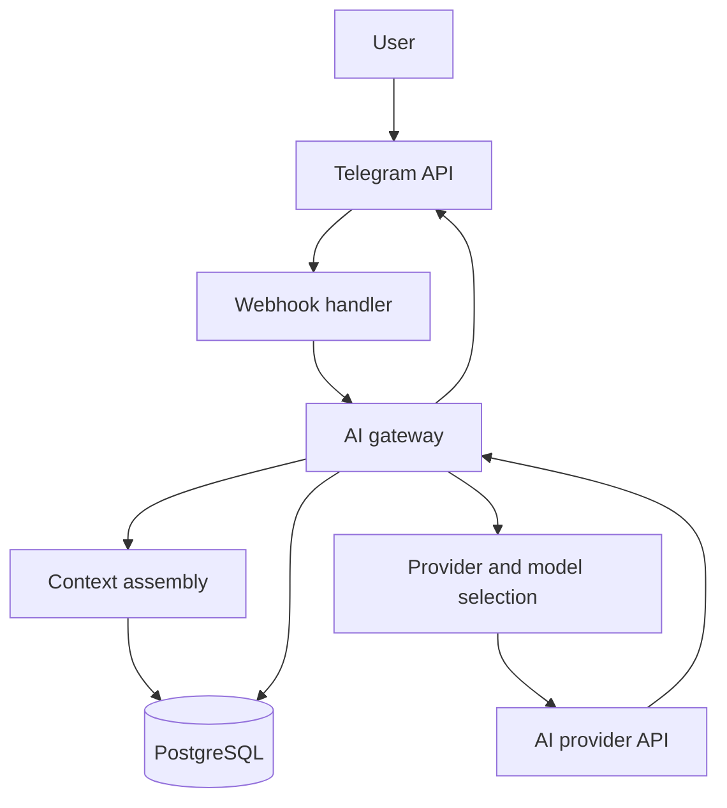

# AI Assistant System Architecture

## Overview

The deployed assistant received Telegram webhook messages, assembled conversation context, selected an AI provider and model, returned a formatted response, and stored interaction data in PostgreSQL.

## Documented Components

### Webhook Handler

- Parses Telegram webhook payloads.
- Extracts message and chat identifiers.
- Calls the AI gateway.
- Formats success or error responses for Telegram.
- Applies request and update timeouts.

The documentation does not establish webhook-origin validation or an application authentication layer.

### AI Gateway

- Selects among configured providers and models.
- Assembles recent conversation context.
- Calls provider APIs.
- Applies exponential backoff with jitter to documented provider rate-limit errors.
- Records interaction or error data used by the application.

Provider selection does not imply failure isolation: provider errors still require explicit fallback and error handling, and independent fallback behavior is not established here.

### Context Management

- Retrieves conversation history.
- Truncates older messages to fit model context limits.
- Preserves the recent context passed to the selected provider.

### Database

- Stores user input, model output, model identifiers, timestamps, and conversation identifiers.
- Supports the documented data-cleaning and indexing work.

The available schema does not establish complete token, latency, throughput, or cost telemetry.

## Observed Operational Work

- Exponential backoff was added after provider `429` responses.
- API and Telegram update timeouts were increased for a slow prompt path.
- Interaction records were searched and cleaned using partial pattern matching.
- Indexes were added for observed context, timestamp, and JSONB query paths.

## Recommended Controls

The following are production recommendations, not documented implementation:

- Validate webhook origin using Telegram's supported mechanism.
- Add user and administrative authorization where required.
- Define application-level abuse controls separately from provider rate limits.
- Validate structured inputs at trust boundaries.
- Document transport and storage protection provided by each service.
- Minimize sensitive logging and define retention and deletion behavior.
- Test provider fallback rather than assuming provider isolation.
- Define measurable logging and monitoring requirements.

## Scaling Boundaries

The modular structure separates webhook, gateway, context, provider, and database responsibilities. It does not by itself establish that components can deploy or scale independently; that depends on runtime topology, shared state, queueing, and load testing not documented here.

[Back to project overview](../README.md)
