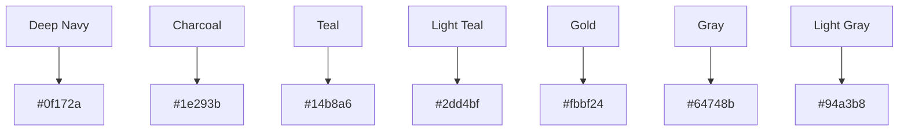
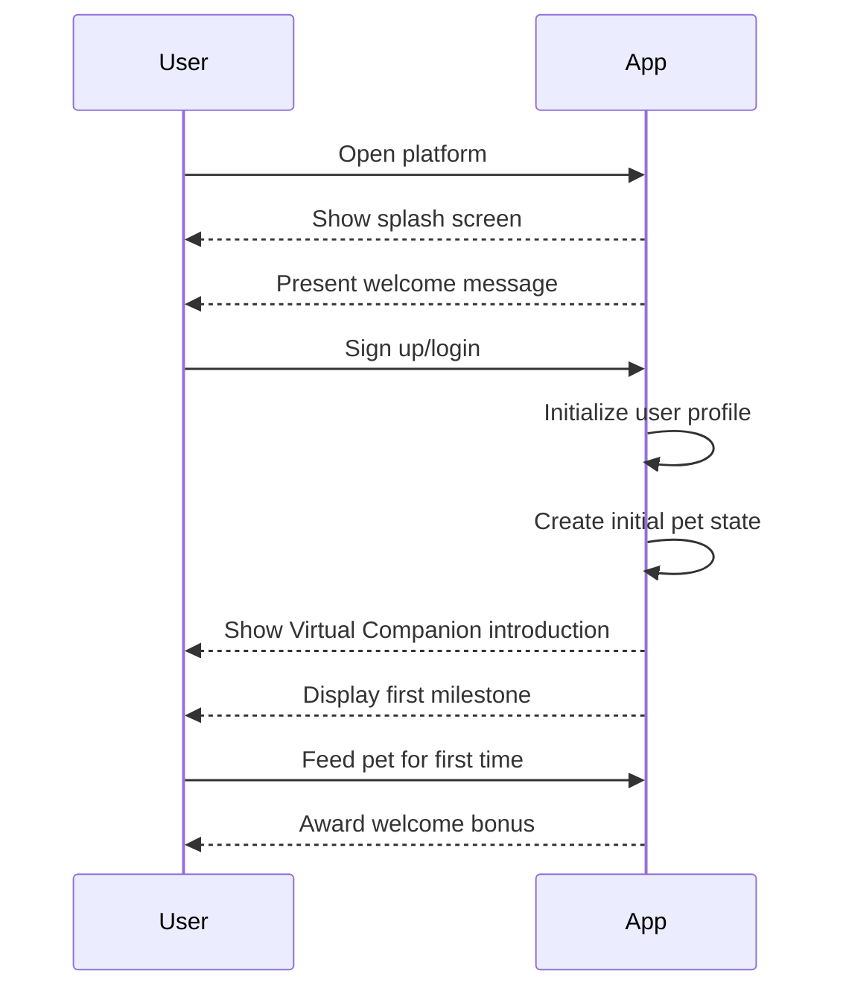
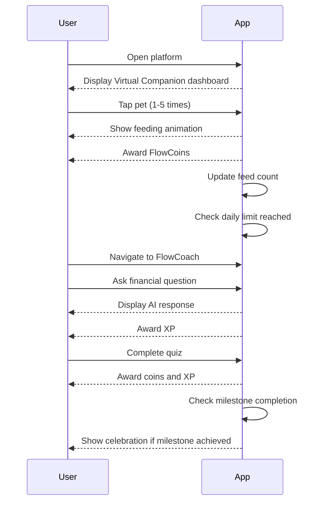

# Financial Wellness Platform - Design Documentation

An overview of the prototype's visual design, interaction principles, and proposed design system.

## Design Philosophy

### Core Principles
- **Calm First**: Create a serene environment for financial reflection
- **Accessibility**: Make financial wellness accessible to everyone
- **Engagement**: Use thoughtful design to encourage positive habits
- **Clarity**: Communicate complex financial concepts simply
- **Trust**: Build user confidence through transparent design

### "Headspace for Money" Concept
- **Analogous to Meditation Apps**: Provide a peaceful space for financial mindfulness
- **Reduced Anxiety**: Remove stress triggers from traditional financial apps
- **Positive Reinforcement**: Focus on progress rather than deficits
- **Mindful Engagement**: Promote healthy interaction patterns (5 taps/day limit)

## Visual Design System

### Color Palette

#### Dark Mode (Primary)

#### Color Usage
| Color | Usage | Purpose |
|-------|-------|---------|
| Deep Navy | Background | Base color for reduced eye strain |
| Charcoal | Cards/Containers | Surface elements with subtle contrast |
| Teal | Primary Accent | Interactive elements and key highlights |
| Light Teal | Secondary Accent | Hover states and active elements |
| Gold | Success/Rewards | Achievement indicators and celebration elements |
| Gray | Text | Secondary text and non-interactive elements |
| Light Gray | Hint Text | Placeholders and subtle indicators |

### Typography

#### Font Selection
- **Inter**: Primary sans-serif font for clarity and readability
- **System Font Fallbacks**: Ensure consistent experience across platforms

#### Font Scale
- **Headings**: Large, bold weights for section titles
- **Body Text**: Medium weight, optimized line height for reading
- **Captions**: Smaller text for supplementary information

#### Text Hierarchy
- h1: 2.5rem (40px) - Section titles
- h2: 2rem (32px) - Component headers
- h3: 1.5rem (24px) - Subheaders
- body: 1rem (16px) - Main content
- caption: 0.875rem (14px) - Supplementary text

### Glassmorphism Design

#### Core Elements
- **Frosted Glass Effect**: `backdrop-filter: blur(12px)` for container elements
- **Subtle Borders**: `border: 1px solid rgba(255, 255, 255, 0.1)` for depth
- **Transparency**: `background-color: rgba(15, 23, 42, 0.8)` for layered appearance

#### Usage Examples
- Card containers
- Navigation tabs
- Modal dialogs
- Floating action buttons

### Iconography

#### Design Style
- **Outline Icons**: Clean, minimal outline style with teal accents
- **Consistent Stroke Weight**: 2px stroke for uniform appearance
- **Rounded Corners**: Soft, rounded edges for approachable feel

#### Icon Categories
- **Navigation**: Tab icons and menu elements
- **Actions**: Buttons and interactive controls
- **Status**: Progress indicators and system states
- **Rewards**: Achievement and coin icons

## UX Principles

### Mobile-First Design

#### Core Strategies
- **Thumb Zone Optimization**: Place interactive elements within easy reach
- **Simplified Navigation**: Tab-based interface with 4 main sections
- **Touch Targets**: Minimum 44x44px for all interactive elements
- **Vertical Scrolling**: Single-column layout for natural mobile interaction

#### Responsive Breakpoints
- **Mobile**: < 640px (primary focus)
- **Tablet**: 640px - 1024px (responsive adaptation)
- **Desktop**: > 1024px (scaled layout with wider content)

### User Flows

#### Onboarding Flow

#### Daily Interaction Flow

### Engagement Design

#### Positive Reinforcement
- **Immediate Feedback**: Animations for every positive action
- **Celebration Effects**: Confetti and glow animations for achievements
- **Progress Indicators**: Clear visual feedback on growth and milestones
- **Reward System**: Coins and XP for all positive behaviors

#### Healthy Habit Formation
- **Daily Limits**: 5 taps/day to prevent overuse
- **Reminder System**: Gentle notifications for daily check-ins
- **Balanced Engagement**: Promote consistency over intensity
- **Mindful Design**: Encourage reflection rather than mindless scrolling

## Animation System

### Core Animation Principles
- **Purposeful**: Every animation serves a clear UX goal
- **Subtle**: Avoid distracting or overwhelming effects
- **Smooth**: Use easing and measure animation performance on target devices
- **Consistent**: Uniform timing and style across the app

### Animation Types

#### Micro-Interactions
- **Button Hover**: Subtle scale and color change
- **Input Focus**: Smooth border and shadow transition
- **Loading States**: Animated spinners and progress indicators

#### Transition Animations
- **Screen Transitions**: Slide and fade effects between tabs
- **Modal Animations**: Scale and fade for dialogs
- **Element Appearances**: Staggered animations for content lists

#### Celebration Animations
- **Confetti Effects**: Particle animations for achievements
- **Glow Pulses**: Radiating light effects around completed elements
- **Virtual Companion Reactions**: Excited animations from Virtual Companion
- **Milestone Celebrations**: Full-screen animations for major achievements

### Technical Implementation
- **Framer Motion**: Primary animation library
- **CSS Transitions**: Simple state changes
- **WebGL**: Complex 3D animations
- **RequestAnimationFrame**: Performance-optimized animations

## Component Library

### Core Components

#### Cards
- **Glass Card**: Glassmorphism design with blur effect
- **Content Card**: Information display with subtle shadows
- **Achievement Card**: Celebratory card with gold accents

#### Buttons
- **Primary Button**: Teal background with white text
- **Secondary Button**: Transparent with teal border
- **Floating Action Button**: Circular button with icon

#### Inputs
- **Text Input**: Glassmorphism design with teal focus
- **Select Input**: Custom dropdown with smooth animations
- **Slider**: Range selector with teal progress indicator

#### Navigation
- **Tab Bar**: Bottom navigation with active state indicators
- **Menu Button**: Hamburger menu for additional options
- **Back Button**: Arrow navigation for nested screens

#### Progress Indicators
- **Progress Bar**: Horizontal bar with teal fill
- **Circular Progress**: Ring indicator for percentage completion
- **Level Indicator**: Visual representation of pet level

## Accessibility Targets

### Core Accessibility Features
- **Color Contrast**: Measure against WCAG AA contrast criteria
- **Keyboard Navigation**: Provide and test keyboard access
- **Screen Reader Support**: Add semantic structure, labels, and roles
- **Touch Target Size**: Minimum 44x44px for interactive elements
- **Text Scaling**: Support for system text size adjustments

### Proposed Accessibility Testing
- **Automated Testing**: Regular runs of accessibility checkers
- **Manual Testing**: Human testing with screen readers
- **User Testing**: Feedback from users with disabilities

## Usability Testing

The following methods are proposed; this document does not establish that a user study was completed.

### Testing Methods
- **Remote Usability Testing**: Unmoderated testing with real users
- **In-Person Testing**: Observational testing sessions
- **A/B Testing**: Comparing different design approaches
- **Feedback Surveys**: Collecting user opinions and suggestions

### Evaluation Questions
- Can users complete the core flow on a phone?
- Does the visual treatment reduce distraction without obscuring information?
- Do rewards support learning without encouraging excessive engagement?
- Do users understand the limits of AI-generated financial education?

## Design Evolution

### Iteration Process
- **User Feedback**: Continuous collection and incorporation
- **A/B Testing**: Data-driven design decisions
- **Trend Analysis**: Balancing modern design with usability
- **Performance Optimization**: Ensuring smooth experience on all devices

### Future Directions
- **Enhanced Personalization**: More customizable themes
- **Expanded 3D Elements**: Additional interactive 3D components
- **Adaptive Design**: Interface that evolves with user progress
- **Social Features**: Design for meaningful social connections
