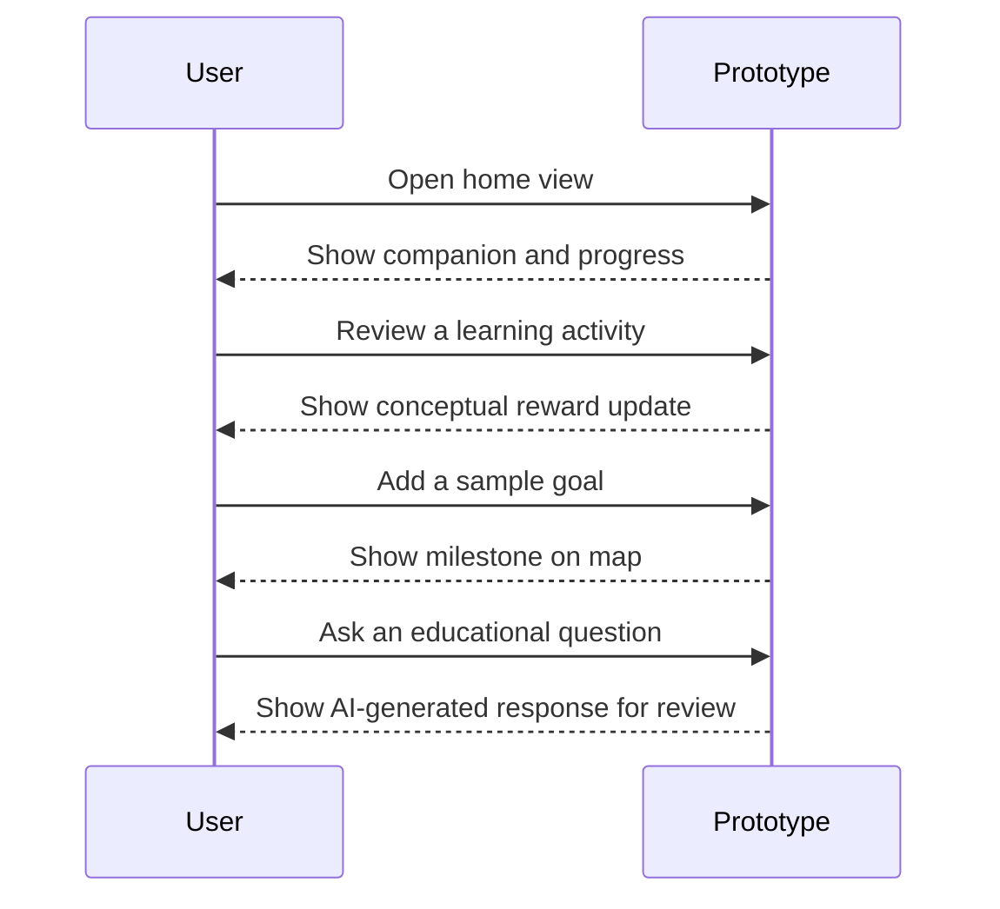

# Financial Wellness Prototype Walkthrough

This document describes the intended hackathon demonstration flow. It is not an installation or account-setup guide, and availability of a hosted build is not established here.

## Conceptual Flow

1. Open the prototype interface.
2. View the virtual companion and progress state.
3. Explore the financial-learning, goal, and coaching views.
4. Enter a sample financial goal.
5. Ask an educational question or review a quiz interaction.

## Prototype Views

### Flow

The home view presents the virtual companion, level, progress, and a limited daily interaction concept.

### FlowFeed

The feed concept presents financial education, prompts, and challenges.

### Map

The map concept represents goals and milestones as a visual journey.

### Gym

The coaching concept combines an AI chat, educational topics, and quizzes. AI output is an educational prompt, not individualized financial advice.

## Reward Model

FlowCoins, experience points, levels, and companion evolution are prototype mechanics intended to connect learning activity with visible progress. Numeric reward values and unlock thresholds are design parameters, not established product rules.

The proposed companion stages are Orb, Sprout, Fox, Dragon, and Guardian.

## Example Demonstration

## Not Established

- Public hosting or browser compatibility
- Account creation, email login, or social login
- Persistent user profiles or real financial-data storage
- Installable PWA behavior
- Service-worker caching, background synchronization, or push notifications
- Offline functionality
- Production support, privacy, or security controls

These capabilities require implementation and testing before they can be presented as available.

[Back to project overview](README.md)
