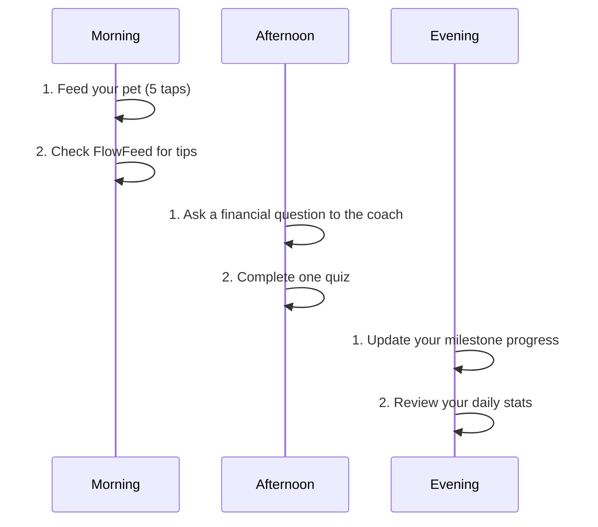

# Financial Wellness Platform - Quick Start Guide

A simple, step-by-step guide to getting started with the platform.

## Getting Started

### 1. Access the App

**Option 1: Web Browser**
- Visit the platform website in your mobile browser
- Recommended browsers: Chrome, Safari, Firefox

**Option 2: Install as PWA**
- Open platform in Chrome/Safari on your mobile device
- Look for the "Add to Home Screen" prompt
- Tap "Install" to add platform to your home screen
- Launch platform from your home screen like a native app

### 2. Create an Account

- **Sign Up**: Tap "Create Account"
- **Email/Password**: Enter your email and create a password
- **Social Login**: Optionally use social media accounts for faster signup
- **Complete Profile**: Fill in basic information (optional)

### 3. Meet Your Virtual Companion

- After signing up, you'll be introduced to your Virtual Companion
- Your pet starts as a small, glowing **Orb** (Level 1)
- Follow the on-screen instructions to begin interacting

## First Day Walkthrough

### 1. Feed Your Pet

- **Where**: Tap the 3D pet in the center of the screen
- **How Many Times**: You can tap up to 5 times per day
- **What Happens**: 
  - Your pet glows and animates
  - You earn **FlowCoins** and **XP**
  - Your pet's health and happiness improve

### 2. Explore the Tabs

#### Flow Tab (Home)
- Your main dashboard
- Interact with your Virtual Companion
- Track daily feeding count
- View current level and FlowCoins

#### FlowFeed Tab
- Financial tips and educational content
- Daily updates and challenges
- Stories from other users

#### Map Tab
- Visual journey of your financial goals
- Milestone markers
- Progress visualization
- Add new financial goals

#### Gym Tab
- AI financial coach chat
- Educational content
- Interactive quizzes
- Learning paths

### 3. Set Your First Milestone

- Navigate to the **Map** tab
- Tap "Add New Milestone"
- Choose a goal (e.g., "Build an Emergency Fund")
- Set a target amount
- Tap "Save Milestone"

### 4. Try the AI Coach

- Navigate to the **Gym** tab
- In the chat box, type a financial question (e.g., "How do I start saving?")
- Tap "Send"
- Receive personalized advice from the AI coach
- Try a quiz to earn additional rewards

## Core Mechanics

### FlowCoins

**How to Earn:**
- Feeding your pet (5-25 coins/day)
- Completing quizzes (10-50 coins/quiz)
- Achieving milestones (50-200 coins/milestone)

**How to Use:**
- Unlock new features and content
- Customize your pet's appearance
- Access premium coaching content

### XP and Levels

**How to Earn XP:**
- Every interaction with your pet (5-10 XP/tap)
- Coaching sessions (20-50 XP/session)
- Quiz completions (10-30 XP/quiz)
- Milestone achievements (50-200 XP/milestone)

**Level Benefits:**
- Unlock new pet forms at specific levels
- Access advanced features
- Higher daily coin limits at higher levels

### Pet Evolution

Your pet evolves through 5 stages as you progress:

1. **Orb** (Levels 1-5): The beginning of your journey
2. **Sprout** (Levels 6-15): Taking root in healthy habits
3. **Fox** (Levels 16-30): Growing financial wisdom
4. **Dragon** (Levels 31-50): Mastering financial strength
5. **Guardian** (Level 51+): Achieving financial freedom

## Tracking Progress

### Daily Stats
- **Feeds Used**: 0/5 (resets daily)
- **Current Level**: 1
- **FlowCoins**: 10
- **XP to Next Level**: 100/500

### Milestones
- View completed and upcoming milestones on the **Map** tab
- Celebrate achievements with animations and rewards
- Set new milestones to continue your journey

## Tips for Success

1. **Daily Consistency**: Check in every day for optimal progress
2. **Use the Coach**: Ask questions whenever you're unsure about finances
3. **Complete Quizzes**: They're a fun way to learn and earn rewards
4. **Set Realistic Goals**: Choose milestones that fit your financial situation
5. **Enjoy the Journey**: Focus on progress, not perfection

## Daily Routine Suggestion

## Getting Help

- **In-App Support**: Tap the menu button for help options
- **FAQ**: Common questions answered in the support section
- **Contact Us**: Reach out to the platform team for assistance

## Privacy and Security

- Your financial data is kept private and secure
- You control what information is shared
- All data is encrypted and protected

---

*"Your journey to financial wellness starts here. Enjoy the flow!"*