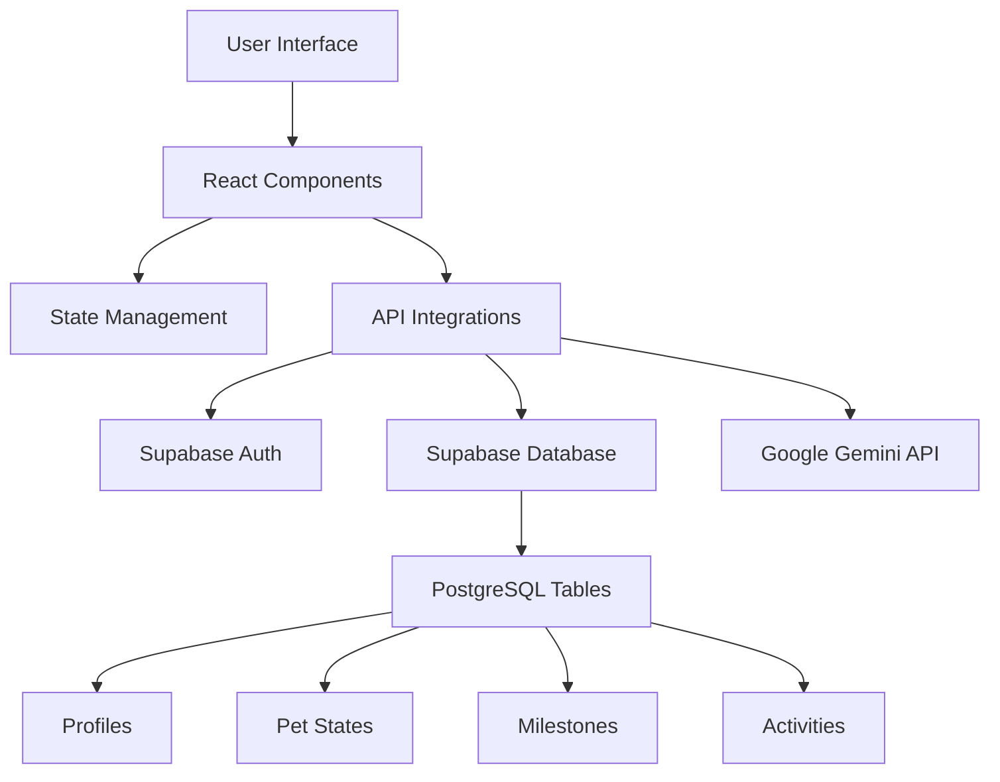
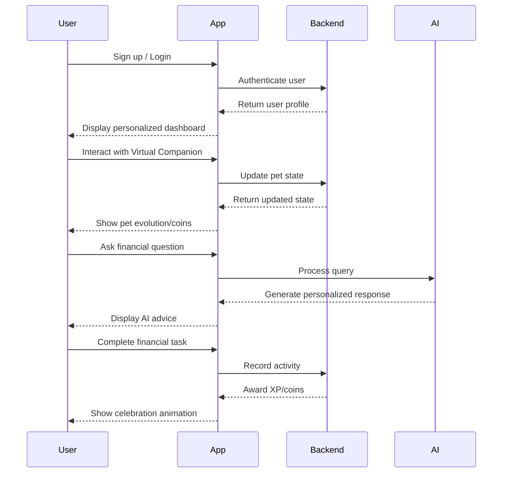

# Financial Wellness Platform - Headspace for Money

Transform your relationship with money through a calm, gamified journey that makes financial growth engaging and approachable.

## Overview

The Financial Wellness Platform is a mobile-first web application designed to help users build healthy financial habits through positive reinforcement, interactive experiences, and personalized guidance. The app combines elements of gamification, AI-powered coaching, and social features to create a "Headspace for money" experience that's both educational and enjoyable.

## Core Mission

To make financial wellness accessible to everyone by:
- Reducing financial anxiety through gamification
- Providing personalized guidance through AI coaching
- Tracking progress with interactive visualizations
- Celebrating financial milestones in a fun, engaging way

## Key Features

### 3D Virtual Companion
- **Evolving Companion**: Watch your pet grow through 5 distinct stages (Orb → Sprout → Fox → Dragon → Guardian)
- **Interactive Care**: Feed, nurture, and grow your pet with daily interactions
- **Progress Tracking**: Your pet's growth reflects your financial journey and achievements

### AI Financial Coach
- **Personalized Guidance**: Get tailored financial advice and answers to your questions
- **Learning Paths**: Progress through financial literacy topics at your own pace
- **Interactive Quizzes**: Test your knowledge and earn rewards for learning

### Journey Maps
- **Milestone Tracking**: Visualize your financial progress with interactive maps
- **Goal Setting**: Set and achieve financial milestones
- **Progress Visualization**: See your journey come to life through engaging graphics

### FlowCoins System
- **Earn Rewards**: Receive coins for positive financial behaviors and completing challenges
- **Redeem Benefits**: Use coins to unlock new features and content
- **Daily Limits**: Healthy interaction boundaries (5 taps/day) to promote mindful engagement

## Design Philosophy

### Visual Design
- **Dark Mode First**: Deep navy/charcoal base with teal accents for reduced eye strain
- **Glassmorphism**: Modern UI with frosted glass effects and subtle animations
- **3D Elements**: Interactive 3D components for enhanced engagement
- **Smooth Animations**: Fluid transitions and micro-interactions for polished UX

### User Experience
- **Mobile-First**: Optimized for seamless use on smartphones
- **Calming Interface**: Reduced clutter and intuitive navigation
- **Positive Reinforcement**: Celebrate every small win with animations and rewards
- **Accessibility**: Designed to be inclusive for all users

## Technical Stack

### Frontend
- **React 18**: Modern functional components with hooks
- **Vite**: Fast build tool and development server
- **Tailwind CSS**: Custom theme with dark mode support
- **Framer Motion**: Smooth animations and transitions
- **Three.js**: 3D graphics with @react-three/fiber and @react-three/drei

### Backend & Infrastructure
- **Supabase**: Auth, database, and storage solutions
- **PostgreSQL**: Scalable relational database with Row Level Security
- **Google Gemini API**: AI-powered chat and coaching

### PWA Features
- **Offline Access**: Service worker for limited offline functionality
- **Installable**: Add to home screen like a native app
- **Auto-Updates**: Seamless updates without user intervention

## Architecture

## User Journey

## Gamification Mechanics

### Pet Evolution System
1. **Orb** (Level 1-5): The beginning of your journey
2. **Sprout** (Level 6-15): Taking root in healthy financial habits
3. **Fox** (Level 16-30): Growing financial wisdom and agility
4. **Dragon** (Level 31-50): Mastering financial strength and confidence
5. **Guardian** (Level 51+): Achieving financial freedom and abundance

### XP and Leveling
- Earn XP through daily interactions, completing milestones, and learning activities
- Level up your Virtual Companion by accumulating XP
- Each level unlocks new features and content

## Data Visualization

- **Progress Charts**: Track your financial growth over time
- **Achievement Badges**: Visual recognition of milestones completed
- **Pet Evolution Timeline**: See your companion's journey alongside yours

## Security & Privacy

- **End-to-End Encryption**: Secure data transmission
- **Row Level Security**: Granular access control for user data
- **Privacy-First Design**: No sensitive financial data stored without explicit consent
- **Compliance**: Built with industry-standard security practices

## Cross-Platform Support

- **Mobile Web**: Optimized for iOS and Android browsers
- **PWA**: Installable to home screen
- **Responsive Design**: Adapts to various screen sizes

## Target Audience

- Individuals seeking to improve their financial literacy
- Those looking for a fun, engaging way to build healthy financial habits
- People who respond well to gamification and positive reinforcement
- Anyone wanting personalized financial guidance in a low-pressure environment

## Impact

The Financial Wellness Platform aims to:
- Reduce financial stress and anxiety
- Increase financial literacy and confidence
- Foster long-term healthy financial behaviors
- Make financial wellness accessible and enjoyable for all

## App Screenshots

> *Note: Screenshots will be added here to showcase the app's UI/UX*

## Getting Started

1. **Visit the App**: Access the platform through your mobile browser
2. **Create an Account**: Sign up with your email or social media
3. **Meet Your Pet**: Start your journey with your new Virtual Companion companion
4. **Set Goals**: Define your financial milestones
5. **Engage Daily**: Check in regularly to nurture your pet and grow your financial knowledge

## Community

Join the platform community to:
- Share your progress and achievements
- Learn from others' financial journeys
- Provide feedback and suggestions
- Participate in community challenges

## License

This project is licensed under the MIT License - see the [LICENSE](LICENSE) file for details.

## Contact

For more information about the platform, please reach out to our team.

---

*"Transforming financial wellness through play, guidance, and growth"*