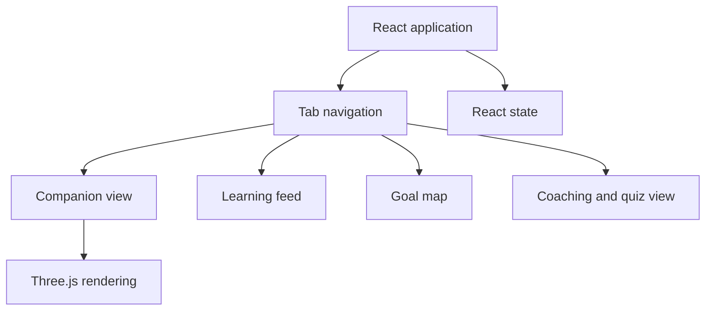

# Financial Wellness Prototype Technical Design

This document separates the hackathon frontend design from proposed backend, PWA, security, and production work.

## Prototype Frontend

The documented frontend uses React, Vite, Tailwind CSS, Framer Motion, Three.js, `@react-three/fiber`, and `@react-three/drei`.

### Documented Components

- `MobileApp.jsx`: tab navigation, transitions, and shared application state
- `FlowWorld.jsx`: companion interaction, prototype rewards, and milestone presentation
- `ThreeDPet.jsx`: three-dimensional companion rendering and interaction
- `FlowCoach.jsx`: chat, message history, quiz, and reward presentation

Reward values, daily limits, evolution stages, and unlocks are prototype design parameters rather than validated product behavior.

## Proposed Service Architecture

The design references Supabase, PostgreSQL, and Gemini for possible authentication, persistence, storage, and AI-assisted education. This documentation does not establish that account creation, social login, database persistence, storage, row-level policies, or all described model interactions were implemented and tested.

Proposed records include profiles, companion state, milestones, activities, and learning cards. Before storing user or financial information, an implementation would need a reviewed schema, authentication and authorization, least-privilege access policies, retention rules, and server-side validation.

## Proposed PWA Work

Service-worker caching, home-screen installation, background synchronization, push notifications, and offline use are future capabilities. A production implementation would need to define:

- Which assets and data may be cached
- How stale and conflicting state is handled
- Which features remain available without a network
- How updates invalidate old caches
- Browser and device support based on testing

No PWA installation or offline behavior is claimed for the prototype.

## AI Boundaries

The coaching design can send educational questions and context to a model. Before release it would need server-side credential handling, input and output controls, clear financial-advice boundaries, failure handling, and evaluation of generated content.

## Three-Dimensional Rendering

The prototype design uses Three.js and React bindings for companion rendering, camera controls, lighting, materials, and animation. Model complexity, texture handling, frame rate, and device support require measurement on target devices.

## Proposed Production Controls

- Authentication and authorization on every user-data path
- Server-side secret handling and request validation
- Data minimization, retention, deletion, and privacy review
- Dependency review and security testing
- Accessibility and cross-browser testing
- Automated tests and reviewed deployment/rollback procedures
- Measured performance budgets rather than unverified latency targets

These controls are recommendations, not established implementation.

## Related Documentation

- [Feature scope](FEATURES.md)
- [Prototype walkthrough](QUICKSTART.md)
- [Design](DESIGN.md)
- [User journey](USER_JOURNEY.md)

[Back to project overview](README.md)
