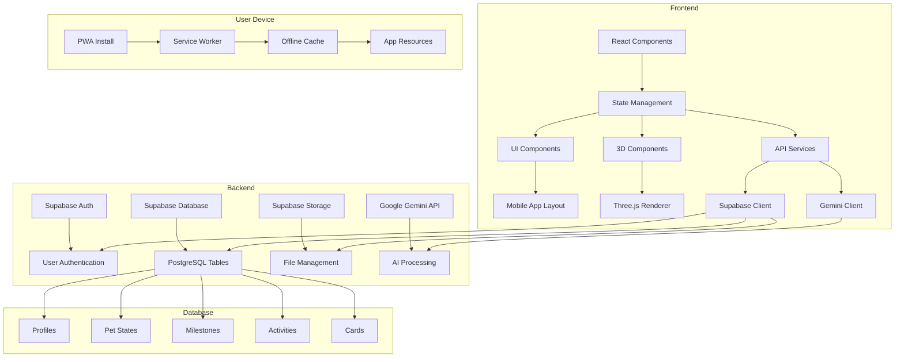

# Financial Wellness Platform - Technical Documentation

A comprehensive overview of the platform's technical architecture, technology stack, and implementation details.

## Technology Stack

### Frontend
| Technology | Version | Purpose |
|------------|---------|---------|
| React | 18 | Core UI framework with functional components and hooks |
| Vite | 5 | Fast build tool and development server |
| Tailwind CSS | 3 | Utility-first CSS framework with custom theming |
| Framer Motion | 10 | Animation library for smooth transitions |
| Three.js | 0.160 | 3D graphics rendering engine |
| @react-three/fiber | 8 | React renderer for Three.js |
| @react-three/drei | 9 | Useful helpers for @react-three/fiber |

### Backend & APIs
| Technology | Purpose |
|------------|---------|
| Supabase | Authentication, database, storage, and backend services |
| PostgreSQL | Relational database with Row Level Security |
| Google Gemini API | AI-powered chat and coaching functionality |

### PWA & DevOps
| Technology | Purpose |
|------------|---------|
| Service Worker | Offline functionality and resource caching |
| Vite PWA Plugin | PWA generation and configuration |
| Vercel | Deployment platform |

## System Architecture

## Frontend Architecture

### Component Structure

### Key Component Responsibilities

#### MobileApp.jsx
- Manages tab navigation between main sections
- Handles component transitions with Framer Motion
- Maintains global app state context

#### FlowWorld.jsx
- Core Virtual Companion interaction interface
- Pet feeding mechanics and limits (5 taps/day)
- Coin and XP calculation logic
- Milestone tracking and celebration effects

#### ThreeDPet.jsx
- 3D model rendering with Three.js
- Stage-specific animations and transitions
- User interaction handling (taps, gestures)
- Performance optimization for mobile devices

#### FlowCoach.jsx
- AI chat interface implementation
- Message history management
- Quiz mode and reward system
- Context-aware AI query construction

### State Management
- **Local State**: React hooks (useState, useReducer) for component-level state
- **Global State**: Context API for app-wide state management
- **Backend State**: Supabase for persistent data storage

### Styling Approach
- **Tailwind CSS**: Utility-first styling with custom theme configuration
- **Custom Color Palette**: Dark mode focused with teal accents
- **Responsive Design**: Mobile-first approach with breakpoints for larger screens
- **Animations**: Framer Motion for smooth transitions and effects

## Database Schema

### Core Tables

#### Profiles

#### Pet States

#### Milestones

#### Activities

#### Cards

### Security & Permissions
- **Row Level Security (RLS)**: Implemented on all tables
- **Policy-Based Access**: Fine-grained control over data access
- **JWT Authentication**: Secure user identification and authorization
- **API Key Protection**: Environment variables for sensitive keys

## API Integrations

### Supabase Integration
- **Auth**: Email/password and social login
- **Database**: CRUD operations with real-time subscriptions
- **Storage**: File uploads and management

### Gemini API Integration
- **Chat Completions**: Natural language responses to user queries
- **Content Generation**: Educational content and quiz questions
- **Context Management**: Maintaining conversation context for coherent interactions

### API Security
- **CORS Configuration**: Restricted access to trusted domains
- **Rate Limiting**: Protection against API abuse
- **Input Validation**: Sanitization of all user inputs

## PWA Implementation

### Service Worker Features
- **Resource Caching**: Offline access to core app resources
- **Background Sync**: Deferred data synchronization
- **Push Notifications**: User engagement alerts

### Manifest Configuration
- **App Icons**: Multiple sizes for different devices
- **Display Modes**: Standalone and fullscreen options
- **Theme Colors**: Consistent branding across platforms

### Installation Flow
1. User visits app on mobile browser
2. Prompt appears to install to home screen
3. Service worker registers in background
4. App becomes accessible offline after installation

## 3D Rendering Architecture

### Three.js Implementation
- **Scene Management**: Multiple scenes for different app sections
- **Camera Controls**: Responsive camera with mobile-friendly interactions
- **Lighting**: Dynamic lighting for realistic 3D effects
- **Materials**: Custom shaders for glassmorphism and glow effects

### Performance Optimization
- **Model Simplification**: Optimized 3D models for mobile devices
- **LOD (Level of Detail)**: Dynamic model complexity based on device capabilities
- **Texture Compression**: Efficient texture storage and loading
- **Batching**: Combined geometry rendering for improved performance

## Development Workflow

### Build Process

### CI/CD Pipeline
1. **Code Push**: Changes pushed to GitHub
2. **Build**: Vercel automatically builds the application
3. **Deploy**: Deployment to production domain
4. **Test**: Automated tests run against production build

## Performance Metrics

### Key Performance Indicators
- **Time to First Byte (TTFB)**: < 200ms
- **First Contentful Paint (FCP)**: < 1s
- **Largest Contentful Paint (LCP)**: < 2s
- **Time to Interactive (TTI)**: < 3s
- **Offline Support**: Core functionality available without internet

### Optimization Strategies
- **Code Splitting**: Lazy loading of components and resources
- **Image Optimization**: Responsive images with WebP format
- **Resource Caching**: Service worker for static asset caching
- **Tree Shaking**: Removal of unused code in production builds

## Security Best Practices

### Authentication & Authorization
- **JWT Validation**: Secure token verification
- **Password Hashing**: Bcrypt for password storage
- **Session Management**: Secure cookie configuration

### Data Protection
- **Encryption**: HTTPS for all data transmission
- **Input Sanitization**: Prevention of injection attacks
- **Data Minimization**: Only collect necessary user data

### Code Security
- **Dependency Scanning**: Regular vulnerability checks
- **Code Reviews**: Peer reviews for all changes
- **Security Testing**: Automated security scans in CI/CD

## Cross-Platform Compatibility

### Browser Support
- Chrome 90+
- Safari 14+
- Firefox 88+
- Edge 90+

### Mobile Platforms
- iOS 14+
- Android 9+

### Testing Strategy
- **Emulators**: Cross-browser testing with BrowserStack
- **Real Devices**: Manual testing on actual mobile devices
- **Responsive Design**: Testing across different screen sizes

---

*"Built with modern web technologies for optimal performance and user experience"*