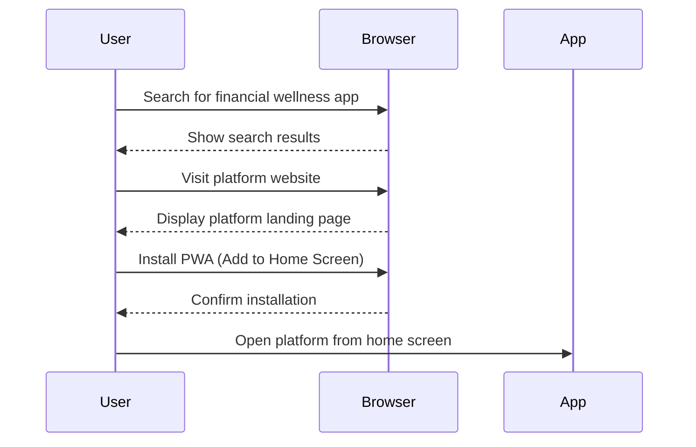
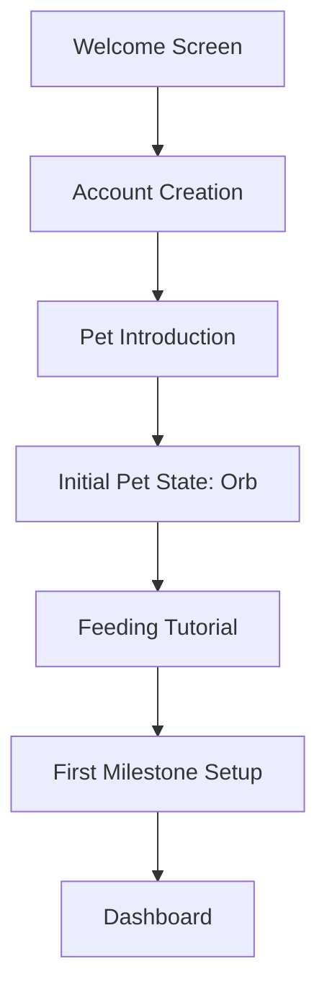
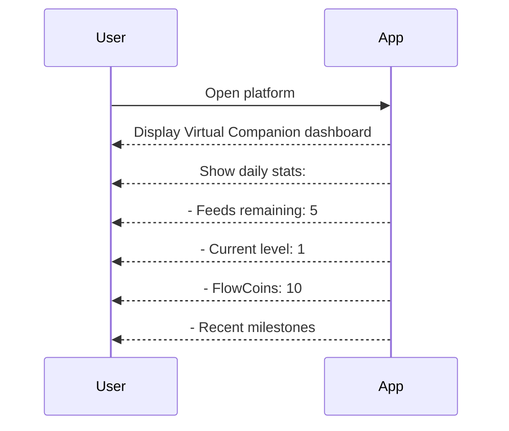
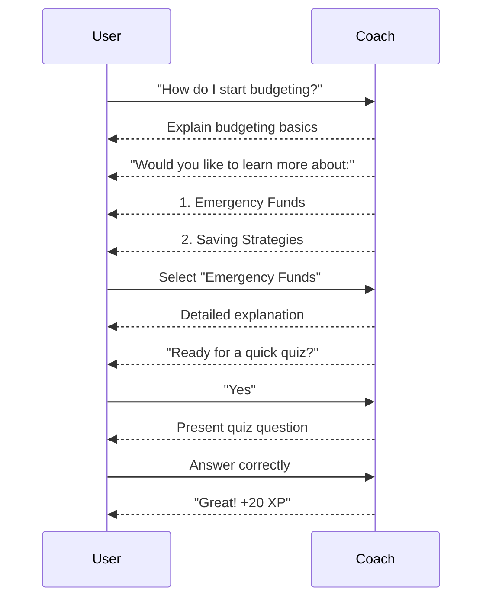
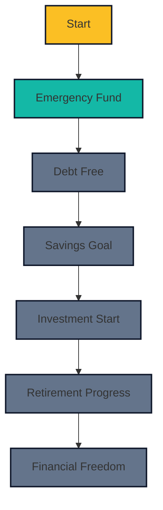
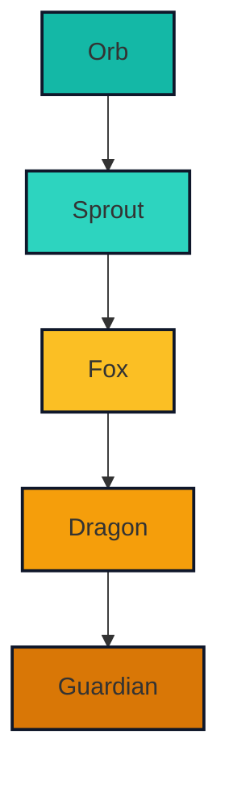
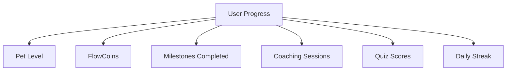

# Financial Wellness Platform - User Journey

A comprehensive walkthrough of the platform user experience from first interaction to ongoing engagement.

## First Time Experience

### 1. Discovery & Installation

### 2. Onboarding Process

#### Welcome Screen
- **Visual**: Deep navy background with animated 3D orbs
- **Message**: "Welcome to your journey to financial wellness"
- **Action**: Sign up/login prompt

#### Account Creation
- **Options**: Email/password or social media login
- **Simplicity**: Minimal form with only essential fields
- **Security**: Password strength indicators

#### Pet Introduction

#### First Milestone
- **Prompt**: "What's your first financial goal?"
- **Options**: Pre-defined milestones or custom goal
- **Action**: User sets first milestone

### 3. First Interaction with Virtual Companion

- **Visual**: 3D Orb floating in center of screen
- **Prompt**: "Tap your pet to feed it"
- **Feedback**: Orb glows and animates when tapped
- **Reward**: First FlowCoins and XP awarded
- **Limit**: User can tap 5 times total (first day)

## Daily Engagement

### 1. Dashboard Overview

### 2. Feeding Routine

#### Tap Interaction
- **Location**: Center of screen where Virtual Companion resides
- **Feedback**: 
  - Visual: Pet glows and animates
  - Audio: Subtle sound effect
  - Text: "FlowCoins +5!"
- **Progress**: Feed count decrements from 5 to 0

#### Limit Reached
- **Visual**: Pet goes into "rest" state
- **Message**: "Your pet needs to rest. Come back tomorrow!"
- **Preventative**: No further taps register

### 3. AI Coach Interaction

#### Navigation
- **Action**: User taps "Gym" tab
- **Transition**: Smooth slide to coach interface

#### Conversation Flow

#### Quiz Mode
- **Format**: Multiple choice questions
- **Difficulty**: Adapts to user knowledge level
- **Rewards**: FlowCoins and XP for correct answers

### 4. Journey Maps Exploration

#### Navigation
- **Action**: User taps "Map" tab
- **Transition**: Smooth slide to map interface

#### Map Features
- **Interactive**: Tap on landmarks for details
- **Progress**: Visual indicators showing completed milestones
- **Goals**: Ability to add new milestones

### 5. Content Feed

#### Navigation
- **Action**: User taps "FlowFeed" tab
- **Transition**: Smooth slide to content feed

#### Content Types
- **Financial Tips**: Short, actionable advice
- **Success Stories**: User achievement highlights
- **Educational Content**: In-depth articles
- **Challenges**: Daily/weekly financial challenges

## Achievement Moments

### 1. Pet Evolution

#### Trigger
- **Condition**: Pet reaches XP threshold for next level
- **Visual**: Dramatic 3D animation showing pet transformation
- **Audio**: Celebratory sound effect
- **Message**: "Congratulations! Your pet evolved to [Stage Name]!"
- **Reward**: Bonus FlowCoins and XP

### 2. Milestone Completion

#### Notification
- **Visual**: Pop-up card with milestone details
- **Animation**: Confetti and glow effects
- **Message**: "You achieved [Milestone Name]!"
- **Reward**: Significant FlowCoins and XP
- **Next Step**: Suggestion for new milestone

### 3. Level Up

#### Experience System
- **XP Sources**: Feeding, coaching, quizzes, milestones
- **Threshold**: Increasing XP required for each level
- **Benefits**: New features unlocked at certain levels

## Long-Term Journey

### 1. Financial Growth Tracking

#### Progress Visualization
- **Timeline**: Historical view of pet evolution
- **Stats**: Charts showing FlowCoin accumulation
- **Milestones**: Completed vs. in-progress goals
- **Activities**: Log of all financial activities

### 2. Advanced Features

#### Unlockable Content
- **Premium Quizzes**: Available at higher levels
- **Advanced AI Coaching**: More sophisticated financial advice
- **Exclusive Pet Skins**: Custom appearance options
- **Community Challenges**: Group financial activities

### 3. Community Engagement

#### Optional Features
- **Achievement Sharing**: Social media integration
- **Leaderboards**: Anonymous progress comparison
- **Community Challenges**: Group goals

## User Progress Metrics

### Key Metrics

### Progress Insights
- **Weekly Reports**: Summary of financial growth
- **Suggestions**: Personalized recommendations
- **Trends**: Visualization of engagement patterns

## Offline Experience

### PWA Capabilities
- **Core Functions**: Access to dashboard and pet state
- **Limited Feeding**: Can feed pet (count updates when online)
- **Cache Content**: Previously viewed content available
- **Sync Mechanism**: Background sync when internet restored

## Security & Privacy

### User Control
- **Data Visibility**: Clear explanation of data collected
- **Privacy Settings**: User-managed sharing preferences
- **Account Management**: Easy profile updates and deletion

### Security Features
- **Authentication**: Secure login mechanisms
- **Encryption**: All data transmitted securely
- **Regular Updates**: Security patches and improvements

---

*"A journey designed to make financial wellness engaging, accessible, and rewarding"*