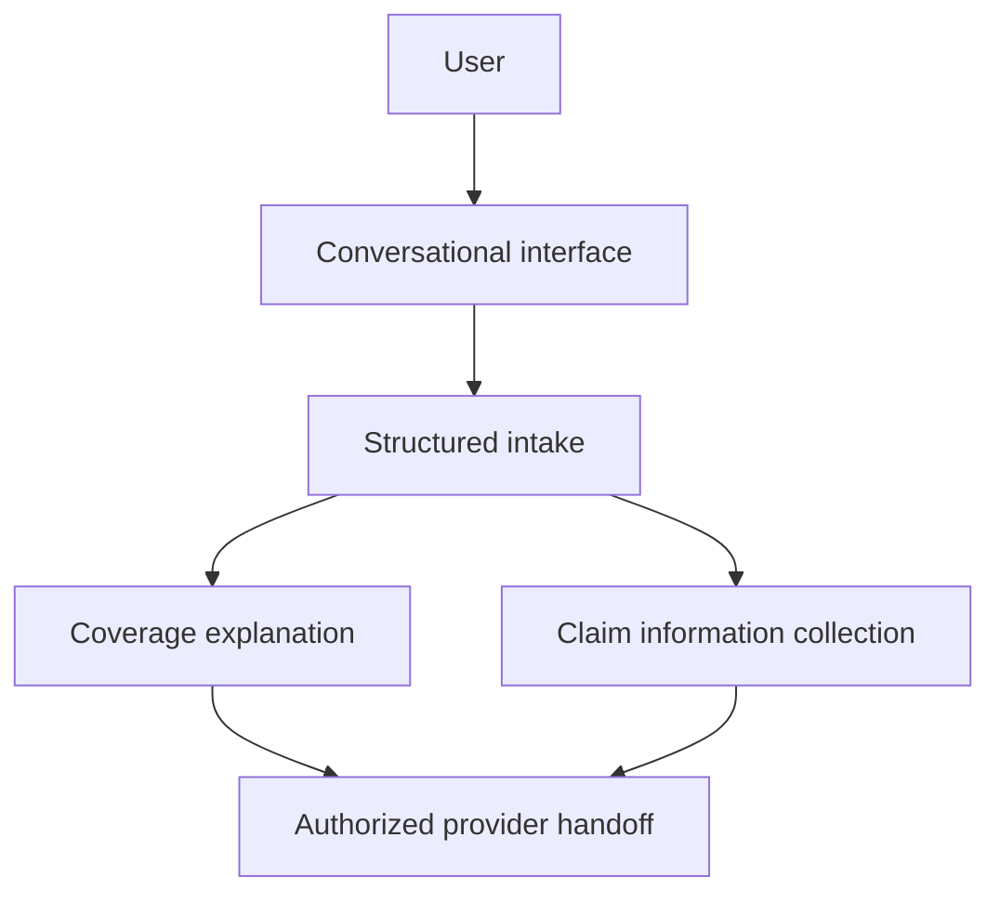

# SingHacks Architecture

## Prototype Architecture

The hackathon prototype centered on a conversational interface for policy discovery and structured claim intake. Text, voice, image, and document inputs were represented in the user flow, while policy issuance, payment, claim decisions, and settlement were simulated handoffs.

The prototype documentation references Next.js, React, speech processing, OCR, and AI-assisted conversation. It does not establish a deployed mobile application, production microservices, live payment processing, automated underwriting, or automated claim settlement.

## Proposed Production Boundaries

A production implementation would need separate services and controls for:

- Identity, authentication, authorization, and consent
- Insurer-owned product catalogs, eligibility rules, pricing, and policy issuance
- Secure document storage and retention
- Payment-provider integration
- Human review of regulated, ambiguous, or high-risk decisions
- Audit trails, monitoring, incident response, backups, and recovery testing
- Security, privacy, accessibility, and regulatory assessment against named requirements

These are architecture requirements, not implemented capabilities. Technology selection, deployment topology, capacity targets, and recovery objectives remain future engineering decisions supported by testing and operational evidence.

## Data Flow

1. Collect the user's travel or claim context.
2. Normalize supported input into structured fields.
3. Present information for user review and correction.
4. Explain options without making an insurer decision.
5. Transfer the reviewed request to an authorized provider or person.

## Related Documentation

- [Architecture summary](README.md)
- [Feature scope](../features/README.md)
- [Detailed prototype features](../features/FEATURES.md)
- [User journeys](../user-journey/README.md)
- [Demo boundaries](../demo/README.md)

[Back to project overview](../README.md)
