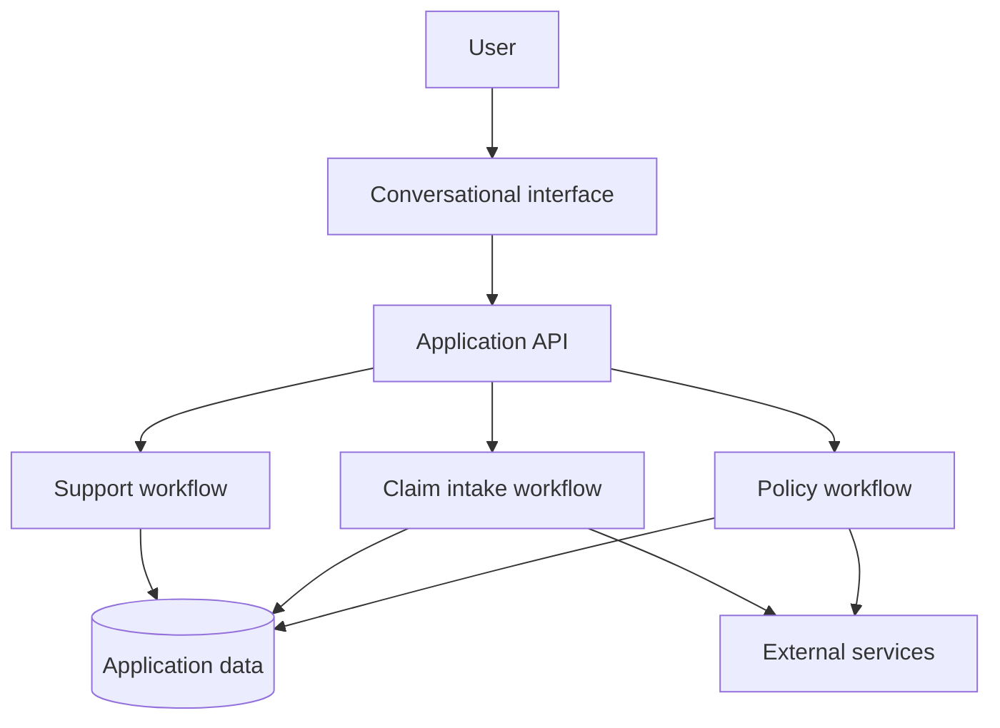

# Architecture

The project architecture separates the conversational interface from policy, claim, and support workflows.

## Components

| Area | Responsibility |
| --- | --- |
| Conversational interface | Collect text, voice, image, and document input |
| Application API | Route requests and validate input |
| Policy workflow | Gather travel needs and explain coverage options |
| Claim intake | Collect claim details and supporting documents |
| Support workflow | Answer general questions and route complex cases |
| External services | Connect insurer, identity, payment, and travel data |
