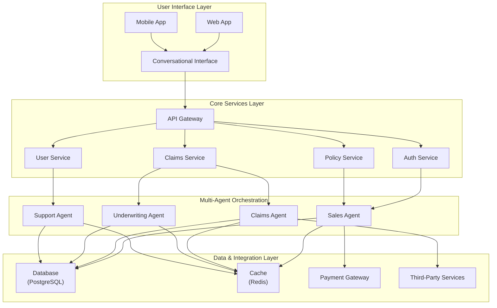

# Architecture

The SingHacks Insurance Platform is built as a modular, multi-agent system designed for scalability, maintainability, and seamless user experience.

## System Overview

## Core Components

### 1. User Interface Layer

- **Web/Mobile App**: Modern, responsive interfaces built with Next.js and React Native
- **Conversational Interface**: Multi-modal support for text, voice, and image interactions
  - Speech-to-text conversion for voice inputs
  - OCR for document processing
  - Image recognition for claim validation

### 2. API Gateway

- Central entry point for all client requests
- Authentication and authorization
- Rate limiting and request validation
- API versioning and documentation

### 3. Core Services Layer

- **Auth Service**: JWT-based authentication, user management, role-based access control
- **Policy Service**: Policy creation, pricing, management, and lifecycle tracking
- **Claims Service**: Claim filing, processing, validation, and payment management
- **User Service**: Profile management, preferences, and notification settings

### 4. Multi-Agent Orchestration

- **Sales Agent**: Guides users through policy selection and purchase
- **Claims Agent**: Assists with claim filing and status updates
- **Underwriting Agent**: Evaluates risk and determines policy eligibility
- **Support Agent**: Handles general inquiries and troubleshooting

### 5. Data & Integration Layer

- **Database**: PostgreSQL with Supabase for data persistence
- **Cache**: Redis for session management and performance optimization
- **Payment Gateway**: Integration with Stripe for secure transactions
- **Third-Party Services**: Weather APIs, travel advisories, and emergency contacts

## Key Architecture Principles

1. **Modularity**: Loosely coupled components for independent development and deployment
2. **Scalability**: Horizontal scaling capabilities to handle varying traffic loads
3. **Resilience**: Fault-tolerant design with circuit breakers and fallback mechanisms
4. **Security**: End-to-end encryption, secure authentication, and data privacy compliance
5. **Maintainability**: Clear separation of concerns and comprehensive documentation

## Integration Patterns

- **RESTful APIs**: Standardized interfaces for service communication
- **Message Queues**: Asynchronous processing for resource-intensive tasks
- **Event-Driven Architecture**: Real-time updates and notifications
- **API-First Design**: API contracts define system interactions

## Deployment Architecture

- **Frontend**: Hosted on Vercel with CDN distribution
- **Backend**: Serverless deployment on AWS Lambda
- **Database**: Managed PostgreSQL on Supabase
- **AI Agents**: Containerized on AWS ECS/Fargate
- **Monitoring**: New Relic and CloudWatch for performance tracking