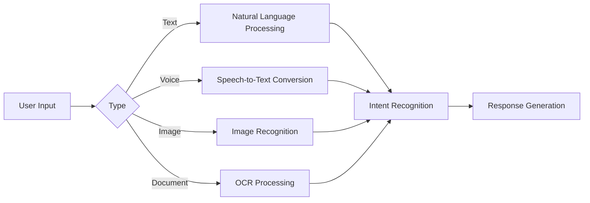
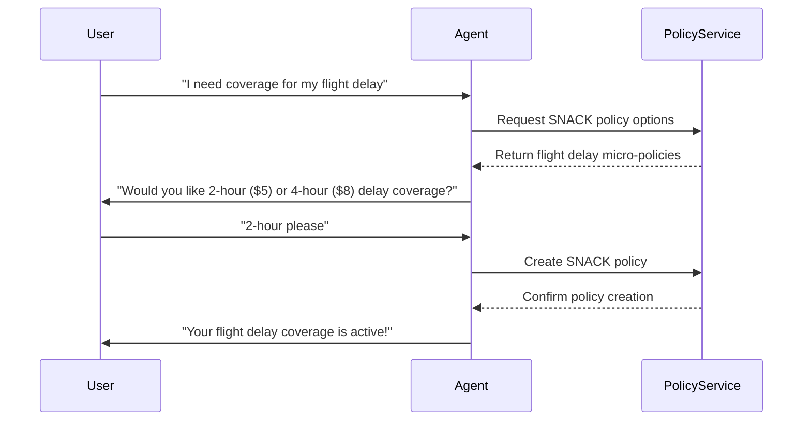
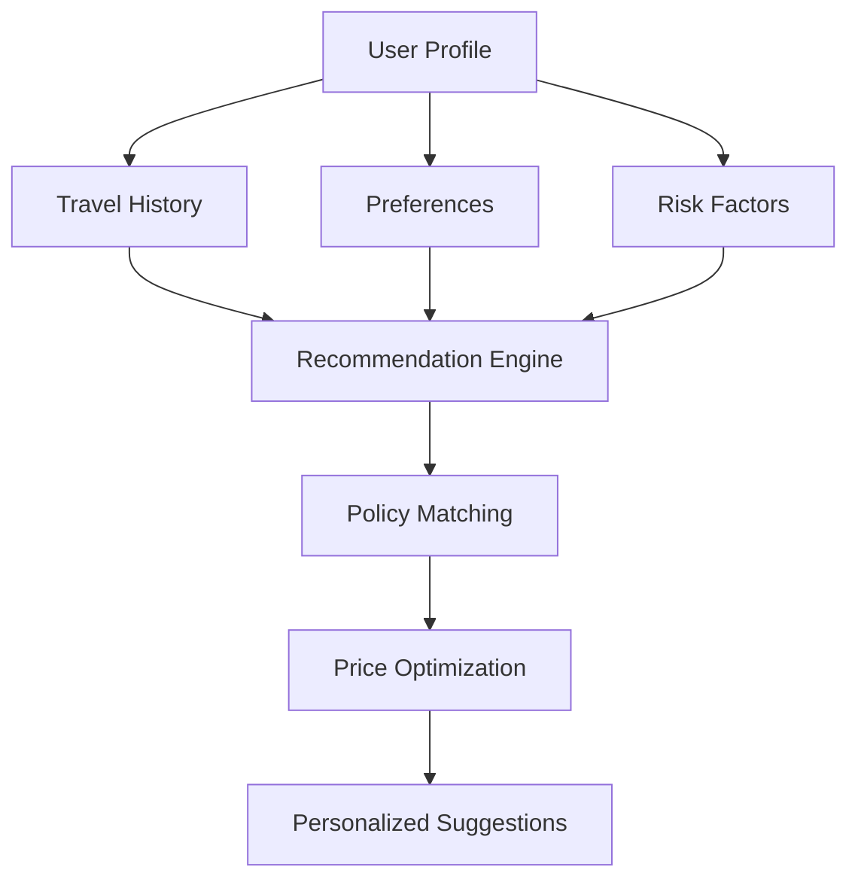
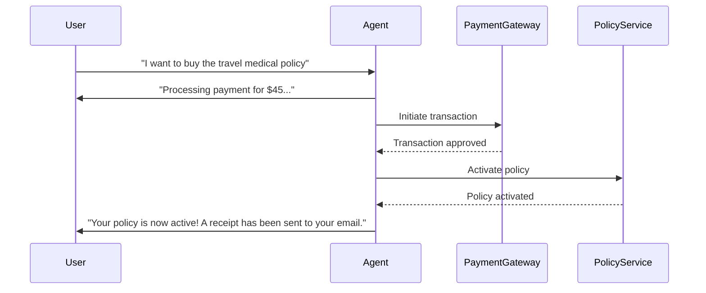
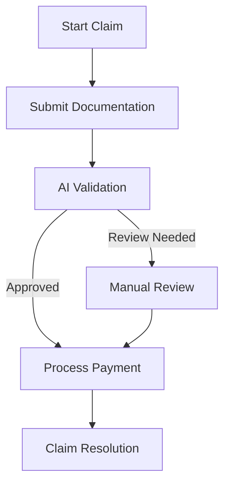

# Features

The SingHacks Insurance Platform offers a comprehensive set of features designed to revolutionize the travel insurance experience through conversational AI.

## Conversational Interface

### Multi-modal Support

- **Text**: Direct natural language conversations
- **Voice**: Real-time speech recognition and synthesis
- **Image**: Capture and analysis of visual content
- **Document**: Extract information from PDFs and photos

### Contextual Understanding

- Maintains conversation history across sessions
- Adapts responses based on user preferences
- Handles multi-turn conversations naturally
- Integrates with user profile data for personalization

## SNACK Micro-Insurance

### Incremental Coverage

- **Flight Delay**: Coverage for unexpected flight delays
- **Baggage Loss**: Protection for lost or damaged luggage
- **Medical Emergencies**: Short-term medical coverage
- **Trip Cancellation**: Coverage for trip cancellations

### Benefits

- Affordable, pay-as-you-go pricing
- Instant activation and confirmation
- No long-term commitments
- Easy management through conversation

## AI-Powered Recommendations

### Personalization Engine

- **Travel Pattern Analysis**: Learns from past behavior
- **Risk Assessment**: Evaluates user-specific risk factors
- **Price Optimization**: Finds the best value for user needs
- **Contextual Suggestions**: Recommends coverage based on conversation context

## Seamless Payment Integration

### One-Click Purchases

- **Multiple Payment Methods**: Credit cards, digital wallets
- **Secure Transactions**: PCI-DSS compliant processing
- **Instant Confirmation**: Real-time policy activation
- **Receipt Generation**: Automated documentation

### Payment Flow

## Streamlined Claims Process

### Intelligent Claim Filing

- **Document Recognition**: OCR for automatic form filling
- **Photo Validation**: Image analysis for claim evidence
- **Status Tracking**: Real-time updates on claim progress
- **Fraud Detection**: AI-powered claim validation

### Claim Journey

## Real-time Analytics

### User Insights

- Travel behavior analysis
- Policy preference tracking
- Claim pattern identification
- Customer satisfaction metrics

### Business Metrics

- Policy activation rates
- Claim resolution times
- Revenue per user
- Conversion funnels

## Security & Compliance

- **Data Encryption**: End-to-end encryption for sensitive data
- **Compliance**: GDPR, HIPAA, and financial regulations
- **Authentication**: Multi-factor authentication support
- **Audit Trails**: Comprehensive logging of all transactions

## Cross-Platform Support

- **Web**: Responsive web application
- **Mobile**: Native iOS and Android apps
- **Messaging**: Integration with popular chat platforms
- **Voice Assistants**: Support for Siri, Alexa, and Google Assistant