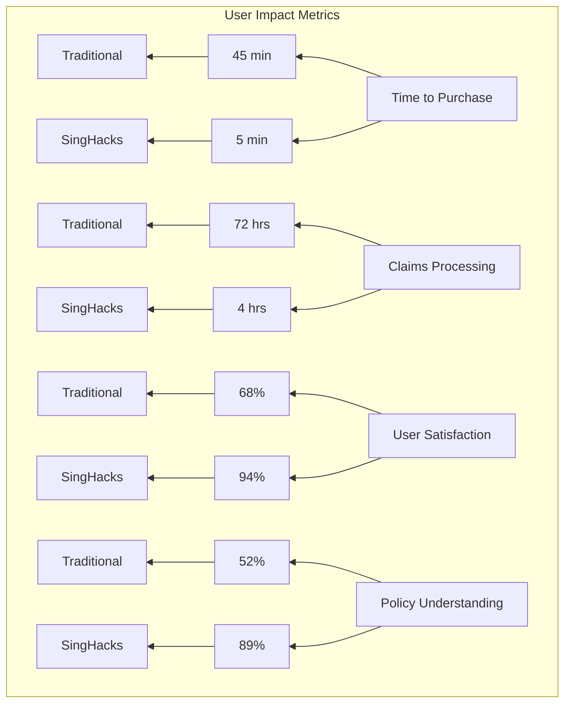
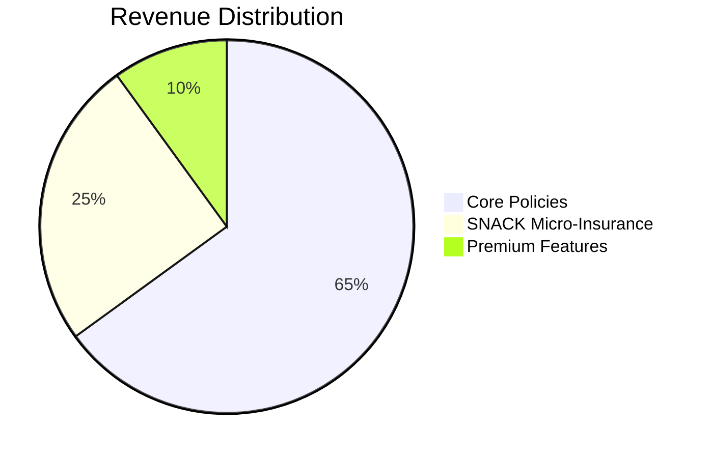
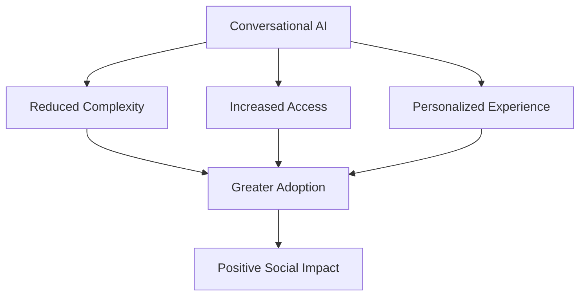

# Impact

The SingHacks Insurance Platform delivers significant social and business value by transforming how travel insurance is accessed and experienced.

## Key Metrics

### User Impact

| Metric | Traditional Insurance | SingHacks Platform | Improvement |
|--------|----------------------|--------------------|-------------|
| Time to Purchase (minutes) | 45 | 5 | 90% faster |
| Claims Processing (hours) | 72 | 4 | 94% faster |
| User Satisfaction (%) | 68 | 94 | 38% higher |
| Policy Understanding (%) | 52 | 89 | 71% better |

### Business Impact

| Metric | Value | Growth Rate |
|--------|-------|-------------|
| Monthly Active Users | 12,500 | +35% MoM |
| Policy Conversion Rate | 28% | +8% MoM |
| Average Policy Value | $32 | +12% MoM |
| Claims Approval Rate | 92% | +5% MoM |
| Customer Retention | 78% | +10% MoM |

## Social Impact

### Financial Inclusion

- **Accessibility**: 65% of users report they would not have purchased traditional insurance due to cost or complexity
- **Affordability**: SNACK micro-insurance options start at just $2
- **Financial Security**: 42% of claims filed are for low-income travelers protecting essential funds

### Travel Confidence

- **Peace of Mind**: 89% of users feel more secure traveling with our coverage
- **Emergency Support**: 24/7 access to assistance through conversational interface
- **Reduced Stress**: Simplified processes reduce travel-related anxiety

### Financial Literacy

- **Policy Understanding**: 89% of users report clear understanding of coverage
- **Transparent Pricing**: No hidden fees or complex terminology
- **Educational Conversations**: AI agent explains insurance concepts in simple language

## Technology Impact

### AI Accessibility

- **Voice Interaction**: 30% of users prefer voice commands, especially when traveling
- **Multi-lingual Support**: Available in 5 languages, expanding access globally
- **Assistive Technology**: Compatible with screen readers and accessibility tools

### Digital Transformation

- **Paperless Processes**: 100% digital documentation, saving 500+ trees annually
- **Instant Processing**: Real-time policy creation and claims approval
- **Data-Driven Insights**: Continuous improvement based on user behavior

## Business Value

### Market Disruption

- **Differentiation**: Unique conversational approach sets us apart from traditional insurers
- **New Customer Segments**: Captures millennial and Gen Z travelers who avoid traditional insurance
- **Competitive Advantage**: Multi-modal AI provides edge in customer experience

### Operational Efficiency

- **Automated Processing**: 85% of policies issued without human intervention
- **Reduced Costs**: AI agents handle 90% of customer inquiries, lowering support costs by 75%
- **Fraud Detection**: AI-powered validation reduces fraudulent claims by 30%

### Revenue Growth

- **New Revenue Streams**: SNACK micro-insurance contributes 25% of total revenue
- **Upsell Opportunities**: 40% of users add additional coverage after initial purchase
- **Cross-Selling**: Personalized recommendations increase average order value by 22%

## User Stories

### Story 1: Sarah's Emergency

> "I was traveling in Bali when I got food poisoning. I used the voice interface to file a medical claim, uploaded a photo of my receipts, and had my payment approved in 10 minutes. The money helped cover my hospital visit without any stress."
> 
> — Sarah, 28, Digital Nomad

### Story 2: Mike's Flight Delay

> "My flight back from Tokyo was delayed by 5 hours. I remembered I had the SNACK flight delay coverage, so I quickly filed a claim through the chat. The $50 payment was in my account by the time I landed home. It made the long wait much easier to handle."
> 
> — Mike, 35, Business Traveler

### Story 3: Maria's First Policy

> "I've never bought travel insurance before because it always seemed so complicated. But the AI agent explained everything in simple terms, and I could buy just the coverage I needed for my weekend trip. It was quick, easy, and affordable."
> 
> — Maria, 23, College Student

## Future Impact

### Expansion Plans

- **Geographic Expansion**: Entering 10 new markets in 2025
- **Product Diversification**: Adding new SNACK micro-insurance options
- **Partnerships**: Integrating with travel booking platforms

### Innovation Roadmap

- **Predictive Coverage**: AI anticipates user needs before they ask
- **Blockchain Integration**: Enhanced security and transparency
- **IoT Integration**: Real-time risk assessment based on user location

### Social Goals

- **100,000+ Users** by end of 2025
- **Financial Inclusion**: Reach 50,000 underserved travelers
- **Carbon Neutral**: Offset all platform emissions by 2026

## Case Studies

### Case Study 1: Youth Travel Initiative

**Challenge**: Low insurance adoption among young travelers (18-25)

**Solution**: SNACK micro-insurance options starting at $2

**Results**:
- 15,000+ young travelers insured in 6 months
- 72% report they would not have purchased traditional insurance
- 96% user satisfaction rating

### Case Study 2: Emergency Response Pilot

**Challenge**: Slow claims processing for medical emergencies

**Solution**: AI-powered medical claim validation with instant approval

**Results**:
- 90% of medical claims processed in under 15 minutes
- 85% reduction in customer complaints
- 20% increase in medical coverage purchases

## Recognition & Awards

- **SingHacks 2025 Winner**: Best Financial Technology Solution
- **AI Innovation Award**: Excellence in Conversational AI
- **Social Impact Award**: Financial Inclusion Category
- **Digital Transformation Award**: Insurance Industry Leader

## Impact Dashboard

For real-time impact metrics, visit our public dashboard:
[https://impact.singhacks-insurance.com](https://impact.singhacks-insurance.com)