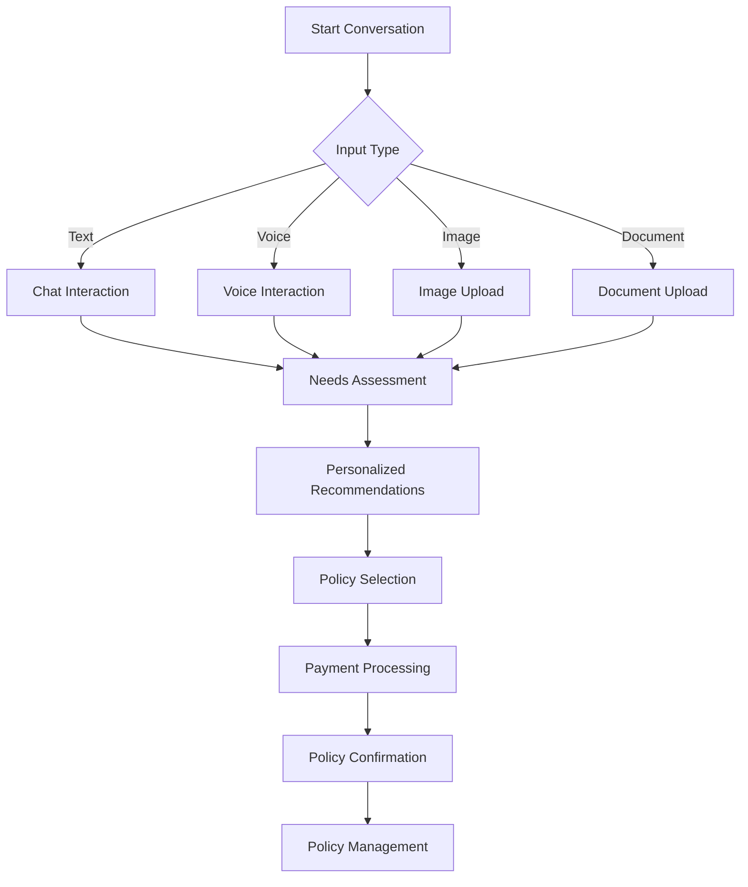
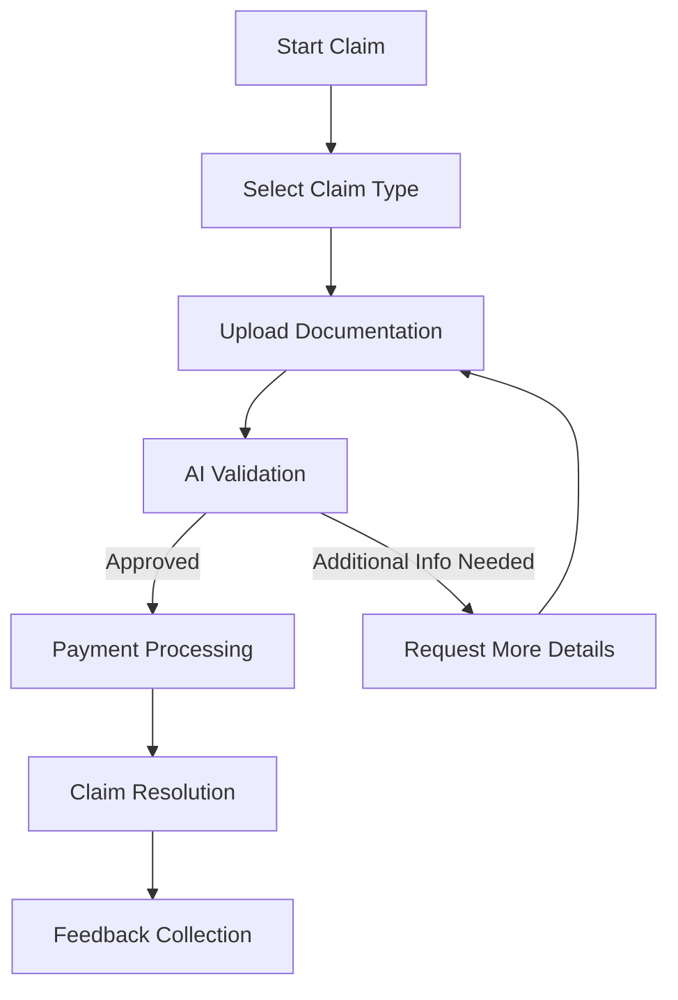
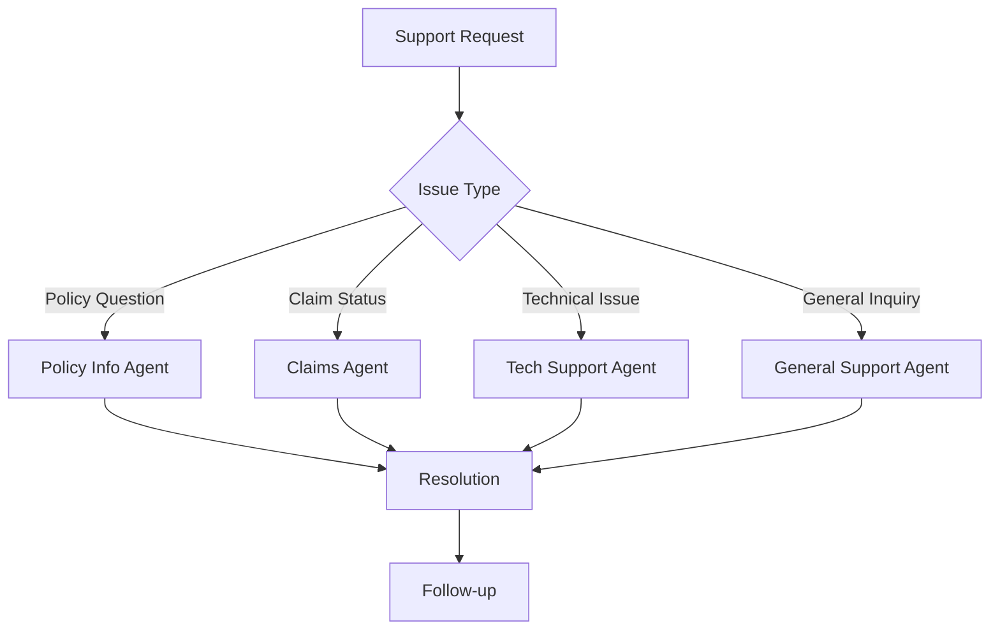
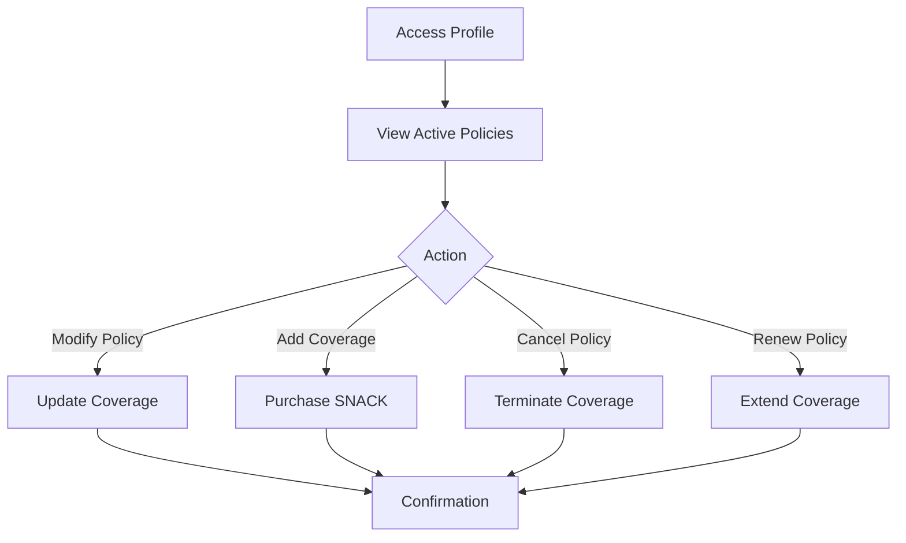
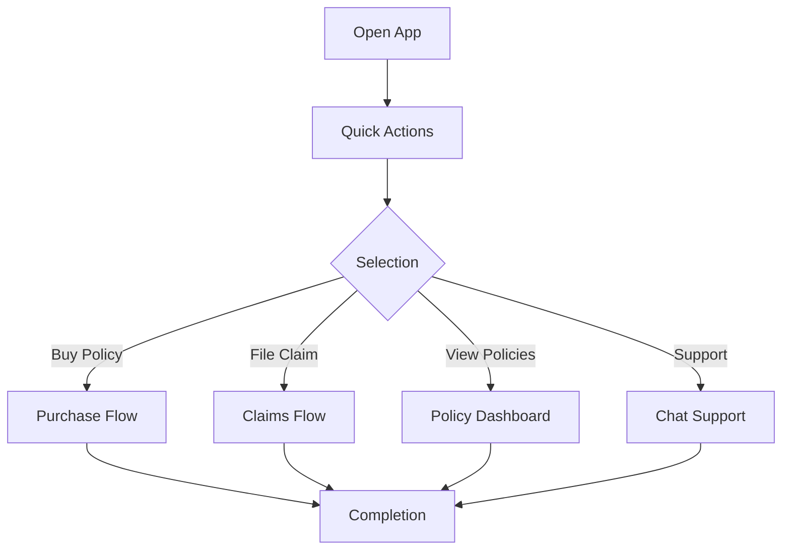

# User Journey

Explore the complete user experiences across the SingHacks Insurance Platform.

## Purchase Journey

### Step-by-Step

1. **Initiate Conversation**
   - User starts a chat via web, mobile, or voice interface
   - System greets user and asks about travel needs

2. **Needs Assessment**
   - AI agent asks targeted questions about travel plans
   - Collects information about destination, duration, activities
   - Identifies potential risks and coverage needs

3. **Personalized Recommendations**
   - System analyzes user profile and travel details
   - Recommends suitable policies and SNACK micro-insurance options
   - Provides clear pricing and coverage details

4. **Policy Selection**
   - User selects desired coverage
   - Agent confirms details and answers questions
   - Explains terms and conditions in simple language

5. **Payment Processing**
   - Secure payment gateway integration
   - Multiple payment methods supported
   - Instant payment confirmation

6. **Policy Confirmation**
   - Digital policy document generated
   - Sent to user via email and stored in profile
   - QR code for quick access during travel

7. **Policy Management**
   - User can view, modify, or cancel policies
   - Add additional coverage as needed
   - Set up automatic renewals if desired

## Claims Journey

### Step-by-Step

1. **Initiate Claim**
   - User starts a claim via the conversational interface
   - Selects claim type (flight delay, baggage loss, etc.)

2. **Documentation Upload**
   - User uploads photos, receipts, or other evidence
   - OCR technology automatically extracts information
   - System verifies required documents are provided

3. **AI Validation**
   - AI agent reviews claim details against policy terms
   - Cross-references with external data (flight status, weather)
   - Detects potential fraud patterns

4. **Resolution**
   - Most claims approved instantly
   - Complex claims routed to human agents
   - User receives real-time status updates

5. **Payment**
   - Approved claims processed for payment
   - Funds transferred to user's preferred method
   - Receipt generated automatically

6. **Feedback**
   - User asked to rate the claims experience
   - Continuous improvement based on feedback

## Support Journey

### Step-by-Step

1. **Request Support**
   - User asks for help via chat, voice, or email
   - System categorizes the request

2. **Agent Assignment**
   - Request routed to specialized agent
   - Complex issues escalated appropriately

3. **Issue Resolution**
   - Agent provides clear, helpful responses
   - Technical issues diagnosed and fixed
   - Follow-up actions taken as needed

4. **Customer Satisfaction**
   - User asked to rate support experience
   - Agent performance tracked and improved

## Policy Management Journey

### Step-by-Step

1. **Access Profile**
   - User logs in to account or continues conversation
   - Views dashboard with active policies

2. **Policy Actions**
   - Modify existing coverage
   - Add SNACK micro-insurance
   - Cancel policies when no longer needed
   - Renew expiring policies

3. **Updates**
   - Changes processed in real-time
   - Confirmation sent immediately
   - Policy documents updated automatically

## Mobile Journey

### Step-by-Step

1. **App Launch**
   - Quick access to all platform features
   - Voice command support for hands-free use

2. **Quick Actions**
   - One-tap policy purchases
   - Instant claim filing
   - Policy status checks
   - Support requests

3. **On-the-Go Support**
   - Real-time notifications for policy updates
   - Offline access to policy documents
   - Emergency assistance contact

## Design Principles

- **User-Centric**: Intuitive interfaces that adapt to user needs
- **Conversational**: Natural language interactions that feel human
- **Efficient**: Minimized steps to complete tasks
- **Transparent**: Clear explanations of policies and processes
- **Accessible**: Available across devices and platforms

## User Experience Metrics

- **Time to Purchase**: Average time to complete policy purchase
- **Claim Resolution Time**: Average time from filing to payment
- **Customer Satisfaction**: NPS and CSAT scores
- **User Retention**: Repeat purchase rate
- **Task Completion Rate**: Percentage of successful user interactions