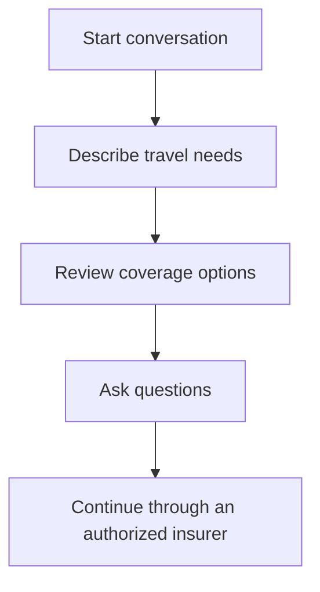
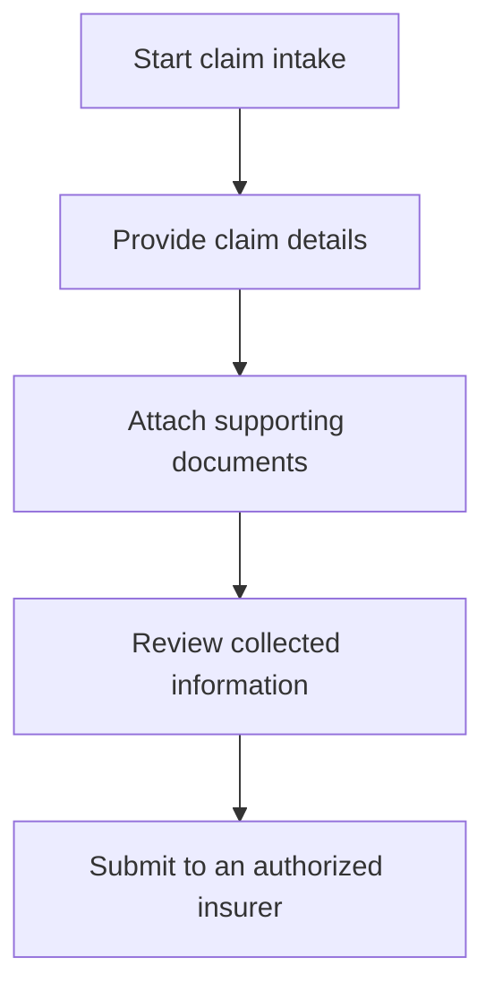
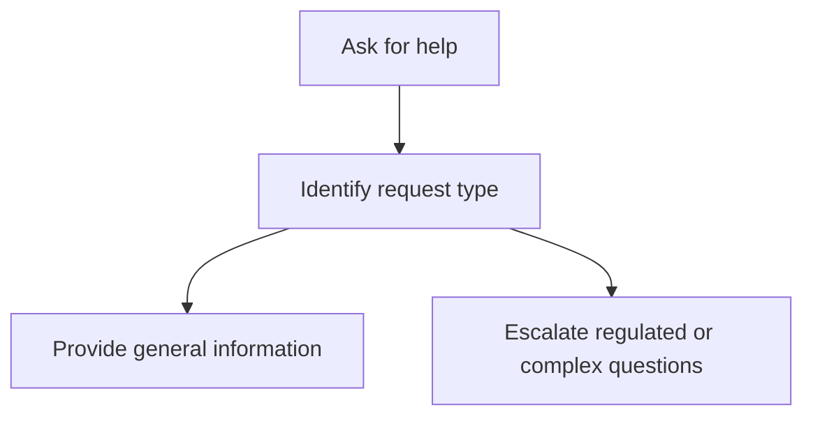

# User Journeys

## Policy Discovery

```mermaid
graph TD
    Start[Start conversation] --> Needs[Describe travel needs]
    Needs --> Options[Review coverage options]
    Options --> Questions[Ask questions]
    Questions --> Handoff[Continue through an authorized insurer]
```

## Claim Intake

```mermaid
graph TD
    Start[Start claim intake] --> Details[Provide claim details]
    Details --> Documents[Attach supporting documents]
    Documents --> Review[Review collected information]
    Review --> Handoff[Submit to an authorized insurer]
```

## Support

```mermaid
graph TD
    Request[Ask for help] --> Classify[Identify request type]
    Classify --> Information[Provide general information]
    Classify --> Escalate[Escalate regulated or complex questions]
```
