# User Journey Flowcharts

Visual representations of the complete user experience across the SingHacks Insurance Platform.

## End-to-End User Journey

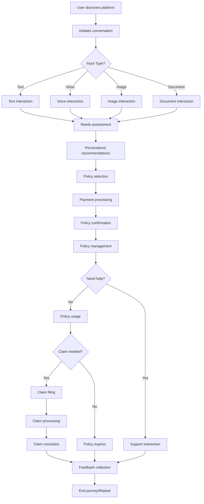
```mermaid
graph TD
    A[User discovers platform] --> B[Initiates conversation]
    B --> C{Input Type?}
    C -->|Text| D[Text interaction]
    C -->|Voice| E[Voice interaction]
    C -->|Image| F[Image interaction]
    C -->|Document| G[Document interaction]
    D & E & F & G --> H[Needs assessment]
    H --> I[Personalized recommendations]
    I --> J[Policy selection]
    J --> K[Payment processing]
    K --> L[Policy confirmation]
    L --> M[Policy management]
    M --> N{Need help?}
    N -->|Yes| O[Support interaction]
    N -->|No| P[Policy usage]
    P --> Q{Claim needed?}
    Q -->|Yes| R[Claim filing]
    Q -->|No| S[Policy expires]
    R --> T[Claim processing]
    T --> U[Claim resolution]
    U --> V[Feedback collection]
    S --> V
    O --> V
    V --> W[End journey/Repeat]
```

## Mobile App User Journey

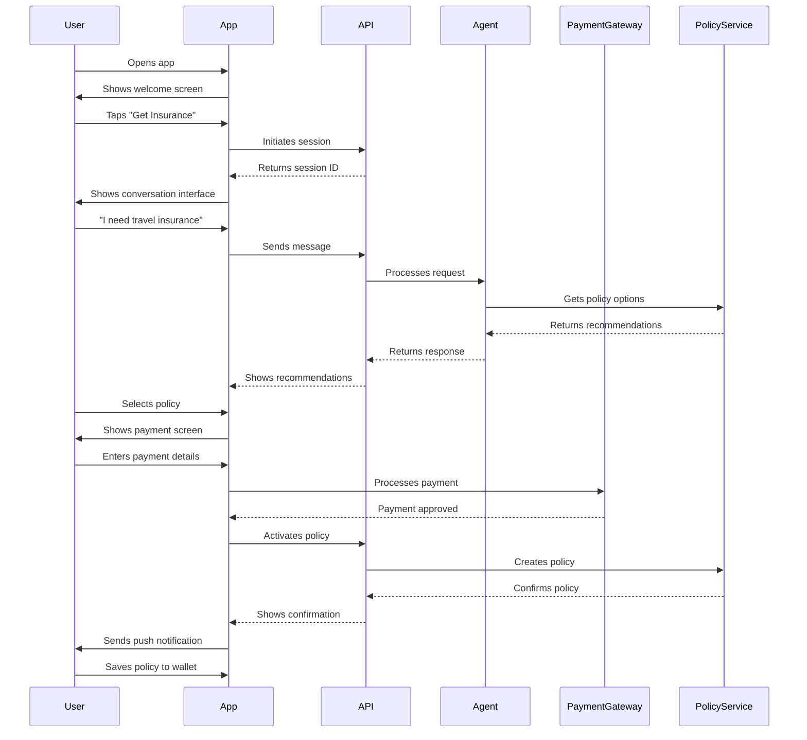
```mermaid
sequenceDiagram
    participant User
    participant App
    participant API
    participant Agent
    participant PaymentGateway
    participant PolicyService
    
    User->>App: Opens app
    App->>User: Shows welcome screen
    User->>App: Taps "Get Insurance"
    App->>API: Initiates session
    API-->>App: Returns session ID
    App->>User: Shows conversation interface
    User->>App: "I need travel insurance"
    App->>API: Sends message
    API->>Agent: Processes request
    Agent->>PolicyService: Gets policy options
    PolicyService-->>Agent: Returns recommendations
    Agent-->>API: Returns response
    API-->>App: Shows recommendations
    User->>App: Selects policy
    App->>User: Shows payment screen
    User->>App: Enters payment details
    App->>PaymentGateway: Processes payment
    PaymentGateway-->>App: Payment approved
    App->>API: Activates policy
    API->>PolicyService: Creates policy
    PolicyService-->>API: Confirms policy
    API-->>App: Shows confirmation
    App->>User: Sends push notification
    User->>App: Saves policy to wallet
```

## Web App User Journey

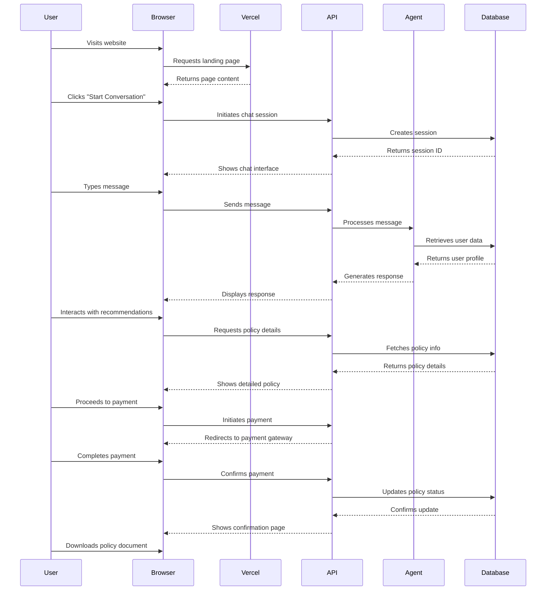
```mermaid
sequenceDiagram
    participant User
    participant Browser
    participant Vercel
    participant API
    participant Agent
    participant Database
    
    User->>Browser: Visits website
    Browser->>Vercel: Requests landing page
    Vercel-->>Browser: Returns page content
    User->>Browser: Clicks "Start Conversation"
    Browser->>API: Initiates chat session
    API->>Database: Creates session
    Database-->>API: Returns session ID
    API-->>Browser: Shows chat interface
    User->>Browser: Types message
    Browser->>API: Sends message
    API->>Agent: Processes message
    Agent->>Database: Retrieves user data
    Database-->>Agent: Returns user profile
    Agent-->>API: Generates response
    API-->>Browser: Displays response
    User->>Browser: Interacts with recommendations
    Browser->>API: Requests policy details
    API->>Database: Fetches policy info
    Database-->>API: Returns policy details
    API-->>Browser: Shows detailed policy
    User->>Browser: Proceeds to payment
    Browser->>API: Initiates payment
    API-->>Browser: Redirects to payment gateway
    User->>Browser: Completes payment
    Browser->>API: Confirms payment
    API->>Database: Updates policy status
    Database-->>API: Confirms update
    API-->>Browser: Shows confirmation page
    User->>Browser: Downloads policy document
```

## Voice Interaction Journey

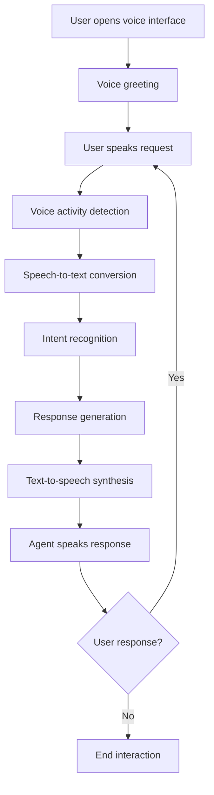
```mermaid
graph TD
    A[User opens voice interface] --> B[Voice greeting]
    B --> C[User speaks request]
    C --> D[Voice activity detection]
    D --> E[Speech-to-text conversion]
    E --> F[Intent recognition]
    F --> G[Response generation]
    G --> H[Text-to-speech synthesis]
    H --> I[Agent speaks response]
    I --> J{User response?}
    J -->|Yes| C
    J -->|No| K[End interaction]
```

## Claims Journey

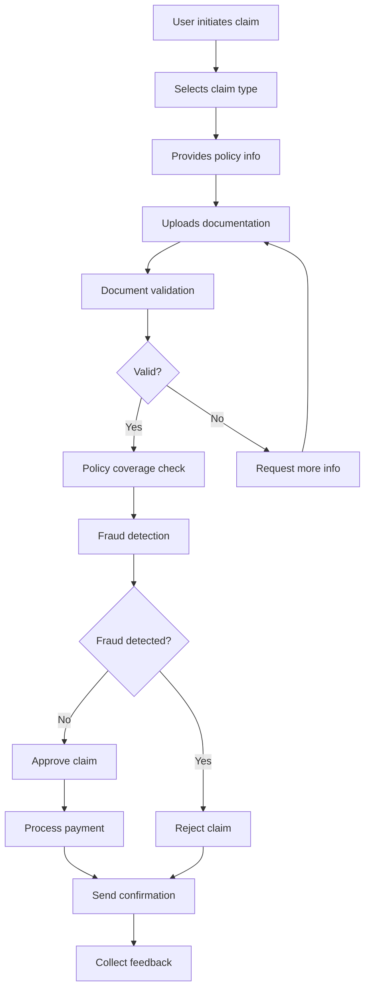
```mermaid
graph TD
    A[User initiates claim] --> B[Selects claim type]
    B --> C[Provides policy info]
    C --> D[Uploads documentation]
    D --> E[Document validation]
    E --> F{Valid?}
    F -->|Yes| G[Policy coverage check]
    F -->|No| H[Request more info]
    H --> D
    G --> I[Fraud detection]
    I --> J{Fraud detected?}
    J -->|Yes| K[Reject claim]
    J -->|No| L[Approve claim]
    L --> M[Process payment]
    M --> N[Send confirmation]
    K --> N
    N --> O[Collect feedback]
```

## Policy Management Journey

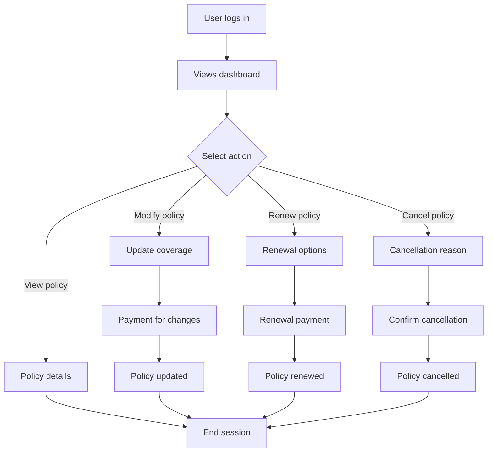
```mermaid
graph TD
    A[User logs in] --> B[Views dashboard]
    B --> C{Select action}
    C -->|View policy| D[Policy details]
    C -->|Modify policy| E[Update coverage]
    C -->|Renew policy| F[Renewal options]
    C -->|Cancel policy| G[Cancellation reason]
    E --> H[Payment for changes]
    F --> I[Renewal payment]
    G --> J[Confirm cancellation]
    D --> K[End session]
    H --> L[Policy updated]
    I --> M[Policy renewed]
    J --> N[Policy cancelled]
    L & M & N --> K
```

## Design System Journey

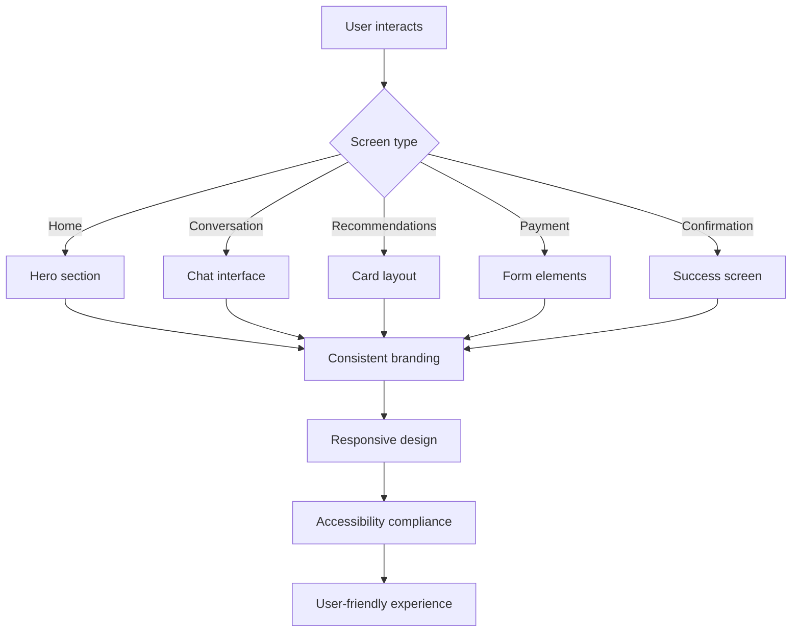
```mermaid
graph TD
    A[User interacts] --> B{Screen type}
    B -->|Home| C[Hero section]
    B -->|Conversation| D[Chat interface]
    B -->|Recommendations| E[Card layout]
    B -->|Payment| F[Form elements]
    B -->|Confirmation| G[Success screen]
    C & D & E & F & G --> H[Consistent branding]
    H --> I[Responsive design]
    I --> J[Accessibility compliance]
    J --> K[User-friendly experience]
```

## Analytics Journey

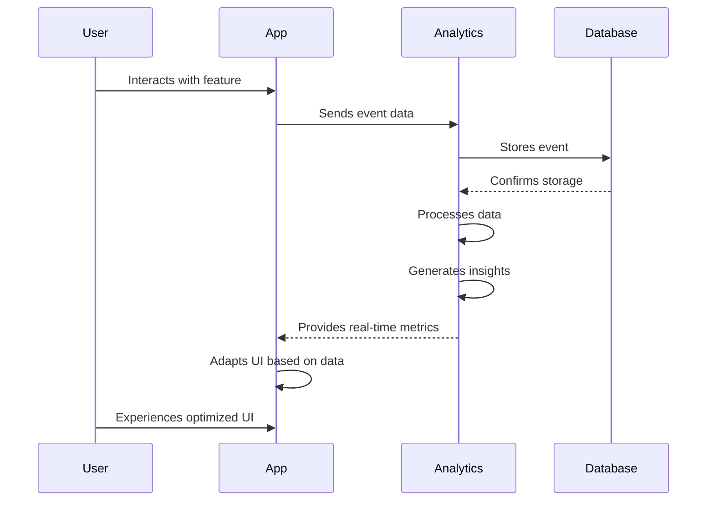
```mermaid
sequenceDiagram
    participant User
    participant App
    participant Analytics
    participant Database
    
    User->>App: Interacts with feature
    App->>Analytics: Sends event data
    Analytics->>Database: Stores event
    Database-->>Analytics: Confirms storage
    Analytics->>Analytics: Processes data
    Analytics->>Analytics: Generates insights
    Analytics-->>App: Provides real-time metrics
    App->>App: Adapts UI based on data
    User->>App: Experiences optimized UI
```

## Security Journey

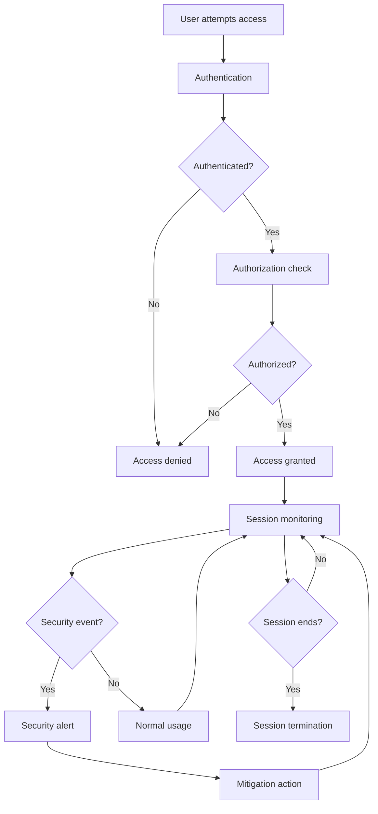
```mermaid
graph TD
    A[User attempts access] --> B[Authentication]
    B --> C{Authenticated?}
    C -->|No| D[Access denied]
    C -->|Yes| E[Authorization check]
    E --> F{Authorized?}
    F -->|No| D
    F -->|Yes| G[Access granted]
    G --> H[Session monitoring]
    H --> I{Security event?}
    I -->|Yes| J[Security alert]
    I -->|No| K[Normal usage]
    J --> L[Mitigation action]
    L --> H
    K --> H
    H --> M{Session ends?}
    M -->|Yes| N[Session termination]
    M -->|No| H
```

## Customer Lifecycle Journey

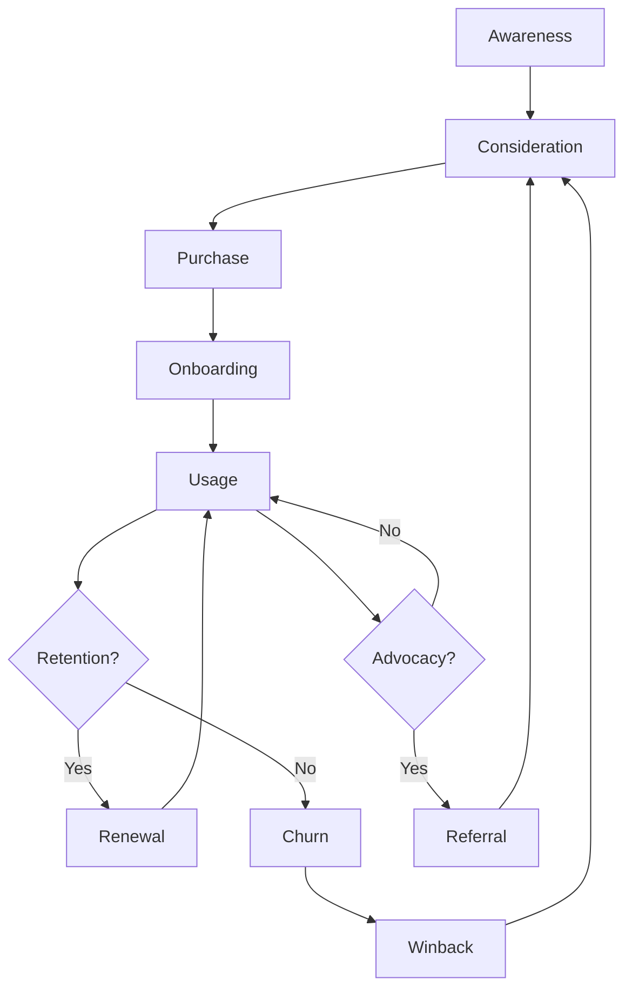
```mermaid
graph TD
    A[Awareness] --> B[Consideration]
    B --> C[Purchase]
    C --> D[Onboarding]
    D --> E[Usage]
    E --> F{Retention?}
    F -->|Yes| G[Renewal]
    F -->|No| H[Churn]
    G --> E
    H --> I[Winback]
    I --> B
    E --> J{Advocacy?}
    J -->|Yes| K[Referral]
    J -->|No| E
    K --> B
```

## Conversion Funnel

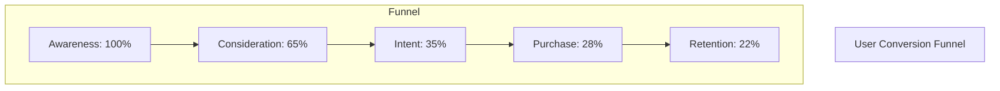
```mermaid
graph TD
    title["User Conversion Funnel"]
    subgraph Funnel
        A["Awareness: 100%"]
        B["Consideration: 65%"]
        C["Intent: 35%"]
        D["Purchase: 28%"]
        E["Retention: 22%"]
    end
    
    A --> B --> C --> D --> E
```

## Accessibility User Journey

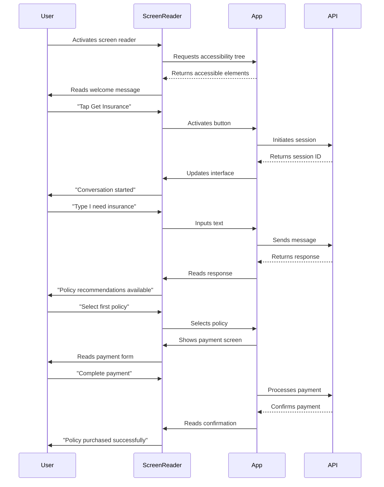
```mermaid
sequenceDiagram
    participant User
    participant ScreenReader
    participant App
    participant API
    
    User->>ScreenReader: Activates screen reader
    ScreenReader->>App: Requests accessibility tree
    App-->>ScreenReader: Returns accessible elements
    ScreenReader->>User: Reads welcome message
    User->>ScreenReader: "Tap Get Insurance"
    ScreenReader->>App: Activates button
    App->>API: Initiates session
    API-->>App: Returns session ID
    App->>ScreenReader: Updates interface
    ScreenReader->>User: "Conversation started"
    User->>ScreenReader: "Type I need insurance"
    ScreenReader->>App: Inputs text
    App->>API: Sends message
    API-->>App: Returns response
    App->>ScreenReader: Reads response
    ScreenReader->>User: "Policy recommendations available"
    User->>ScreenReader: "Select first policy"
    ScreenReader->>App: Selects policy
    App->>ScreenReader: Shows payment screen
    ScreenReader->>User: Reads payment form
    User->>ScreenReader: "Complete payment"
    App->>API: Processes payment
    API-->>App: Confirms payment
    App->>ScreenReader: Reads confirmation
    ScreenReader->>User: "Policy purchased successfully"
```

## Technical User Journey

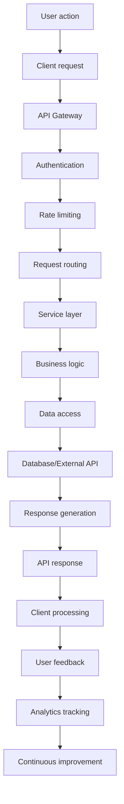
```mermaid
graph TD
    A[User action] --> B[Client request]
    B --> C[API Gateway]
    C --> D[Authentication]
    D --> E[Rate limiting]
    E --> F[Request routing]
    F --> G[Service layer]
    G --> H[Business logic]
    H --> I[Data access]
    I --> J[Database/External API]
    J --> K[Response generation]
    K --> L[API response]
    L --> M[Client processing]
    M --> N[User feedback]
    N --> O[Analytics tracking]
    O --> P[Continuous improvement]
```

## Visual User Journey

### Welcome to Insurance Screen
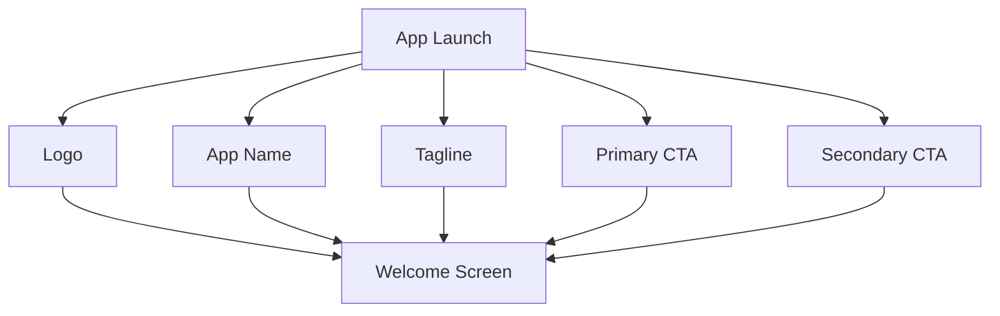
```mermaid
graph TD
    A[App Launch] --> B[Logo]
    A --> C[App Name]
    A --> D[Tagline]
    A --> E[Primary CTA]
    A --> F[Secondary CTA]
    B & C & D & E & F --> G[Welcome Screen]
```

### Conversation Interface
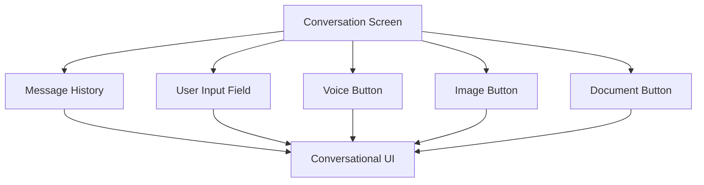
```mermaid
graph TD
    A[Conversation Screen] --> B[Message History]
    A --> C[User Input Field]
    A --> D[Voice Button]
    A --> E[Image Button]
    A --> F[Document Button]
    B & C & D & E & F --> G[Conversational UI]
```

### Payment Screen
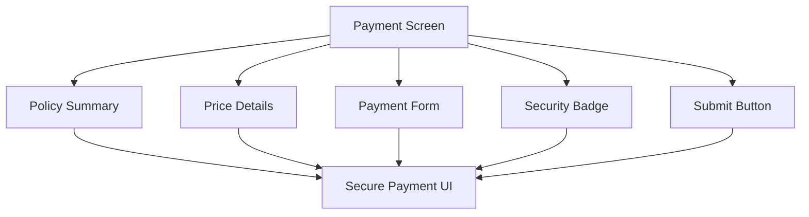
```mermaid
graph TD
    A[Payment Screen] --> B[Policy Summary]
    A --> C[Price Details]
    A --> D[Payment Form]
    A --> E[Security Badge]
    A --> F[Submit Button]
    B & C & D & E & F --> G[Secure Payment UI]
```

### Confirmation Screen
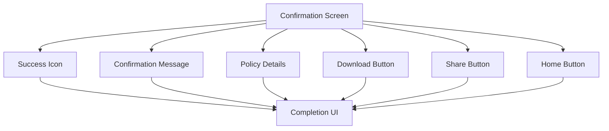
```mermaid
graph TD
    A[Confirmation Screen] --> B[Success Icon]
    A --> C[Confirmation Message]
    A --> D[Policy Details]
    A --> E[Download Button]
    A --> F[Share Button]
    A --> G[Home Button]
    B & C & D & E & F & G --> H[Completion UI]
```

## User Experience Metrics

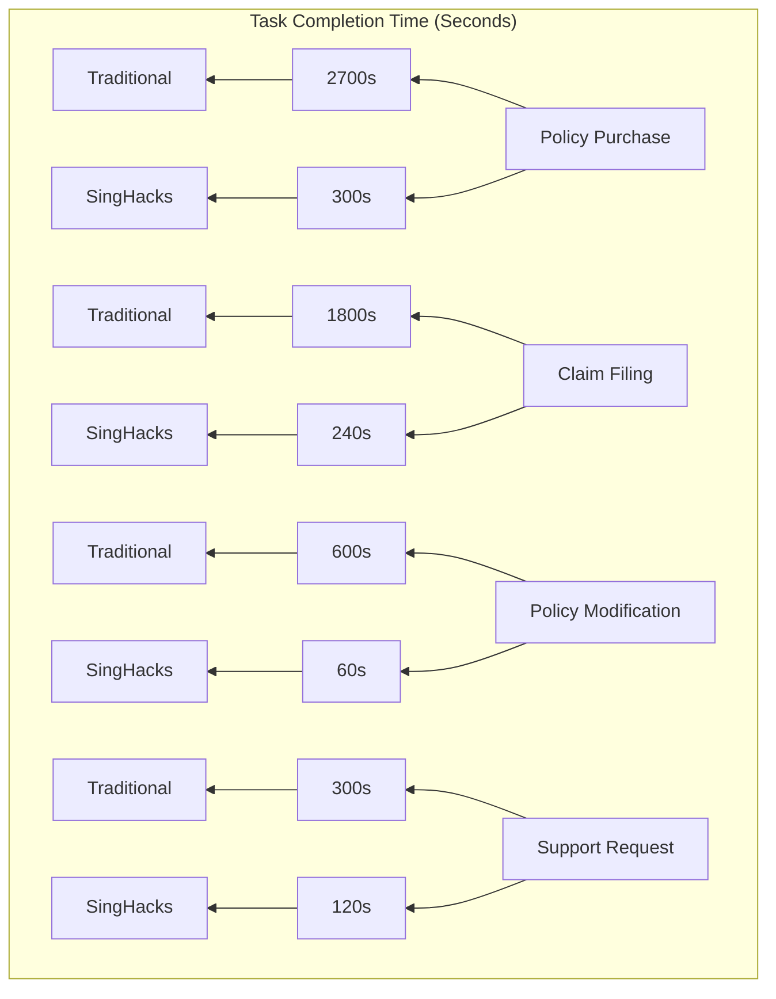
```mermaid
graph TD
    subgraph "Task Completion Time (Seconds)"
        direction RL
        
        %% Policy Purchase
        A1["2700s"] --> B1["Traditional"]
        C1["300s"] --> D1["SingHacks"]
        T1["Policy Purchase"] --> A1
        T1 --> C1
        
        %% Claim Filing
        A2["1800s"] --> B2["Traditional"]
        C2["240s"] --> D2["SingHacks"]
        T2["Claim Filing"] --> A2
        T2 --> C2
        
        %% Policy Modification
        A3["600s"] --> B3["Traditional"]
        C3["60s"] --> D3["SingHacks"]
        T3["Policy Modification"] --> A3
        T3 --> C3
        
        %% Support Request
        A4["300s"] --> B4["Traditional"]
        C4["120s"] --> D4["SingHacks"]
        T4["Support Request"] --> A4
        T4 --> C4
    end
```

## Key User Interactions

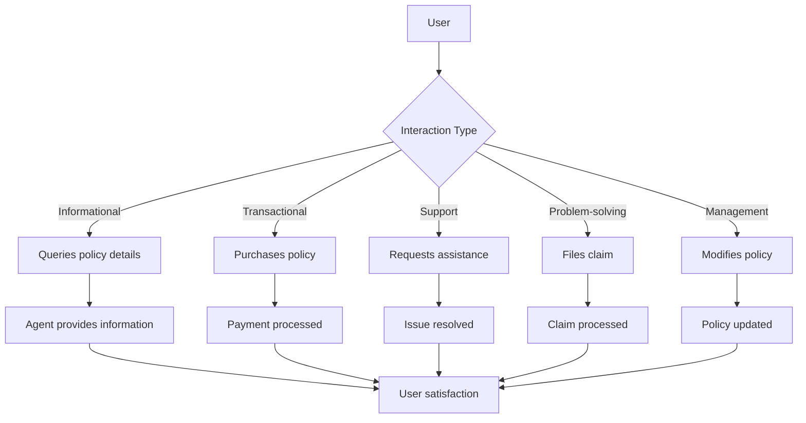
```mermaid
graph TD
    A[User] --> B{Interaction Type}
    B -->|Informational| C[Queries policy details]
    B -->|Transactional| D[Purchases policy]
    B -->|Support| E[Requests assistance]
    B -->|Problem-solving| F[Files claim]
    B -->|Management| G[Modifies policy]
    C --> H[Agent provides information]
    D --> I[Payment processed]
    E --> J[Issue resolved]
    F --> K[Claim processed]
    G --> L[Policy updated]
    H & I & J & K & L --> M[User satisfaction]
```

## Iterative User Journey

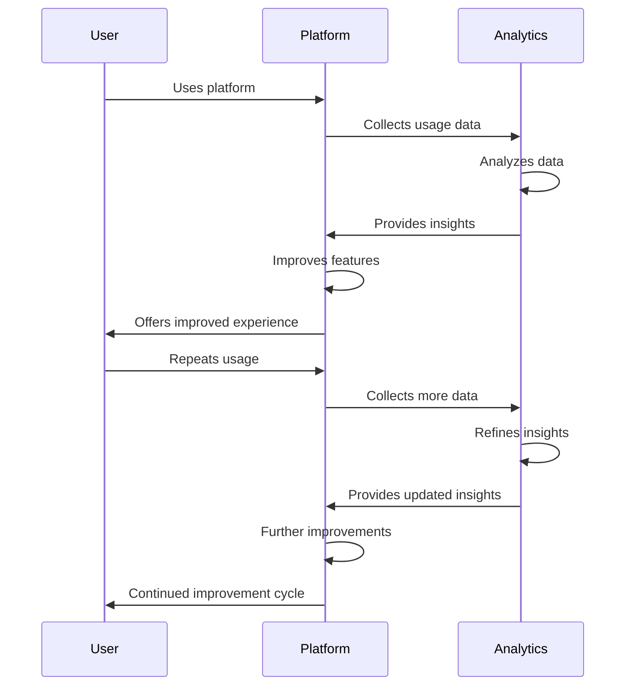
```mermaid
sequenceDiagram
    participant User
    participant Platform
    participant Analytics
    
    User->>Platform: Uses platform
    Platform->>Analytics: Collects usage data
    Analytics->>Analytics: Analyzes data
    Analytics->>Platform: Provides insights
    Platform->>Platform: Improves features
    Platform->>User: Offers improved experience
    User->>Platform: Repeats usage
    Platform->>Analytics: Collects more data
    Analytics->>Analytics: Refines insights
    Analytics->>Platform: Provides updated insights
    Platform->>Platform: Further improvements
    Platform->>User: Continued improvement cycle
```

## Cross-Platform User Journey

```mermaid
graph TD
    A[User starts on web] --> B[Begins conversation]
    B --> C[Pauses interaction]
    C --> D[Opens mobile app]
    D --> E[Resumes conversation]
    E --> F[Completes purchase]
    F --> G[Receives policy]
    G --> H[Travels]
    H --> I[Files claim via mobile]
    I --> J[Tracks claim on web]
    J --> K[Receives payment]
    K --> L[Provides feedback]
    L --> M[End journey]
```

## Design Principles in User Journey

```mermaid
graph TD
    A[User Action] --> B[Design Principle]
    B --> C{Principle Type}
    C -->|Simplicity| D[Minimal steps]
    C -->|Consistency| E[Uniform design]
    C -->|Feedback| F[Real-time updates]
    C -->|Accessibility| G[Inclusive features]
    C -->|Efficiency| H[Fast processing]
    D & E & F & G & H --> I[Positive UX]
    I --> J[User satisfaction]
    J --> K[Repeat usage]
```

## User Journey Heatmap

```mermaid
graph TD
    A[High Engagement] --> B[Conversation]
    A --> C[Policy Selection]
    A --> D[Payment]
    
    E[Medium Engagement] --> F[Welcome Screen]
    E --> G[Policy Details]
    E --> H[Confirmation]
    
    I[Low Engagement] --> J[Account Setup]
    I --> K[Feedback]
    I --> L[Help Center]
    
    B & C & D & F & G & H & J & K & L --> M[Complete Journey]
```

## Privacy-First User Journey

```mermaid
sequenceDiagram
    participant User
    participant Platform
    participant PrivacyManager
    
    User->>Platform: Visits platform
    Platform->>User: Shows privacy notice
    User->>Platform: Accepts privacy policy
    Platform->>PrivacyManager: Records consent
    PrivacyManager-->>Platform: Confirms consent
    Platform->>User: Allows full functionality
    User->>Platform: Provides personal data
    Platform->>PrivacyManager: Processes data request
    PrivacyManager-->>Platform: Validates data usage
    Platform->>Platform: Secures data
    Platform->>User: Continues journey
    User->>Platform: Requests data export
    Platform->>PrivacyManager: Processes export request
    PrivacyManager-->>Platform: Provides data
    Platform->>User: Delivers data export
    User->>Platform: Requests account deletion
    Platform->>PrivacyManager: Processes deletion
    PrivacyManager-->>Platform: Confirms deletion
    Platform->>User: Account deleted
```