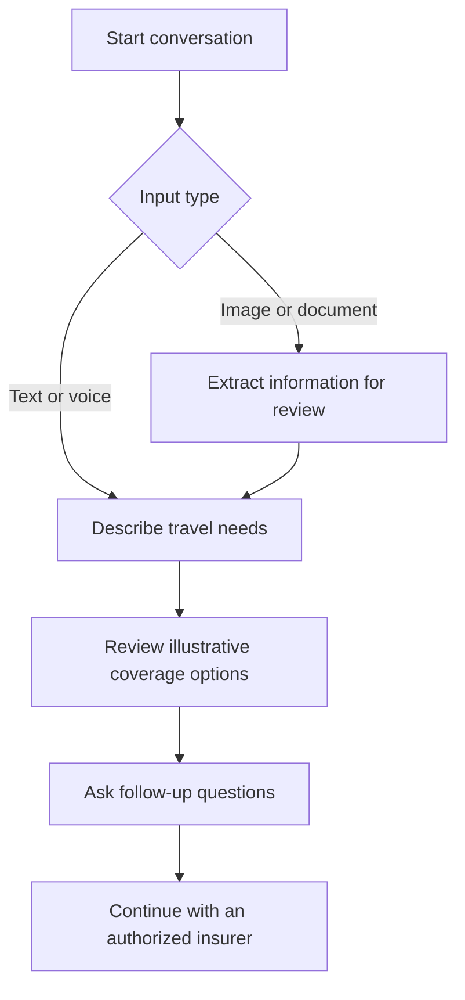
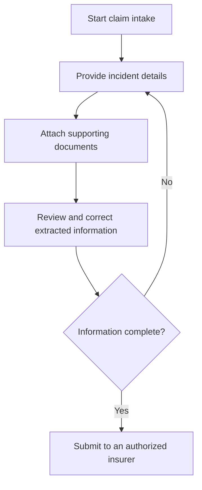
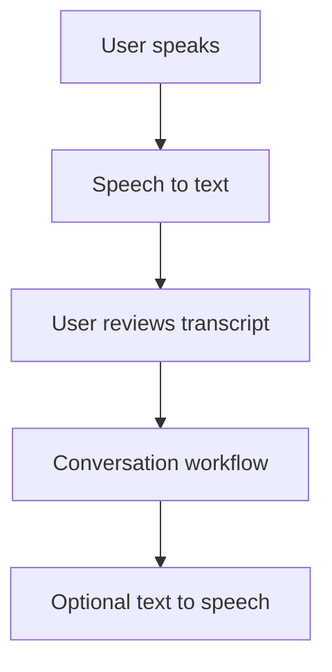

# Prototype User Journeys

## Policy Discovery

## Claim Intake

## Voice Interaction

## Boundaries

- The prototype demonstrates interaction and intake flows.
- Payment, policy issuance, claim decisions, settlement, account management, and analytics are not established as live integrations.
- A production journey would require authorization, consent, accessibility testing, data-protection controls, insurer review, and failure handling.

[Back to user-journey summary](README.md)
