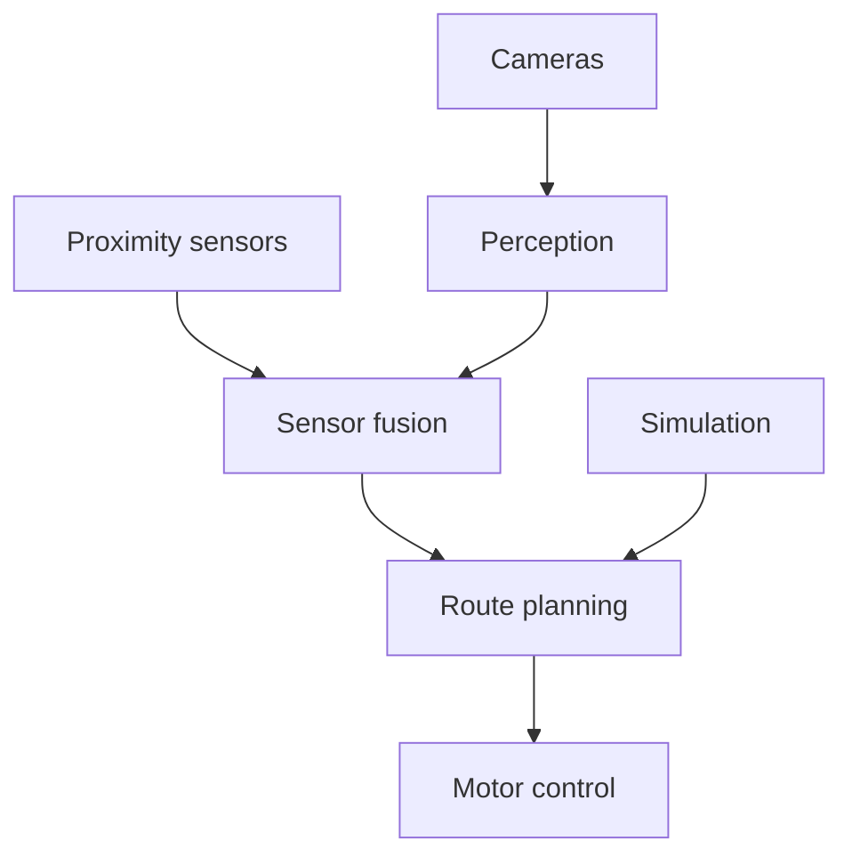

# GalaxyRVR Autonomous Navigation

This hackathon prototype explored cameras, proximity sensors, route planning, and simulation for a small mobile robot. The documentation records the intended design and prototype work; it does not establish hardware validation of autonomous or safety behavior.

## Project Scope

- Global and onboard camera inputs
- Ultrasonic and infrared proximity sensing
- Position estimation
- Waypoint and route planning
- Obstacle detection and avoidance
- Simulation for navigation testing

## System Design

## Technology

The project documentation covers Python, OpenCV, Arduino, serial communication, and camera and proximity sensor integration.

## Limitations

Navigation, sensor fusion, hybrid vision, obstacle avoidance, emergency stopping, low-battery handling, and sensor-failure handling require calibration and hardware testing under defined conditions. Simulation results do not establish physical-robot performance.

## Documentation

- [Project summary](SUMMARY.md)
- [Architecture](architecture/ARCHITECTURE.md)
- [Setup guide](getting-started/setup.md)
- [Navigation](features/navigation.md)
- [Sensors](features/sensors.md)
- [Simulation](features/simulation.md)
- [Vision](features/vision.md)

## License

This project documentation is covered by the repository [MIT License](../../LICENSE).
