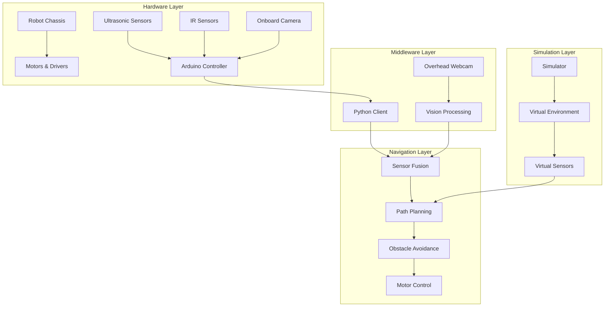
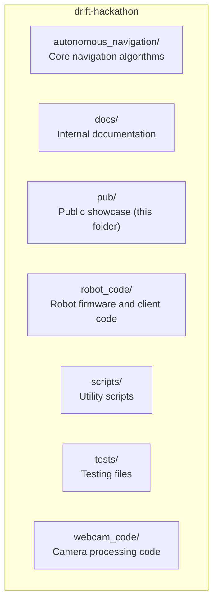

# GalaxyRVR Autonomous Navigation System

A cutting-edge autonomous navigation system for small robots, combining computer vision, sensor fusion, and advanced path planning to enable precise movement in complex environments.

## Overview

GalaxyRVR is an autonomous navigation platform designed for small robots, featuring:
- **Hybrid Vision System**: Combines overhead (global view) and onboard (local view) cameras for robust navigation
- **Sensor Fusion**: Integrates ultrasonic, infrared, and vision sensors for comprehensive environmental awareness
- **Advanced Path Planning**: Generates optimal paths while avoiding obstacles in real-time
- **Simulation Environment**: Test navigation algorithms in a virtual environment without physical hardware
- **Modular Architecture**: Easy to extend and customize for different robot platforms

## Key Features

### Autonomous Navigation
- Precise target tracking and waypoint navigation
- Real-time obstacle detection and avoidance
- Dynamic path planning with replanning capabilities
- Dead reckoning for reliable position estimation

### Vision System
- Color-based target detection
- Line following capabilities
- Arena mapping and localization
- Calibration tools for camera setup

### Simulation
- Virtual environment for algorithm testing
- Physics-based robot movement simulation
- Sensor data simulation
- Performance metrics and visualization

### Sensor Integration
- Ultrasonic sensors for forward obstacle detection
- Infrared sensors for side obstacle detection
- Camera-based vision systems
- Arduino-based sensor firmware

## Architecture

GalaxyRVR follows a modular architecture with clear separation of concerns:

## Getting Started

### Prerequisites
- Python 3.8+
- OpenCV 4.0+
- Arduino IDE (for robot firmware)
- Git

### Installation

1. Clone the repository
2. Install Python dependencies
3. Upload Arduino firmware

### Quick Start

1. **Simulation Mode** (no hardware required)
2. **Real Hardware Mode**

## Documentation

- [Architecture Details](architecture/ARCHITECTURE.md)
- [Navigation Features](features/navigation.md)
- [Simulation Environment](features/simulation.md)
- [Vision System](features/vision.md)
- [Sensor Integration](features/sensors.md)
- [Getting Started Guide](getting-started/setup.md)

## Project Structure

## License

This project is licensed under the MIT License - see the [LICENSE](LICENSE) file for details.

## Acknowledgments

- OpenCV for computer vision capabilities
- Arduino for hardware control
- Contributors to the GalaxyRVR project
