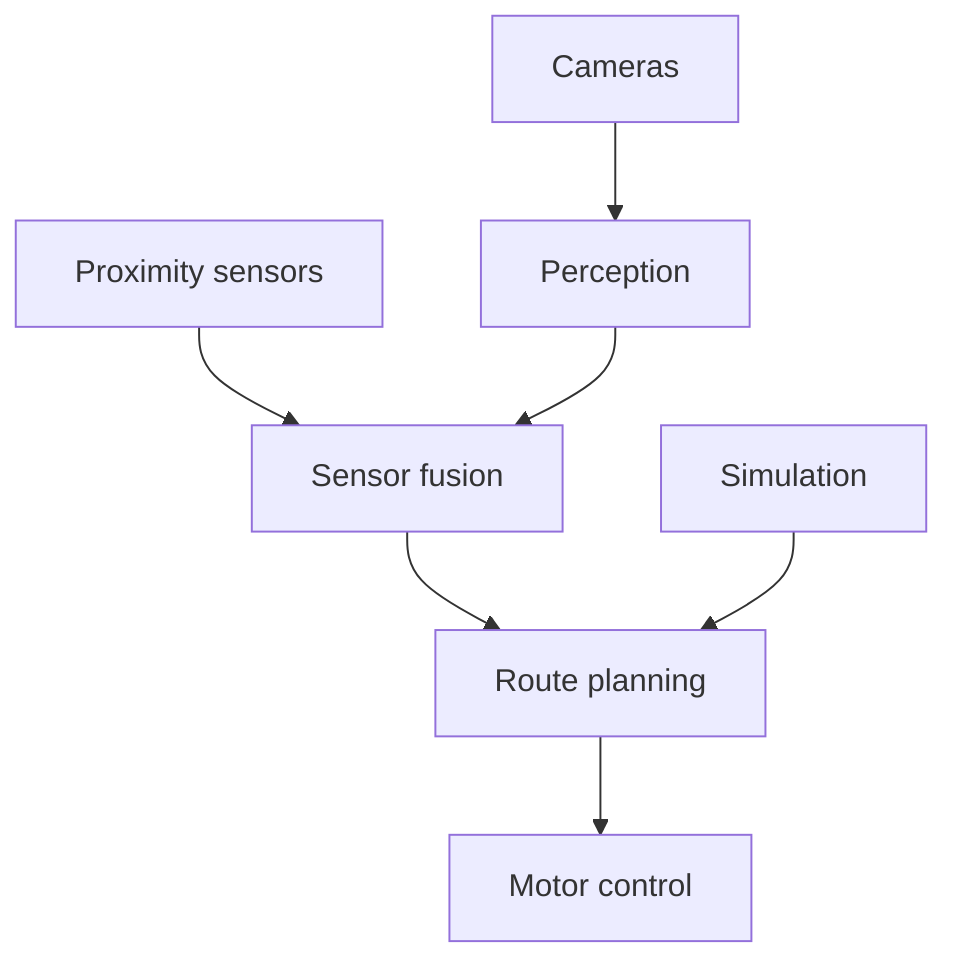

# GalaxyRVR Autonomous Navigation

This hackathon project combined cameras, proximity sensors, route planning, and simulation to navigate a small mobile robot.

## Project Scope

- Global and onboard camera inputs
- Ultrasonic and infrared proximity sensing
- Position estimation
- Waypoint and route planning
- Obstacle detection and avoidance
- Simulation for navigation testing

## System Design

## Technology

The project documentation covers Python, OpenCV, Arduino, serial communication, and camera and proximity sensor integration.

## License

This project documentation is covered by the repository [MIT License](../../LICENSE).
