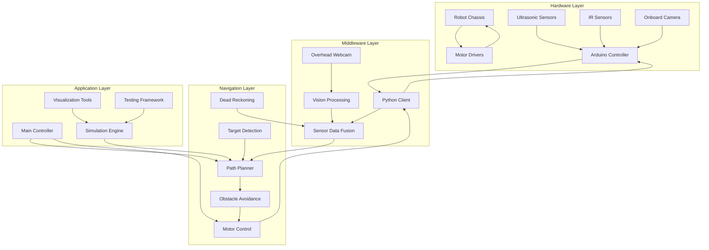
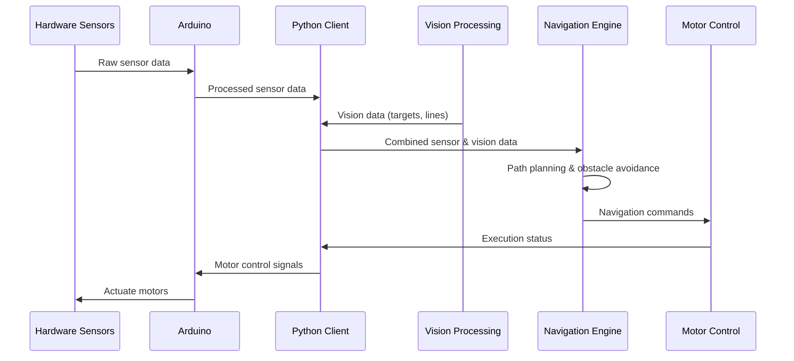

# GalaxyRVR Architecture

This document provides a comprehensive overview of the GalaxyRVR autonomous navigation system architecture, including its components, data flow, and integration patterns.

## System Overview

GalaxyRVR is built on a modular architecture that separates concerns and enables flexible extension. The system consists of four main layers:

1. **Hardware Layer**: Physical robot components and sensors
2. **Middleware Layer**: Communication interfaces and data processing
3. **Navigation Layer**: Core algorithms for path planning and control
4. **Application Layer**: User interfaces and simulation tools

## Architecture Diagram

## Component Details

### 1. Hardware Layer

#### Robot Chassis
- Compact, lightweight design
- Differential drive system
- Mounting points for sensors and cameras
- Power management system

#### Sensors
- **Ultrasonic Sensors**: Measure distance to forward obstacles
- **IR Sensors**: Detect obstacles on left and right sides
- **Onboard Camera**: Capture local environment view

#### Arduino Controller
- Low-level hardware control
- Sensor data acquisition
- Communication with Python client
- Motor control signals

### 2. Middleware Layer

#### Python Client
- High-level robot control interface
- Data communication with Arduino
- Command processing and execution

#### Vision Processing
- Image capture from overhead webcam
- Arena mapping and localization
- Target detection and tracking
- Line detection for navigation

#### Sensor Data Fusion
- Combine data from multiple sensors
- Filter and process sensor readings
- Provide unified view of environment
- Handle sensor calibration

### 3. Navigation Layer

#### Path Planner
- Generate optimal paths to targets
- Consider obstacle positions
- Support dynamic replanning
- Path smoothing algorithms

#### Obstacle Avoidance
- Real-time obstacle detection
- Path adjustment based on sensor data
- Collision avoidance strategies
- Emergency stop mechanisms

#### Motor Control
- Convert navigation commands to motor signals
- Speed and direction control
- PID control for smooth movement
- Motor synchronization

#### Dead Reckoning
- Estimate robot position from wheel movements
- Compensate for camera delays
- Enhance navigation accuracy

#### Target Detection
- Identify colored targets in camera view
- Calculate target position and distance
- Track multiple targets simultaneously

### 4. Application Layer

#### Main Controller
- Central system coordination
- Navigation loop management
- Error handling and recovery
- System status monitoring

#### Simulation Engine
- Virtual environment for testing
- Physics-based movement simulation
- Sensor data simulation
- Algorithm validation

#### Visualization Tools
- Real-time navigation visualization
- Path and obstacle display
- Performance metrics visualization
- Camera feed display

#### Testing Framework
- Unit tests for components
- Integration tests for system
- Visual tests for navigation scenarios
- Performance benchmarking

## Data Flow

The system follows a clear data flow pattern:

## Integration Patterns

### Communication Protocols
- **Arduino-Python**: Serial communication
- **Camera-Python**: OpenCV video capture
- **Module-Module**: In-memory data structures

### Data Formats
- Sensor data: JSON-like structures
- Image data: OpenCV matrices
- Navigation commands: Structured objects

### Module Interfaces
- Clear function signatures and APIs
- Well-defined data contracts
- Error handling and validation
- Logging and debugging support

## Extensibility

The architecture is designed for easy extension:

- **New Sensors**: Add sensor drivers and update sensor fusion
- **New Navigation Algorithms**: Implement path planner interface
- **New Robot Platforms**: Adapt motor control and hardware abstraction
- **New Features**: Add modules to application layer

## Performance Considerations

- Real-time processing requirements
- Low-latency communication
- Memory and CPU usage optimization
- Error tolerance and recovery mechanisms

## Safety Features

- Emergency stop functionality
- Collision avoidance protocols
- Sensor redundancy
- System health monitoring
