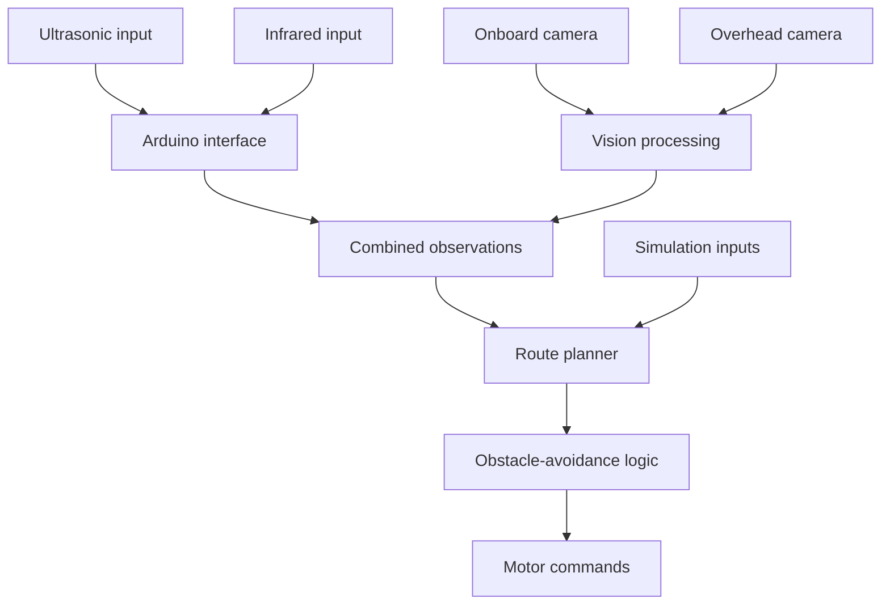

# GalaxyRVR Prototype Architecture

GalaxyRVR is a hackathon prototype for exploring navigation of a small differential-drive robot. This document describes the intended component boundaries and data flow, not a hardware-validated autonomous system.

## Design

## Prototype Components

### Hardware Interface

- Differential-drive chassis and motor control
- Arduino sensor acquisition and serial communication
- Ultrasonic and infrared proximity inputs
- Onboard and overhead camera inputs

### Perception Design

- Color and contour processing for target candidates
- Line detection for structured routes
- Perspective transformation for an overhead arena view
- Combined camera and proximity observations for planning

The phrase "sensor fusion" describes this intended combination of observations. The documentation does not establish a calibrated fusion model, confidence calibration, redundancy guarantee, or measured localization improvement.

### Navigation Design

- Waypoint and route planning
- Position estimation from camera and wheel information
- Path adjustment from proximity observations
- Translation of navigation output into motor commands

These behaviors were designed or prototyped. Accuracy, stopping distance, collision avoidance, target tracking, and operation under changing conditions require physical testing.

### Simulation

The simulation represents robot movement, obstacles, and sensor inputs so navigation logic can be exercised without hardware. Its physics and sensor models must be compared with physical measurements before simulation results can support hardware conclusions.

## Safety Boundaries

Emergency-stop, manual-override, sensor-failure, low-battery, collision-detection, and health-monitoring behavior appear as design requirements in the prototype documentation. Their implementation and effectiveness are not established. A physical system requires fail-safe design, independent stopping controls, fault injection, and measured tests before operation around people or property.

## Interfaces

- Arduino to Python: serial messages
- Cameras to Python: OpenCV capture
- Internal modules: in-memory structures for observations and commands

Exact schemas, validation, timing, and error behavior should be checked against the implementation.

## Future Validation

- Define the robot, sensor placement, lighting, surface, speed, and obstacle test conditions.
- Measure sensor error, localization error, loop latency, and stopping distance.
- Compare simulation trajectories with physical runs.
- Inject stale, missing, contradictory, and out-of-range sensor data.
- Verify manual stopping and power-loss behavior independently of navigation logic.

[Back to project overview](../README.md)
