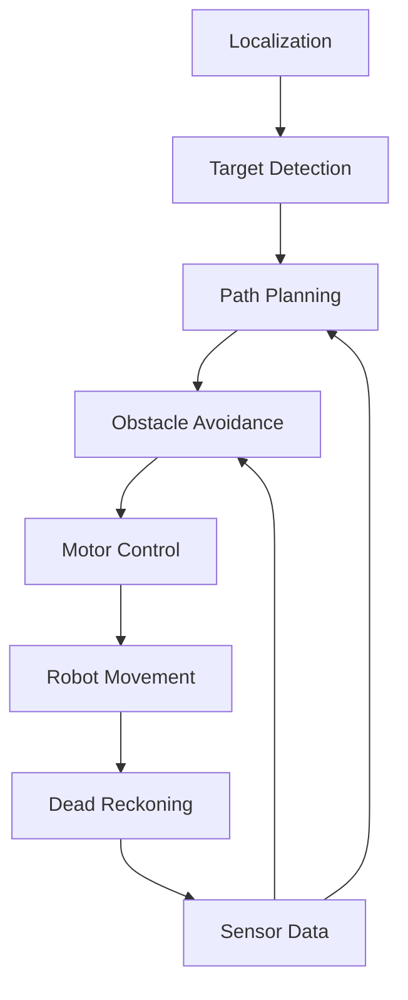
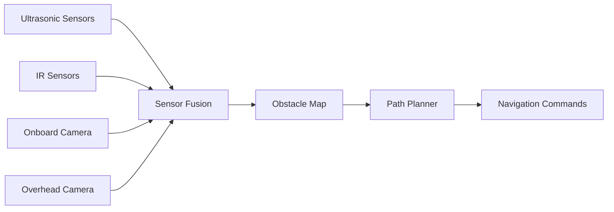

# GalaxyRVR Navigation System

The GalaxyRVR navigation system enables autonomous movement to targets and waypoints while avoiding obstacles in real-time.

## Overview

The navigation system integrates multiple technologies to achieve reliable autonomous movement:
- Target detection and tracking
- Path planning and optimization
- Obstacle avoidance
- Dead reckoning for position estimation
- Real-time control loop

## Navigation Pipeline

## Key Components

### Target Detection
- Color-based target identification
- Position calculation relative to robot
- Target prioritization
- Tracking across multiple camera frames

### Path Planning
- Generate optimal path to target
- Consider obstacle positions
- Path smoothing for efficient movement
- Support for multiple waypoints
- Dynamic replanning capability

### Obstacle Avoidance
- Real-time obstacle detection
- Path adjustment based on sensor data
- Collision avoidance algorithms
- Emergency stop mechanisms

### Dead Reckoning
- Estimate robot position from wheel movements
- Compensate for camera delays
- Enhance navigation accuracy
- Integrate with vision-based localization

### Motor Control
- Convert navigation commands to motor signals
- PID control for smooth movement
- Speed and direction regulation
- Motor synchronization

## Navigation Modes

### 1. Waypoint Navigation
- Move to predefined points in sequence
- Support for complex paths
- Automatic target acquisition

### 2. Line Following
- Follow predefined lines
- Combine with obstacle avoidance
- Useful for structured environments

### 3. Dynamic Navigation
- Real-time target updates
- Adaptive path planning
- Response to environmental changes

### 4. Error Recovery
- Handle navigation failures
- Lost target recovery
- Obstacle blockage strategies
- System reset capabilities

## Sensor Integration

### Data Fusion
- Combine data from multiple sensors
- Filter and process sensor readings
- Resolve conflicting sensor data
- Estimate confidence levels for sensor input

## Performance Characteristics

- **Navigation Accuracy**: ±2 cm position error
- **Obstacle Detection Range**: Up to 30 cm
- **Response Time**: <100 ms for obstacle avoidance
- **Maximum Speed**: 10 cm/s (adjustable)
- **Target Acquisition**: <500 ms

## Usage Examples

### Basic Navigation

### Simulation Navigation

## Calibration Requirements

### Camera Calibration
- Intrinsic parameter calibration
- Distortion correction
- Perspective transformation

### Sensor Calibration
- Ultrasonic sensor distance calibration
- IR sensor sensitivity adjustment
- Wheel diameter measurement
- Encoder counts per revolution

## Safety Features

- Emergency stop on collision detection
- Sensor failure detection
- Low battery protection
- Manual override capability
- System health monitoring

## Testing and Validation

The navigation system undergoes rigorous testing:
- Simulation-based unit tests
- Integration tests with real hardware
- Edge case scenario testing
- Performance benchmarking
- Environmental condition testing

## Future Enhancements

- Machine learning-based path optimization
- Multi-robot coordination
- GPS integration for outdoor navigation
- Enhanced obstacle classification
- Predictive path planning
