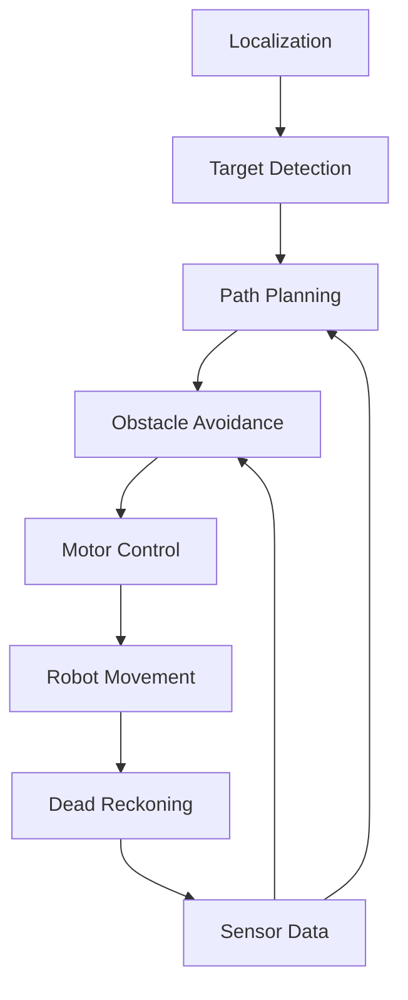
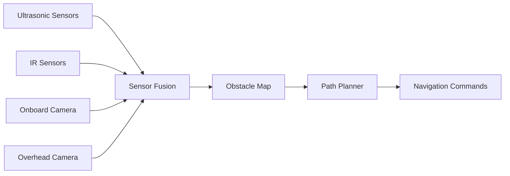

# GalaxyRVR Navigation System

The GalaxyRVR hackathon prototype explores movement toward targets and waypoints with obstacle-avoidance logic. The behavior described here is designed or prototyped rather than established by a documented hardware validation.

## Overview

The navigation system integrates:
- Target detection and tracking
- Path planning and optimization
- Obstacle avoidance
- Dead reckoning for position estimation
- Real-time control loop

## Navigation Pipeline

## Key Components

### Target Detection
- Color-based target identification
- Position calculation relative to robot
- Target prioritization
- Tracking across multiple camera frames

### Path Planning
- Generate a path to the target
- Consider obstacle positions
- Path smoothing for efficient movement
- Support for multiple waypoints
- Dynamic replanning capability

### Obstacle-Avoidance Design
- Real-time obstacle detection
- Path adjustment based on sensor data
- Collision avoidance algorithms
- Proposed emergency-stop trigger

### Dead Reckoning
- Estimate robot position from wheel movements
- Compensate for camera delays
- Compare wheel-based and vision-based position estimates
- Integrate with vision-based localization

### Motor Control
- Convert navigation commands to motor signals
- PID control for smooth movement
- Speed and direction regulation
- Motor synchronization

## Navigation Modes

### 1. Waypoint Navigation
- Move to predefined points in sequence
- Support for complex paths
- Automatic target acquisition

### 2. Line Following
- Follow predefined lines
- Combine with obstacle avoidance
- Useful for structured environments

### 3. Dynamic Navigation
- Real-time target updates
- Adaptive path planning
- Response to environmental changes

### 4. Proposed Error Recovery
- Handle navigation failures
- Lost target recovery
- Obstacle blockage strategies
- System reset capabilities

## Sensor Integration

### Data Fusion
- Combine data from multiple sensors
- Filter and process sensor readings
- Resolve conflicting sensor data
- Estimate confidence levels for sensor input

## Operating Parameters

Position error, obstacle range, control-loop latency, target-acquisition time, and safe speed depend on calibration, lighting, surface, sensor placement, and hardware. The hackathon documentation does not provide a reproducible benchmark for these values.

## Usage Examples

### Basic Navigation

### Simulation Navigation

## Calibration Requirements

### Camera Calibration
- Intrinsic parameter calibration
- Distortion correction
- Perspective transformation

### Sensor Calibration
- Ultrasonic sensor distance calibration
- IR sensor sensitivity adjustment
- Wheel diameter measurement
- Encoder counts per revolution

## Proposed Safety Requirements

- Emergency stop on collision detection
- Sensor failure detection
- Low battery protection
- Manual override capability
- System health monitoring

Implementation and effectiveness of these controls are not established. Physical operation requires independent stop controls and tests for sensor, power, communication, and control failures.

## Validation Needed

- Compare simulated paths with measured hardware runs.
- Test stopping distance and manual override under defined speeds and surfaces.
- Record localization error and control-loop latency under named conditions.
- Exercise lost-target, blocked-path, sensor-failure, and low-battery cases.

## Future Enhancements

- Machine learning-based path optimization
- Multi-robot coordination
- GPS integration for outdoor navigation
- Enhanced obstacle classification
- Predictive path planning
