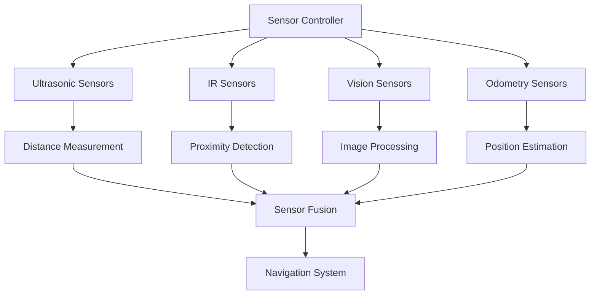
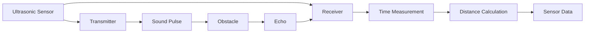
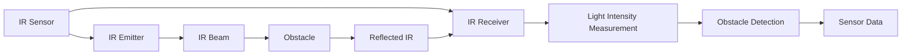
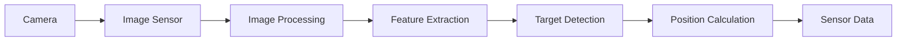
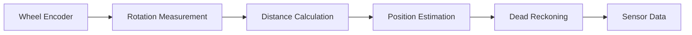
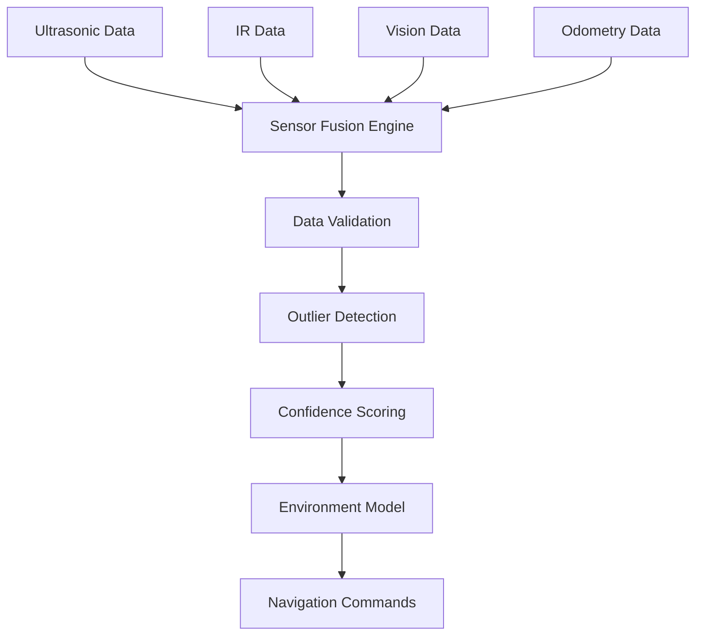

# GalaxyRVR Sensor System

The GalaxyRVR sensor system provides the robot with environmental awareness, enabling it to detect obstacles, measure distances, and navigate safely in complex environments.

## Sensor System Overview

GalaxyRVR integrates multiple sensor types to create a comprehensive understanding of its surroundings:

1. **Ultrasonic Sensors**: Measure distance to forward obstacles
2. **Infrared (IR) Sensors**: Detect obstacles on left and right sides
3. **Vision Sensors**: Cameras for target detection and localization
4. **Odometry Sensors**: Wheel encoders for dead reckoning

## Sensor Architecture

## Sensor Details

### 1. Ultrasonic Sensors

- **Working Principle**: Emits sound waves and measures echo time
- **Detection Range**: 2-300 cm
- **Accuracy**: ±1 cm
- **Update Rate**: 10 Hz
- **Usage**: Forward obstacle detection

### 2. Infrared (IR) Sensors

- **Working Principle**: Measures reflected infrared light intensity
- **Detection Range**: 10-80 cm
- **Update Rate**: 20 Hz
- **Usage**: Side obstacle detection
- **Features**: Digital and analog output modes

### 3. Vision Sensors

- **Camera Types**: Overhead (global view) and onboard (local view)
- **Resolution**: VGA (640x480) or higher
- **Frame Rate**: 30 fps
- **Usage**: Target detection, line following, localization

### 4. Odometry Sensors

- **Working Principle**: Counts wheel rotations
- **Accuracy**: Dependent on wheel size and terrain
- **Update Rate**: 100 Hz
- **Usage**: Dead reckoning, position estimation

## Sensor Fusion

Sensor fusion combines data from multiple sensors to create a more accurate and reliable understanding of the environment:

### Fusion Benefits
- **Increased Accuracy**: Combined data reduces individual sensor errors
- **Enhanced Reliability**: Redundancy improves system robustness
- **Better Coverage**: Multiple sensors provide complete environment awareness
- **Reduced Uncertainty**: Confidence scoring improves decision making

## Sensor Calibration

### 1. Ultrasonic Calibration

- Distance measurement calibration
- Temperature compensation
- Sensitivity adjustment

### 2. IR Sensor Calibration

- Threshold setting
- Sensitivity adjustment
- Environmental compensation

### 3. Camera Calibration

- Lens distortion correction
- Perspective transformation
- Color calibration

## Sensor Data Processing

### Signal Processing
- Noise filtering
- Signal amplification
- Threshold detection
- Data validation

### Data Format
- Distance measurements (cm)
- Proximity flags (binary)
- Image data (pixels)
- Encoder counts

### Communication Protocol
- Serial communication (Arduino-Python)
- Digital and analog signals
- Data packet structure
- Error checking mechanisms

## Performance Characteristics

- **Total Sensor Update Rate**: 50 Hz combined
- **Latency**: <50 ms from sensor to navigation system
- **Power Consumption**: Optimized for battery operation
- **Environmental Resistance**: Dust and vibration resistant

## Integration with Navigation

### Obstacle Avoidance
- Ultrasonic data for forward obstacles
- IR data for side obstacles
- Vision data for distant obstacles

### Path Planning
- Sensor data updates obstacle map
- Dynamic path replanning
- Safe distance calculations

### Motor Control
- Sensor triggers for emergency stops
- Proximity warnings for speed adjustments
- Collision detection for immediate action

## Future Enhancements

- **3D Depth Sensors**: Add depth perception
- **IMU Integration**: Improve orientation sensing
- **Lidar Sensors**: Enhanced obstacle detection
- **Environmental Sensors**: Temperature, humidity, etc.
- **Wireless Sensor Network**: Expand sensing capabilities
