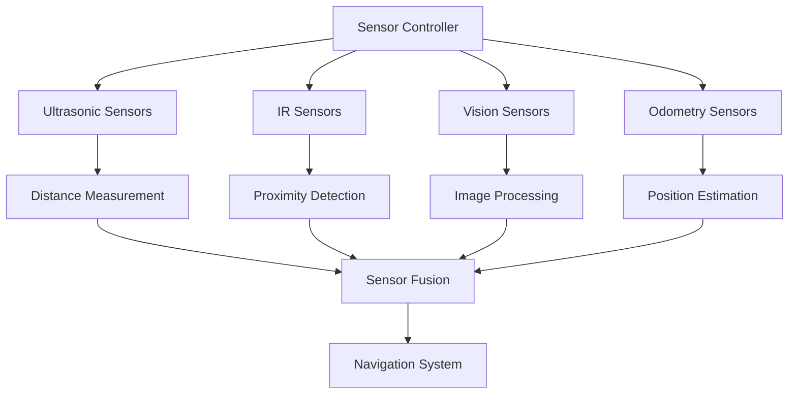
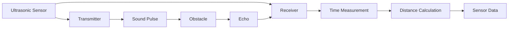
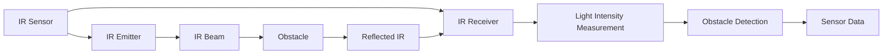
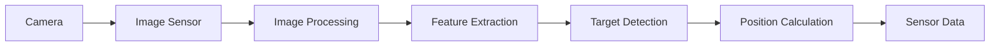
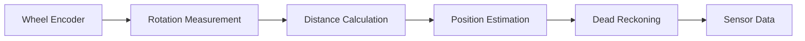
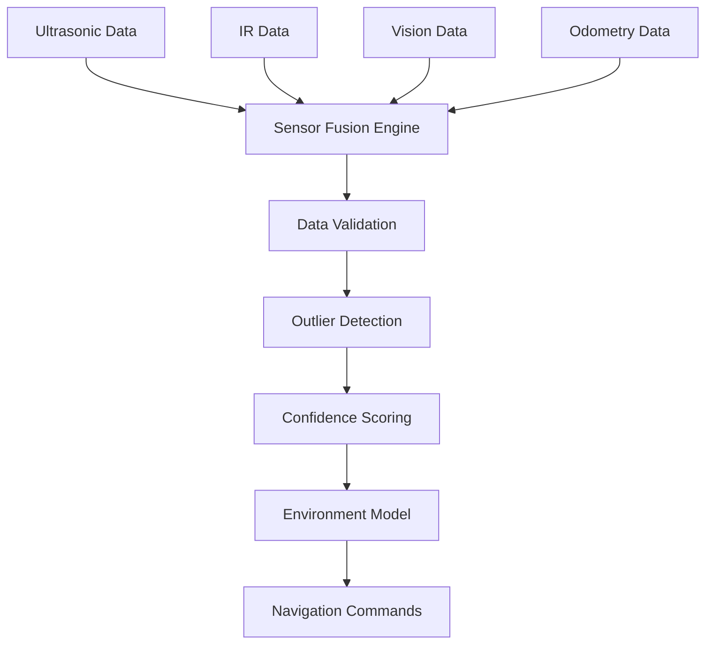

# GalaxyRVR Sensor System

The GalaxyRVR prototype combines proximity, camera, and odometry inputs for navigation experiments. The documentation does not establish safe navigation or calibrated hardware performance.

## Sensor System Overview

GalaxyRVR integrates multiple sensor types to observe its surroundings:

1. **Ultrasonic Sensors**: Measure distance to forward obstacles
2. **Infrared (IR) Sensors**: Detect obstacles on left and right sides
3. **Vision Sensors**: Cameras for target detection and localization
4. **Odometry Sensors**: Wheel encoders for dead reckoning

## Sensor Architecture

## Sensor Details

### 1. Ultrasonic Sensors

- **Working Principle**: Emits sound waves and measures echo time
- **Nominal Range**: Use the selected sensor's data sheet as a starting point, then calibrate on the robot
- **Update Rate**: Configurable in the sensor loop
- **Usage**: Forward obstacle detection

### 2. Infrared (IR) Sensors

- **Working Principle**: Measures reflected infrared light intensity
- **Range**: Depends on the selected sensor, target reflectivity, and calibration
- **Update Rate**: Configurable in the sensor loop
- **Usage**: Side obstacle detection
- **Features**: Digital and analog output modes

### 3. Vision Sensors

- **Camera Types**: Overhead (global view) and onboard (local view)
- **Resolution and Frame Rate**: Selected according to camera and compute limits
- **Usage**: Target detection, line following, localization

### 4. Odometry Sensors

- **Working Principle**: Counts wheel rotations
- **Accuracy**: Dependent on wheel size and terrain
- **Update Rate**: Selected according to encoder and controller limits
- **Usage**: Dead reckoning, position estimation

## Sensor Fusion

The sensor-fusion design combines observations from multiple inputs:

### Intended Fusion Benefits
- Compare overlapping observations from different sensors.
- Extend observation coverage beyond one sensor type.
- Attach confidence information to inputs used by navigation logic.

Accuracy and fault tolerance require calibration, conflict-handling rules, and hardware tests; they are not established by the architecture alone.

## Sensor Calibration

### 1. Ultrasonic Calibration

- Distance measurement calibration
- Temperature compensation
- Sensitivity adjustment

### 2. IR Sensor Calibration

- Threshold setting
- Sensitivity adjustment
- Environmental compensation

### 3. Camera Calibration

- Lens distortion correction
- Perspective transformation
- Color calibration

## Sensor Data Processing

### Signal Processing
- Noise filtering
- Signal amplification
- Threshold detection
- Data validation

### Data Format
- Distance measurements (cm)
- Proximity flags (binary)
- Image data (pixels)
- Encoder counts

### Communication Protocol
- Serial communication (Arduino-Python)
- Digital and analog signals
- Data packet structure
- Error checking mechanisms

## Performance Evaluation

Update rate, end-to-end latency, power use, dust exposure, and vibration tolerance require measurement on the assembled robot. The prototype documentation does not establish environmental ratings.

## Integration with Navigation

### Obstacle Avoidance
- Ultrasonic data for forward obstacles
- IR data for side obstacles
- Vision data for distant obstacles

### Path Planning
- Sensor data updates obstacle map
- Dynamic path replanning
- Configurable distance thresholds for obstacle-avoidance experiments

### Motor Control
- Sensor inputs to proposed emergency-stop logic
- Proximity warnings for speed adjustments
- Collision detection for immediate action

## Future Enhancements

- **3D Depth Sensors**: Add depth perception
- **IMU Integration**: Improve orientation sensing
- **Lidar Sensors**: Enhanced obstacle detection
- **Environmental Sensors**: Temperature, humidity, etc.
- **Wireless Sensor Network**: Expand sensing capabilities
