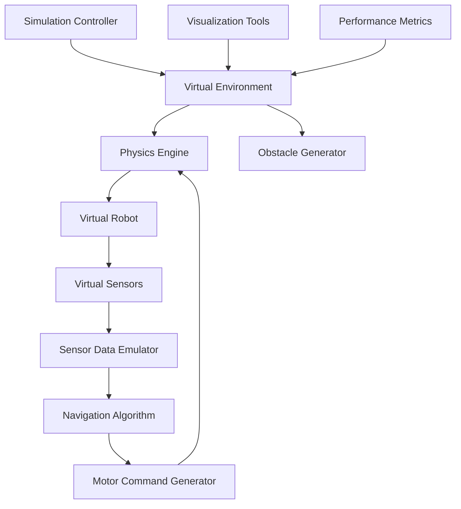
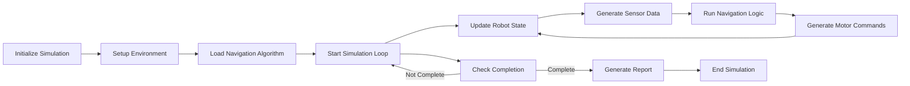

# GalaxyRVR Simulation

The GalaxyRVR simulation environment provides a virtual testing platform for autonomous navigation algorithms, allowing developers to test and refine their code without physical hardware.

## Overview

The simulation environment replicates the physical robot and its environment in software, including:
- Physics-based robot movement
- Sensor data simulation
- Virtual arena with obstacles
- Performance metrics and visualization
- Integration with real navigation algorithms

## Simulation Architecture

## Key Features

### Virtual Environment
- Configurable arena dimensions
- Dynamic obstacle generation
- Target placement and management
- Lighting and camera perspective simulation

### Physics Simulation
- Realistic robot movement physics
- Friction and inertia modeling
- Motor speed and acceleration limits
- Collision detection

### Sensor Simulation
- Ultrasonic sensor distance simulation
- IR sensor obstacle detection
- Camera image generation
- Sensor noise and error modeling

### Integration
- Direct integration with navigation algorithms
- Same API as physical robot
- Seamless transition between simulation and real hardware
- Debug information and visualization

## Technical Implementation

### Simulated Robot Model

### Simulation Loop

## Usage

### Running a Simulation

### Configuration Options

### Available Simulation Scenarios

1. **Basic Navigation**: Move to a single target
2. **Obstacle Course**: Navigate through multiple obstacles
3. **Dynamic Environment**: Obstacles change during simulation
4. **Line Following**: Follow predefined lines to targets

## Performance Metrics

The simulation provides detailed performance metrics:

- Navigation time to target
- Path length efficiency
- Number of collisions
- Sensor usage statistics
- Algorithm computation time
- Path smoothness measurements

## Visualization

### Real-time Visualization
- Robot position and orientation
- Sensor coverage areas
- Planned path and obstacles
- Target locations
- Navigation status

### Post-simulation Analysis
- Path trajectory plots
- Performance metric graphs
- Sensor data visualization
- Collision analysis

## Benefits of Simulation

- **Cost-effective**: No physical hardware required
- **Safe**: Test potentially dangerous scenarios
- **Fast iteration**: Rapidly test algorithm changes
- **Controlled environment**: Reproducible test cases
- **Scalable**: Test with multiple configurations
- **Educational**: Learn navigation concepts without hardware

## Getting Started

1. Install simulation dependencies:

2. Run a basic simulation:

3. View simulation results:

## Extension Points

The simulation framework can be extended by:
- Adding new robot models
- Creating custom environment scenarios
- Implementing additional sensor types
- Adding performance metrics
- Developing new visualization tools

## Testing Capabilities

- Unit tests for individual components
- Integration tests for complete navigation workflows
- Regression tests to ensure algorithm stability
- Performance benchmarking across configurations
