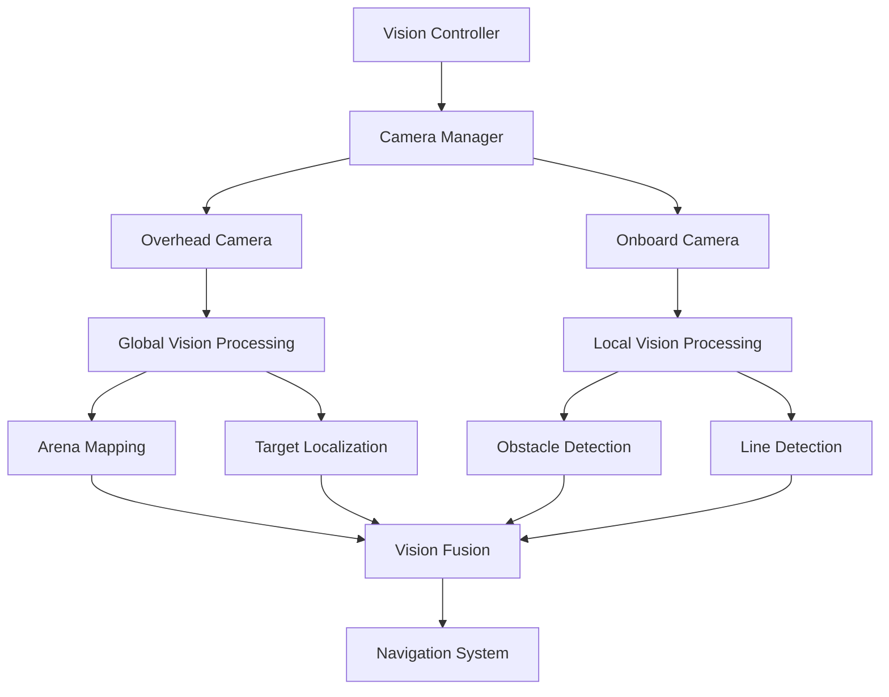
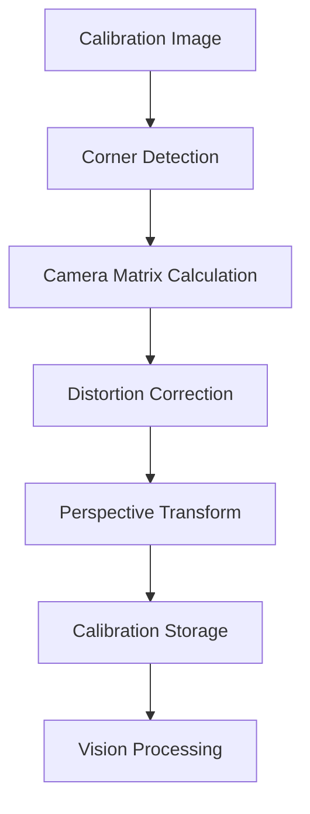

# GalaxyRVR Vision System

The GalaxyRVR hackathon prototype uses camera processing to produce observations for navigation and target-tracking experiments.

## Vision System Overview

The hybrid-vision design combines two camera perspectives:

1. **Overhead Camera**: Provides a global view of the arena for localization and path planning
2. **Onboard Camera**: Captures local environment for obstacle detection and fine navigation

## Hybrid Vision Architecture

## Key Vision Capabilities

### 1. Target Detection

- **Color-based Detection**: Identifies targets by their unique color signatures
- **Contour Analysis**: Extracts target shapes and sizes
- **Position Estimation**: Calculates target coordinates relative to robot
- **Tracking**: Maintains lock on targets across frames

### 2. Line Following

- **Edge Detection**: Identifies line boundaries
- **Line Fitting**: Determines line direction and curvature
- **Heading Control**: Adjusts robot direction to follow line
- **Speed Regulation**: Maintains appropriate speed for line tracking

### 3. Arena Mapping

- **Perspective Transformation**: Converts camera view to top-down perspective
- **Feature Extraction**: Identifies landmarks and boundaries
- **Coordinate System Alignment**: Maps camera coordinates to robot coordinates
- **Obstacle Localization**: Identifies obstacles from camera view

### 4. Calibration Tools

- **Camera Calibration**: Corrects lens distortion
- **Perspective Calibration**: Aligns camera view with arena coordinates
- **Color Calibration**: Defines target color ranges
- **Calibration Validation**: Tests calibration accuracy

## Vision Processing Pipeline

### Image Acquisition
- High-resolution image capture
- Adjustable frame rate
- Image compression and transmission
- Real-time processing capabilities

### Image Preprocessing
- Noise reduction
- Contrast enhancement
- Color space conversion
- Image segmentation

### Feature Extraction
- Contour detection
- Edge detection
- Line extraction
- Shape recognition

### Object Localization
- Position calculation
- Distance estimation
- Size measurement
- Orientation determination

## Performance Evaluation

Frame rate, detection range, heading error, latency, and memory use depend on the cameras, compute device, calibration, lighting, target size, and scene. These characteristics require measurement under a documented test setup.

## Calibration Process

### 1. Camera Calibration

### 2. Color Calibration

### 3. Perspective Calibration

## Vision Integration

### Navigation Integration
- Target position for path planning
- Line direction for heading control
- Obstacle positions for avoidance
- Localization for position estimation

### Simulation Integration
- Virtual camera image generation
- Simulated target detection
- Virtual line following
- Calibration simulation

## Intended Benefits of Hybrid Vision

- **Global Context**: Overhead camera provides complete arena view
- **Local Detail**: Onboard camera captures immediate environment
- **Redundancy**: Multiple perspectives for comparison and fallback
- **Flexibility**: Adapt to different environmental conditions
- **Cross-checking**: Compare global and local observations before navigation updates

These benefits require calibration and physical testing. The documentation does not establish robust fallback, measured accuracy, or safe operation when either camera is unavailable.

## Future Enhancements

- **Machine Learning**: Advanced object recognition
- **3D Vision**: Depth perception capabilities
- **Low-light Performance**: Enhanced performance in dim conditions
- **Wide-angle Coverage**: Increased field of view
- **Multi-target Tracking**: Track multiple targets simultaneously
