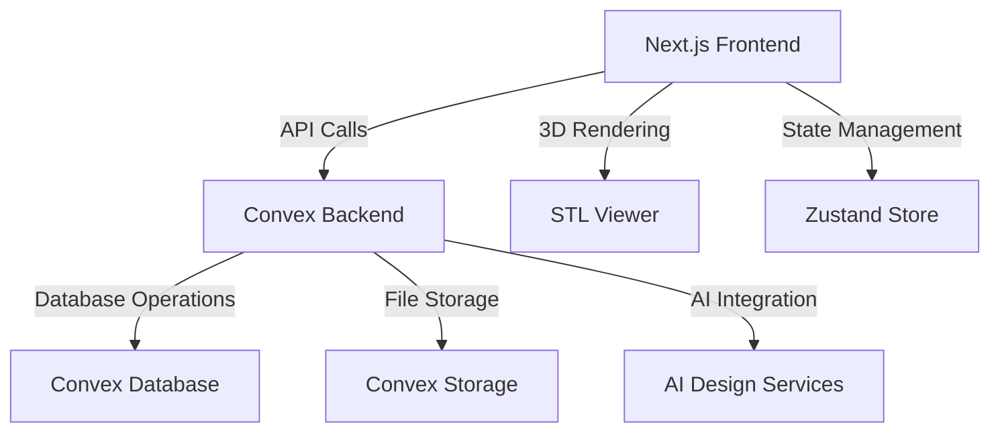
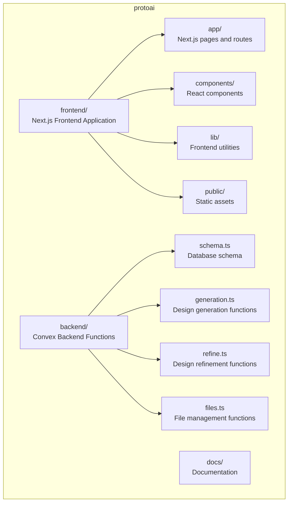
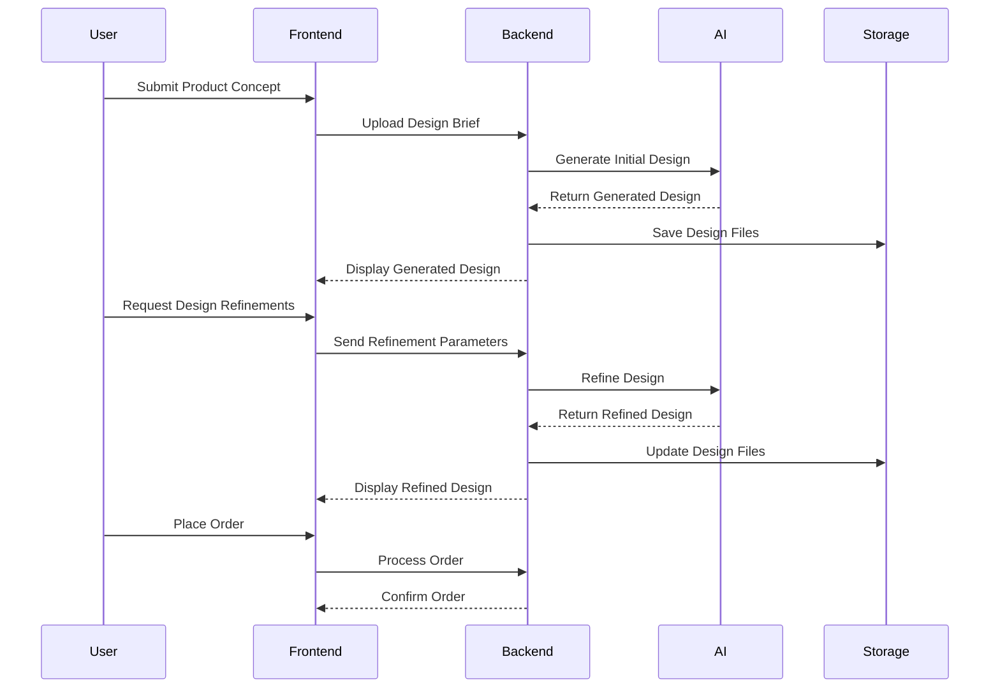

# AI Hardware Design Platform

A Next.js application for entrepreneurs to design and build hardware products with AI-powered tools.

## Overview

The AI Hardware Design Platform empowers entrepreneurs and innovators to turn their hardware ideas into reality through an intuitive web platform enhanced with AI capabilities. The platform streamlines the product development process, from initial concept to manufacturing-ready designs.

## Key Features

- **AI-Powered Design Generation**: Transform product concepts into detailed designs with the help of AI
- **Interactive Design Refinement**: Iterate and refine designs through a user-friendly interface
- **Comprehensive File Management**: Generate and manage all necessary design files including STL, PCB, Gerber, and BOM
- **3D Visualization**: Preview designs in 3D to better understand form and function
- **Order Processing System**: Seamlessly move from design to production with integrated order management

## Technology Stack

### Frontend
- **Framework**: Next.js 13+ with App Router
- **UI Components**: Custom React components with modern styling
- **State Management**: Zustand
- **3D Rendering**: STL Viewer for design visualization

### Backend
- **Database & API**: Convex (full-stack JavaScript/TypeScript backend)
- **Storage**: Convex Storage for file management

## Architecture

## Project Structure

## Getting Started

### Prerequisites
- Node.js 20+
- npm or yarn
- Convex account

### Installation

## User Flow

## Contributors

- **Core Development**: [Your Name]
- **AI Design Generation**: [Contributor Name]
- **3D Visualization**: [Contributor Name]
- **Database Architecture**: [Contributor Name]

## License

This project is licensed under the MIT License - see the [LICENSE](LICENSE) file for details.
