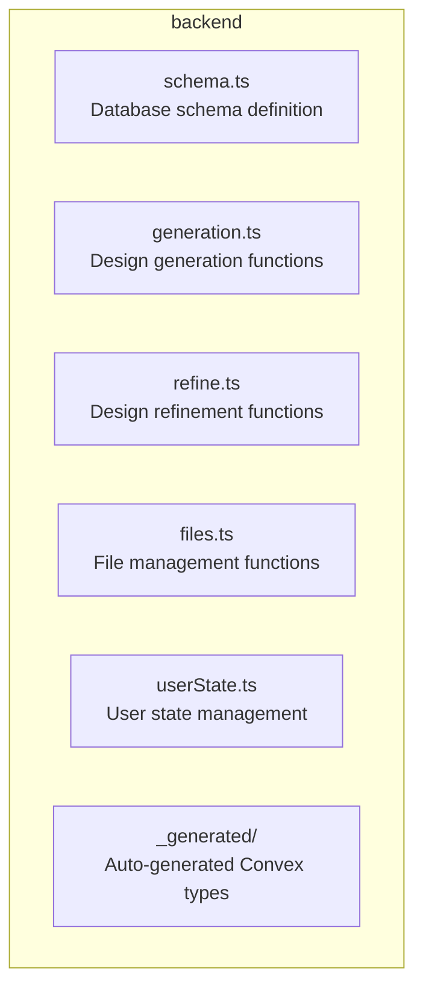
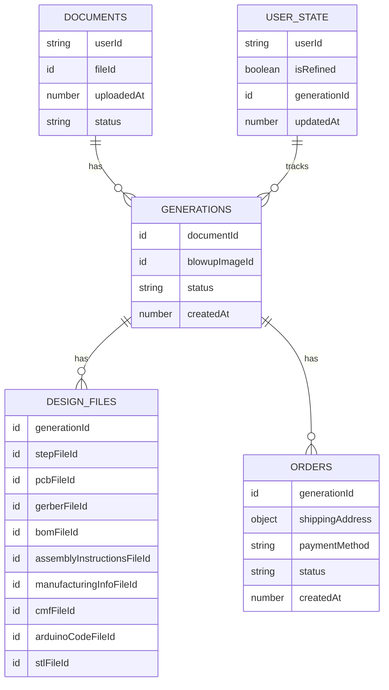

# AI Hardware Design Platform Backend

The Convex-based backend for the AI Hardware Design Platform that powers the design generation, refinement, and file management capabilities.

## Overview

The backend provides a scalable, serverless architecture for handling all the core functionality of the platform. It manages data storage, file operations, and integrates with AI services to generate and refine hardware designs.

## Technology Stack

- **Backend Platform**: Convex
- **Language**: TypeScript
- **Database**: Convex Database (document-oriented)
- **Storage**: Convex Storage
- **API**: Generated Convex API

## Directory Structure

## Data Model

## API Endpoints

### Design Generation
- `generation.create`: Initiate design generation process
- `generation.get`: Retrieve generation status and results
- `generation.list`: List all generations for a user

### Design Refinement
- `refine.create`: Create a refinement request
- `refine.get`: Retrieve refinement results

### File Management
- `files.upload`: Upload design files
- `files.download`: Download generated files
- `files.list`: List files for a generation

### User State
- `userState.get`: Get current user state
- `userState.save`: Save user preferences

## Security

- Role-based access control
- Input validation using Convex values
- Secure file storage
- Compliance with data protection regulations

## Performance

- Serverless architecture for automatic scaling
- Optimized database queries
- Caching for frequently accessed data
- Asynchronous processing for long-running tasks

## Scalability

The backend architecture is designed to scale seamlessly with:
- Automatic scaling based on demand
- Horizontal database scaling
- Efficient storage management

## Reliability

- Built-in error handling
- Automatic retries for transient failures
- Data backup and recovery
- Monitoring and alerting

## Development

### Running Locally

### Testing

## API Documentation

Full API documentation is automatically generated by Convex and available through the Convex dashboard.
