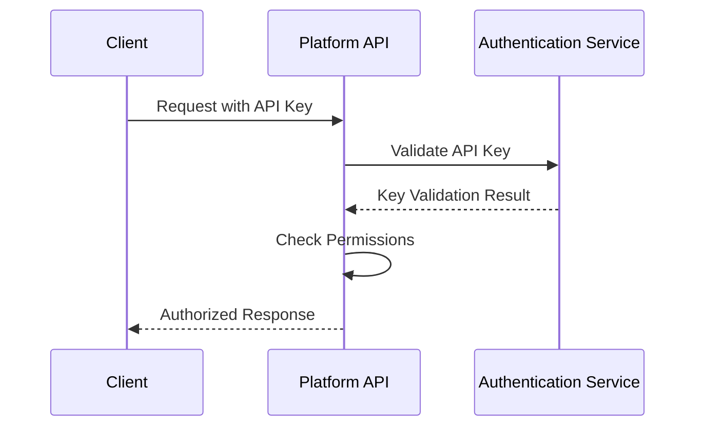

# AI Hardware Design Platform API Reference

This document provides a reference for the AI Hardware Design Platform API, including endpoints, request/response formats, and authentication.

## Table of Contents

1. [Authentication](#authentication)
2. [API Basics](#api-basics)
3. [Design Generation](#design-generation)
4. [Design Refinement](#design-refinement)
5. [File Management](#file-management)
6. [User State](#user-state)
7. [Order Processing](#order-processing)
8. [Error Handling](#error-handling)

## Authentication

The AI Hardware Design Platform uses API keys for authentication. All API requests must include a valid API key in the `Authorization` header.

### Example

### Authentication Flow

## API Basics

### Base URL

### Request Formats

All API requests should be sent with a `Content-Type` header of `application/json`.

### Response Formats

All API responses are in JSON format.

### Rate Limiting

API requests are rate-limited to prevent abuse:
- 100 requests per minute per API key
- 10 concurrent requests per API key

## Design Generation

### Create Generation

Create a new design generation request.

**Endpoint:** `POST /generations`

**Request Body:**

**Response:**

### Get Generation

Retrieve a specific generation by ID.

**Endpoint:** `GET /generations/:id`

**Response:**

### List Generations

List all generations for a user.

**Endpoint:** `GET /generations`

**Query Parameters:**
- `userId`: User ID (required)
- `status`: Filter by status (optional)
- `limit`: Maximum number of results (default: 20)
- `offset`: Offset for pagination (default: 0)

**Response:**

## Design Refinement

### Create Refinement

Create a refinement request for an existing design.

**Endpoint:** `POST /refinements`

**Request Body:**

**Response:**

### Get Refinement

Retrieve a specific refinement by ID.

**Endpoint:** `GET /refinements/:id`

**Response:**

## File Management

### Upload File

Upload a design file.

**Endpoint:** `POST /files`

**Request:**

**Response:**

### Download File

Download a file by ID.

**Endpoint:** `GET /files/:id/download`

**Response:**

The file content with appropriate `Content-Type` and `Content-Disposition` headers.

### List Files

List all files for a generation.

**Endpoint:** `GET /generations/:generationId/files`

**Response:**

## User State

### Get User State

Retrieve the current state for a user.

**Endpoint:** `GET /users/:userId/state`

**Response:**

### Save User State

Save the current state for a user.

**Endpoint:** `PUT /users/:userId/state`

**Request Body:**

**Response:**

## Order Processing

### Create Order

Create a new order for manufacturing.

**Endpoint:** `POST /orders`

**Request Body:**

**Response:**

### Get Order

Retrieve a specific order by ID.

**Endpoint:** `GET /orders/:id`

**Response:**

### List Orders

List all orders for a user.

**Endpoint:** `GET /orders`

**Query Parameters:**
- `userId`: User ID (required)
- `status`: Filter by status (optional)
- `limit`: Maximum number of results (default: 20)

**Response:**

## Error Handling

### Error Response Format

All error responses follow this format:**Response:**

### Common Error Codes

| Error Code | HTTP Status | Description |
|------------|-------------|-------------|
| `INVALID_REQUEST` | 400 | The request is malformed or missing required fields |
| `UNAUTHORIZED` | 401 | The API key is invalid or expired |
| `FORBIDDEN` | 403 | The user does not have permission for this action |
| `NOT_FOUND` | 404 | The requested resource was not found |
| `RATE_LIMITED` | 429 | Too many requests |
| `INTERNAL_ERROR` | 500 | An internal server error occurred |

## Additional Resources

- [API Changelog](./api-changelog.md) - Changes to the API
- [SDK Documentation](./sdk-documentation.md) - Client SDKs
- [Best Practices](./api-best-practices.md) - API usage best practices

## Support

If you need help with the API:
- Email: api-support@example.com
- Documentation: https://docs.protoai.com/api
- Status Page: https://status.protoai.com
