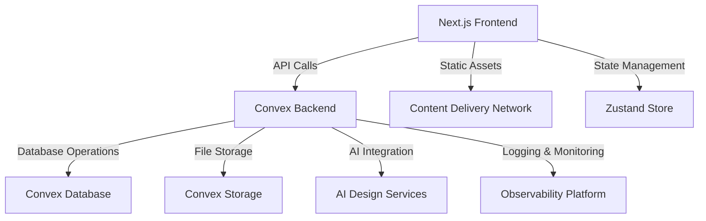
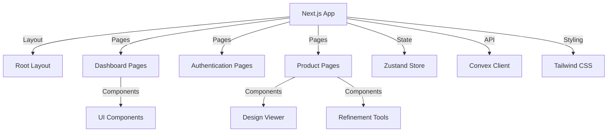
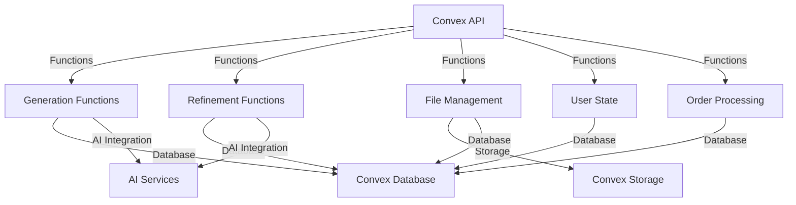
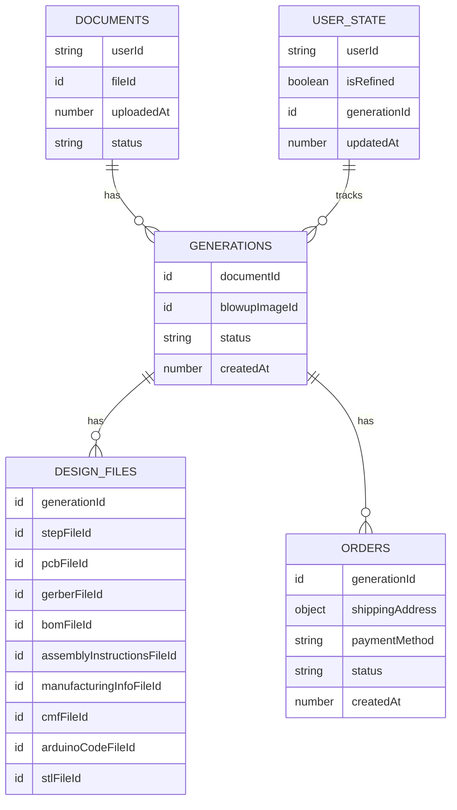
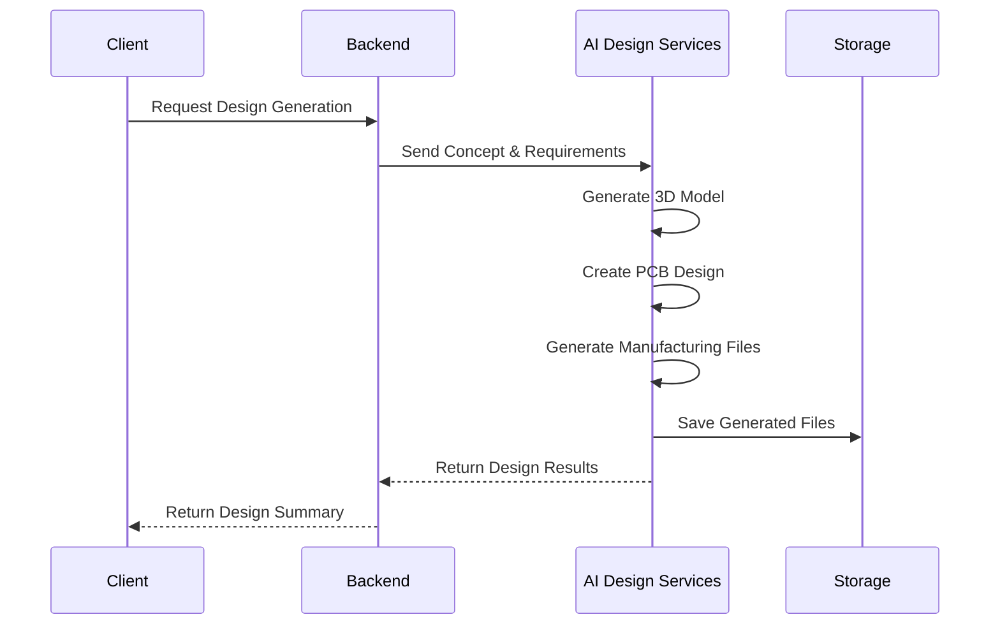
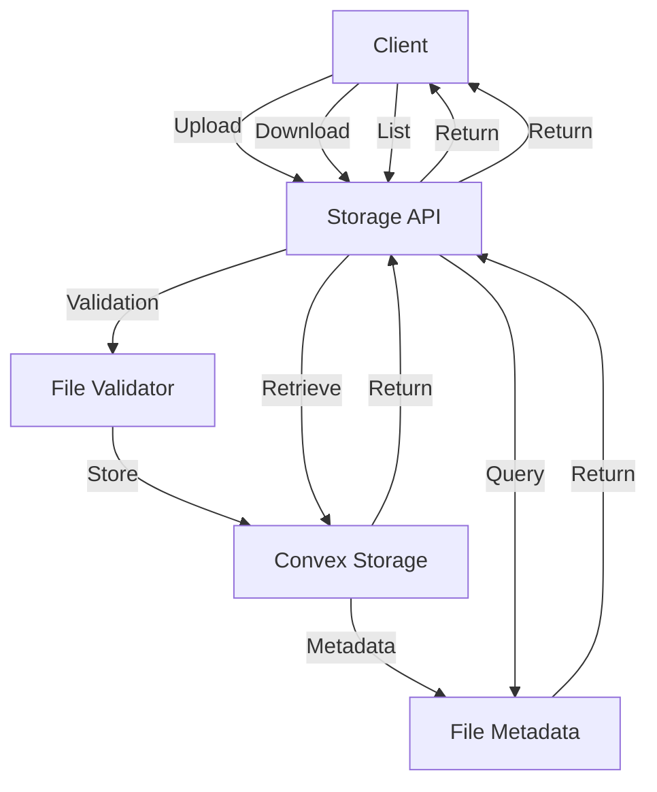
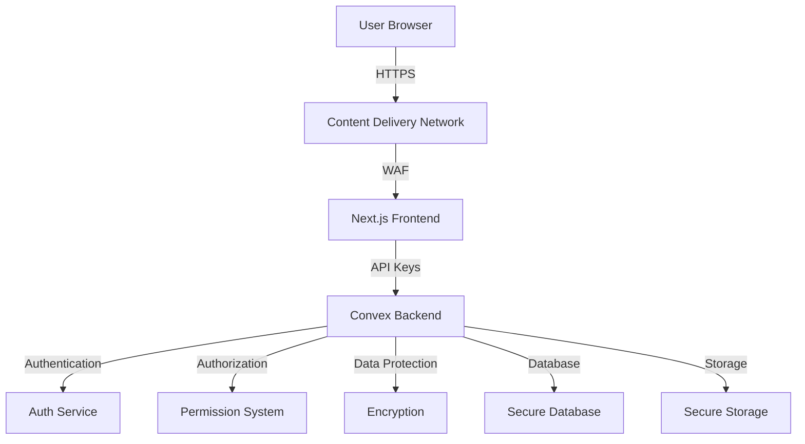
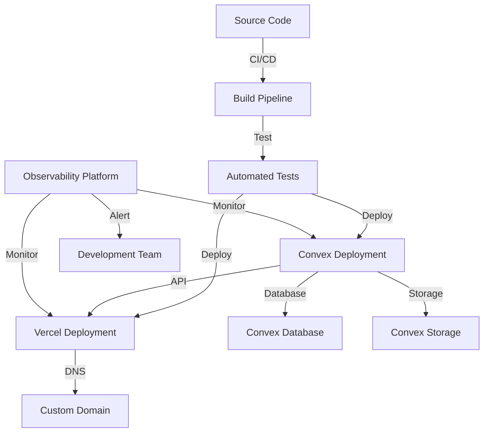

# AI Hardware Design Platform Architecture Overview

This document provides a high-level overview of the AI Hardware Design Platform architecture, including the key components, data flow, and technical implementation details.

## Table of Contents

1. [System Architecture](#system-architecture)
2. [Frontend Architecture](#frontend-architecture)
3. [Backend Architecture](#backend-architecture)
4. [Data Model](#data-model)
5. [API Design](#api-design)
6. [AI Integration](#ai-integration)
7. [Storage System](#storage-system)
8. [Security Architecture](#security-architecture)
9. [Performance Optimization](#performance-optimization)
10. [Deployment Architecture](#deployment-architecture)

## System Architecture

The platform follows a modern, cloud-native architecture that separates concerns while enabling seamless integration between components.

### Key Principles

1. **Separation of Concerns**: Clear boundaries between frontend, backend, and AI services
2. **Scalability**: Cloud-native architecture that scales with demand
3. **Maintainability**: Modular design with well-defined interfaces
4. **Reliability**: Redundant systems with error handling
5. **Security**: Layered security approach

## Frontend Architecture

The frontend is built with Next.js 13+ using the App Router pattern, providing a modern, performant user interface.

### Frontend Technologies

- **Framework**: Next.js 13+ with App Router
- **Language**: TypeScript
- **State Management**: Zustand
- **UI Library**: Custom components with Tailwind CSS
- **3D Rendering**: STL Viewer
- **API Client**: Convex client

## Backend Architecture

The backend is built on Convex, a full-stack JavaScript/TypeScript backend platform that provides database, storage, and API capabilities.

### Backend Components

1. **API Layer**: Convex functions that handle client requests
2. **Business Logic**: Core application logic for design generation and refinement
3. **Database Layer**: Convex database for structured data
4. **Storage Layer**: Convex storage for file management
5. **AI Integration**: Interface with AI design services

## Data Model

The data model is designed to support the entire product lifecycle, from concept to manufacturing.

## API Design

The API follows RESTful principles with a focus on simplicity and usability.

### API Endpoints

#### Design Generation
- `POST /api/generation`: Create a new design generation
- `GET /api/generation/:id`: Get generation details
- `GET /api/generations`: List all generations

#### Design Refinement
- `POST /api/refine`: Create a refinement request
- `GET /api/refine/:id`: Get refinement details

#### File Management
- `POST /api/files`: Upload files
- `GET /api/files/:id`: Download files
- `GET /api/generations/:id/files`: List generation files

#### Order Processing
- `POST /api/orders`: Create an order
- `GET /api/orders/:id`: Get order details
- `GET /api/orders`: List all orders

## AI Integration

The platform integrates with advanced AI services to generate and refine hardware designs.

### AI Capabilities

- **Concept Analysis**: Understanding natural language product descriptions
- **3D Model Generation**: Creating production-ready 3D models
- **PCB Design**: Generating circuit board layouts
- **Bill of Materials**: Creating component lists
- **Assembly Instructions**: Generating step-by-step guides

## Storage System

The platform uses Convex Storage for managing all design files, ensuring secure, scalable file storage.

### Supported File Types

- 3D Models: STL, STEP
- PCB Designs: Gerber, PCB
- Documents: PDF, CSV (BOM)
- Code: Arduino sketches

## Security Architecture

The platform employs a layered security approach to protect user data and intellectual property.

### Security Measures

1. **Data Encryption**: All data is encrypted at rest and in transit
2. **Authentication**: Secure authentication system
3. **Authorization**: Role-based access control
4. **Input Validation**: Strict validation of all inputs
5. **Rate Limiting**: Protection against API abuse
6. **Vulnerability Scanning**: Regular security audits

## Performance Optimization

The platform is designed for high performance and low latency.

### Optimization Strategies

1. **Frontend Optimization**
   - Server-side rendering with Next.js
   - Static site generation for public pages
   - Code splitting and lazy loading
   - Image optimization

2. **Backend Optimization**
   - Serverless architecture for automatic scaling
   - Caching frequently accessed data
   - Optimized database queries
   - Asynchronous processing for long-running tasks

3. **AI Service Optimization**
   - Batch processing for multiple requests
   - Result caching
   - Efficient resource allocation

## Deployment Architecture

The platform follows a modern deployment architecture that enables continuous delivery and high availability.

### Deployment Process

1. **Continuous Integration**: GitHub Actions builds and tests changes
2. **Automated Testing**: Unit, integration, and end-to-end tests
3. **Deployment**: Automatic deployment to production
4. **Monitoring**: Real-time monitoring of all systems
5. **Rollback**: Automated rollback in case of failures

## Future Enhancements

1. **Enhanced AI Capabilities**: More advanced design generation and refinement
2. **Collaboration Features**: Multi-user design collaboration
3. **Manufacturing Integration**: Direct integration with manufacturing partners
4. **Simulation Tools**: Virtual testing of designs
5. **Mobile App**: Native mobile application

## Additional Resources

- [Getting Started Guide](./getting-started.md)
- [User Guide](./user-guide.md)
- [API Reference](./api-reference.md)
- [Development Guide](./development-guide.md)
