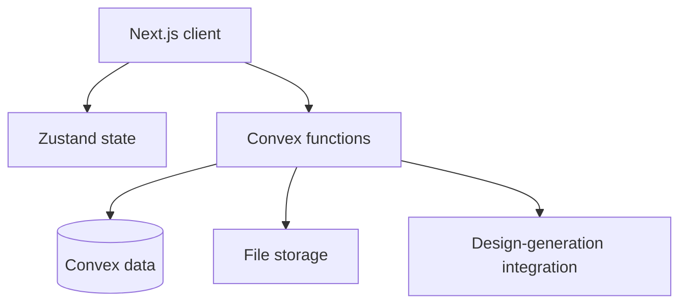

# AI Hardware Design Platform Architecture

## Prototype Status

The hackathon prototype models a workflow from product brief to generated concept artifacts, refinement requests, file review, and an order-planning screen. Mock authentication and workflow state support the demonstration. Generated outputs are not validated engineering deliverables.

## Implemented Design

### Frontend

- Next.js and TypeScript
- Tailwind CSS components
- Zustand workflow state
- Three-dimensional file preview
- Brief, review, refinement, download, and order-planning screens

### Backend Model

| Record | Responsibility |
| --- | --- |
| Document | Uploaded product brief |
| Generation | Design-generation request and status |
| Design file | Output associated with a generation |
| User state | Current workflow step |
| Order | Demonstration order state |

Convex functions organize generation requests, refinement requests, file associations, and workflow state. The order flow represents application state rather than evidence of payment or manufacturing integration.

## Output Boundaries

The workflow can represent STL, STEP, PCB, Gerber, bill-of-materials, assembly, firmware, and manufacturing-information files. Presence of a file or preview does not establish dimensional correctness, electrical safety, component availability, manufacturability, firmware safety, standards conformity, or fitness for use.

Every generated output requires review and validation by qualified mechanical, electrical, firmware, manufacturing, and safety engineers as applicable. Physical prototyping and testing are required before procurement or manufacturing decisions.

## Proposed Production Architecture

A production implementation would need authenticated identities, per-project authorization, input validation, secure secret handling, file scanning, retention controls, audit logs, observability, backups, tested recovery procedures, and controlled deployment. It would also need explicit integrations for engineering tools, simulation, suppliers, quotations, payments, and fulfillment.

These controls and integrations are proposed requirements, not established implementation. Availability, scale, latency, security, and test-coverage claims require measured evidence.

## Future Work

- Connect generation to reviewed CAD and EDA toolchains.
- Add mechanical, electrical, thermal, firmware, and design-rule validation.
- Track output provenance, model versions, assumptions, and reviewer approvals.
- Add physical prototype test records and revision history.
- Integrate suppliers only after technical and commercial review.

## Related Documentation

- [Getting started](getting-started.md)
- [User guide](user-guide.md)
- [Prototype API reference](api-reference.md)
- [Frontend design](../frontend/README.md)
- [Backend design](../backend/README.md)

[Back to project overview](../README.md)
