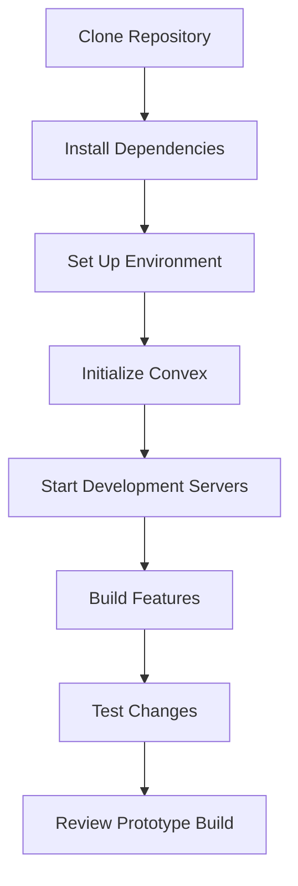

# Getting Started with AI Hardware Design Platform

This guide summarizes the documented setup and prototype workflow. The application source is maintained separately, so commands and environment variables should be taken from that source repository.

## Prerequisites

- Node.js 20+
- npm or yarn
- Convex account (sign up at [convex.dev](https://convex.dev/))

## Installation

### 1. Clone the Repository

### 2. Install Dependencies

### 3. Set Up Environment Variables

### 4. Initialize Convex

### 5. Start the Development Servers

### 6. Access the Application

Open your browser and navigate to `http://localhost:3000`

## First Steps

1. **Sign In** - Use the mock authentication to get started
2. **Create a New Project** - Click "Start Building" on the homepage
3. **Submit Your Concept** - Describe what hardware product you want to build
4. **Review Generated Concept** - Inspect the generated concept and its assumptions
5. **Refine Your Design** - Make adjustments to the generated design
6. **Download Files** - Review the available concept artifacts
7. **Review Order Flow** - Continue through the demonstration order-planning screen

## Development Workflow

## Additional Resources

- [User Guide](./user-guide.md) - Detailed instructions on using the platform
- [Architecture Overview](./architecture.md) - Technical details of the platform
- [API Reference](./api-reference.md) - Documentation for developers

## Troubleshooting

### Common Issues

1. **Convex Deployment Errors**
   - Ensure your Convex account is properly set up
   - Check that your environment variables are correctly configured

2. **Frontend Build Errors**
   - Verify Node.js version is 20+
   - Clear node_modules and reinstall dependencies

3. **Database Connection Issues**
   - Ensure Convex dev server is running
   - Check network connectivity

Generated hardware outputs require engineering review and physical validation before procurement or manufacturing.
