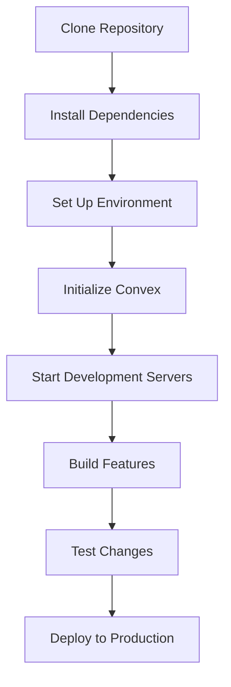

# Getting Started with AI Hardware Design Platform

Welcome to the AI Hardware Design Platform! This guide will help you set up and start using the platform to design and build hardware products.

## Prerequisites

- Node.js 20+
- npm or yarn
- Convex account (sign up at [convex.dev](https://convex.dev/))

## Installation

### 1. Clone the Repository

### 2. Install Dependencies

### 3. Set Up Environment Variables

### 4. Initialize Convex

### 5. Start the Development Servers

### 6. Access the Application

Open your browser and navigate to `http://localhost:3000`

## First Steps

1. **Sign In** - Use the mock authentication to get started
2. **Create a New Project** - Click "Start Building" on the homepage
3. **Submit Your Concept** - Describe what hardware product you want to build
4. **Review Generated Design** - The AI will generate initial design concepts
5. **Refine Your Design** - Make adjustments to the generated design
6. **Download Files** - Get all necessary manufacturing files
7. **Place Order** - Proceed to production

## Development Workflow

## Additional Resources

- [User Guide](./user-guide.md) - Detailed instructions on using the platform
- [Architecture Overview](./architecture.md) - Technical details of the platform
- [API Reference](./api-reference.md) - Documentation for developers

## Troubleshooting

### Common Issues

1. **Convex Deployment Errors**
   - Ensure your Convex account is properly set up
   - Check that your environment variables are correctly configured

2. **Frontend Build Errors**
   - Verify Node.js version is 20+
   - Clear node_modules and reinstall dependencies

3. **Database Connection Issues**
   - Ensure Convex dev server is running
   - Check network connectivity

### Getting Help

- Check the [official documentation](https://docs.protoai.com)
- Join our [community forum](https://forum.protoai.com)
- Submit an issue on [GitHub](https://github.com/protoai/protoai/issues)
