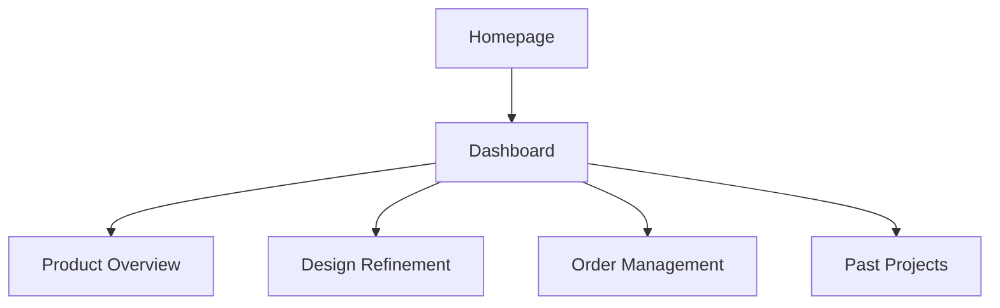
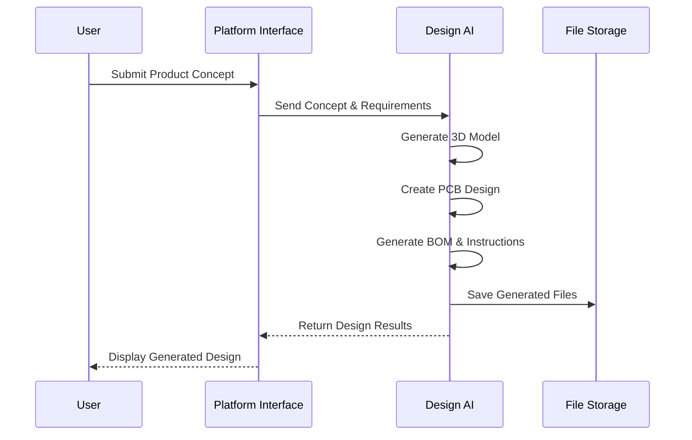
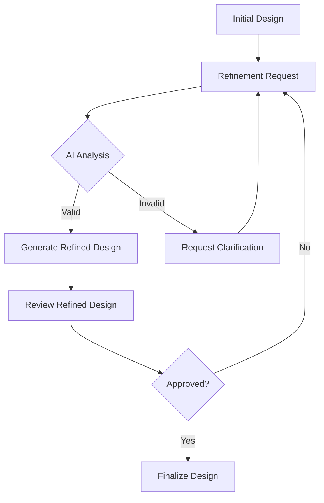

# AI Hardware Design Platform User Guide

Welcome to the AI Hardware Design Platform! This guide will walk you through the entire process of designing and building hardware products using our platform.

## Table of Contents

1. [Getting Started](#getting-started)
2. [Creating Your First Project](#creating-your-first-project)
3. [Design Generation](#design-generation)
4. [Design Refinement](#design-refinement)
5. [3D Visualization](#3d-visualization)
6. [File Management](#file-management)
7. [Order Processing](#order-processing)
8. [Best Practices](#best-practices)

## Getting Started

### Account Setup

The platform uses mock authentication for demonstration purposes. Simply click "Sign In" to get started.

### Dashboard Overview

The dashboard provides an overview of your projects, recent designs, and order status.

## Creating Your First Project

### 1. Submit Your Concept

1. Navigate to the homepage
2. Enter a description of your hardware product in the input field
3. Click "Start Building"

**Example Concept:**
> "A wearable fitness tracker with heart rate monitoring, GPS, and 7-day battery life."

### 2. Review the Design Brief

The AI will analyze your concept and create a detailed design brief. Review this brief to ensure it accurately captures your requirements.

## Design Generation

### How It Works

The platform uses advanced AI algorithms to generate hardware designs based on your concept. The generation process typically takes 2-5 minutes.

### Generation Status

- **Pending**: Your design is being generated
- **Completed**: Design generation is complete
- **Error**: There was an issue generating your design

## Design Refinement

### Iterating on Your Design

Once you receive your initial design, you can refine it using the following options:

1. **Form Adjustments**: Modify the physical dimensions and shape
2. **Component Placement**: Adjust the placement of internal components
3. **Material Selection**: Change materials for better performance
4. **Feature Additions**: Add new features to your design

### Refinement Process

## 3D Visualization

### Interactive Viewer

The 3D viewer allows you to:
- Rotate the model (left-click and drag)
- Zoom in/out (scroll wheel)
- Pan (right-click and drag)
- Change viewing angles

### Viewer Controls

| Action | Control |
|--------|---------|
| Rotate | Left-click + drag |
| Zoom | Scroll wheel |
| Pan | Right-click + drag |
| Reset View | Double-click |

## File Management

### Available Files

The platform generates all necessary files for manufacturing:

- **STL Files**: 3D printing models
- **PCB Files**: Printed circuit board designs
- **Gerber Files**: PCB manufacturing files
- **BOM (Bill of Materials)**: List of components
- **Assembly Instructions**: Step-by-step assembly guide
- **Arduino Code**: Firmware for microcontrollers

### Downloading Files

1. Navigate to the Product Overview page
2. Click "Download Files"
3. Select the files you want to download
4. Click "Download Selected" or "Download All"

## Order Processing

### Placing an Order

1. Finalize your design
2. Click "Place Order"
3. Enter shipping information
4. Select payment method
5. Review and confirm order

### Order Status

- **Pending**: Order has been received and is being processed
- **Processing**: Your order is being manufactured
- **Shipped**: Your order has been shipped
- **Delivered**: Your order has been delivered
- **Cancelled**: Order has been cancelled

### Tracking Your Order

Once your order is shipped, you will receive a tracking number to monitor delivery progress.

## Best Practices

### Concept Submission

- **Be Specific**: Provide detailed specifications for your product
- **Prioritize Features**: List the most important features first
- **Include Constraints**: Mention any size, weight, or material constraints

### Design Refinement

- **Iterate Gradually**: Make small changes rather than completely redesigning
- **Focus on Functionality**: Ensure design changes don't compromise functionality
- **Consider Manufacturing**: Keep designs manufacturable with standard processes

### File Usage

- **Verify Files**: Always check files before sending to manufacturing
- **Backup Files**: Keep copies of all generated files
- **Share Responsibly**: Only share files with authorized manufacturers

## FAQ

### Q: How long does design generation take?
A: Typically 2-5 minutes, depending on the complexity of your concept.

### Q: Can I modify the generated files?
A: Yes, all files are in standard formats that can be edited with common CAD and EDA tools.

### Q: What file formats are supported?
A: STL, STEP, Gerber, CSV (BOM), PDF (instructions), and Arduino sketch files.

### Q: How accurate are the generated designs?
A: The designs are production-ready, but we recommend having them reviewed by a hardware engineer before manufacturing.

## Support

If you need help, you can:
- Check the [Troubleshooting Guide](./troubleshooting.md)
- Contact our support team at support@protoai.com
- Join our community forum at forum.protoai.com
