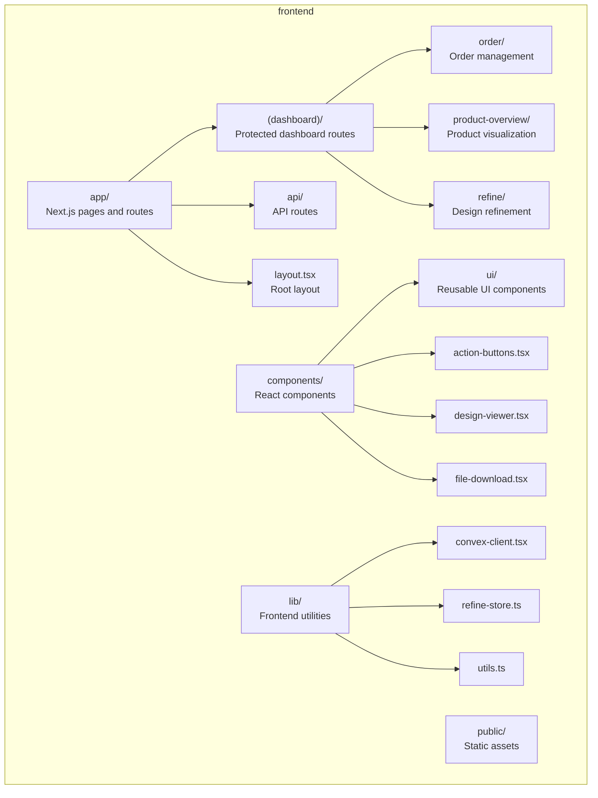
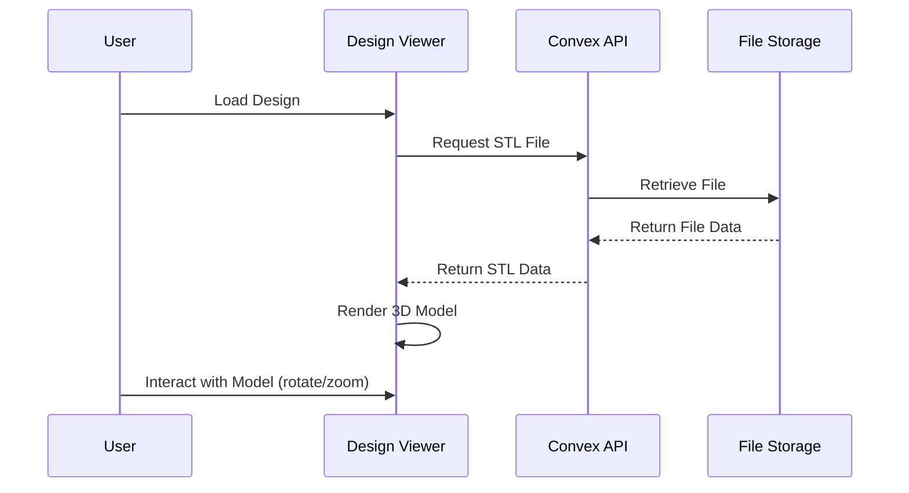

# AI Hardware Design Platform Frontend

The Next.js-based frontend for the AI Hardware Design Platform that provides an intuitive interface for users to design and refine hardware products.

## Overview

The frontend is built with modern web technologies to deliver a smooth, responsive experience for hardware designers and entrepreneurs. It provides the interface for users to interact with the AI-powered design tools and manage their projects.

## Technology Stack

- **Framework**: Next.js 13+ with App Router
- **Language**: TypeScript
- **State Management**: Zustand
- **UI Components**: Custom React components with Tailwind CSS
- **3D Rendering**: STL Viewer for 3D design visualization
- **API Integration**: Convex client for backend communication

## Directory Structure

## Key Components

### Design Viewer

Interactive 3D viewer that allows users to preview their hardware designs in real-time.

### Refine Store

State management for tracking design refinement progress and user preferences.

### File Download System

Handles downloading of generated design files including STL, PCB, Gerber, and BOM files.

## Responsive Design

The frontend is fully responsive and optimized for:
- Desktop (1920px+)
- Tablet (768px-1024px)
- Mobile (320px-767px)

## UI/UX Principles

- **Intuitive Navigation**: Clear user flows from concept to completion
- **Visual Feedback**: Real-time updates and progress indicators
- **Accessibility**: WCAG 2.1 compliant design
- **Performance**: Optimized for fast loading and smooth interactions

## Development

### Running Locally

### Testing

## Security

- Input validation on all user inputs
- Secure API communication
- Protected routes for authenticated users
- Compliance with data protection standards
