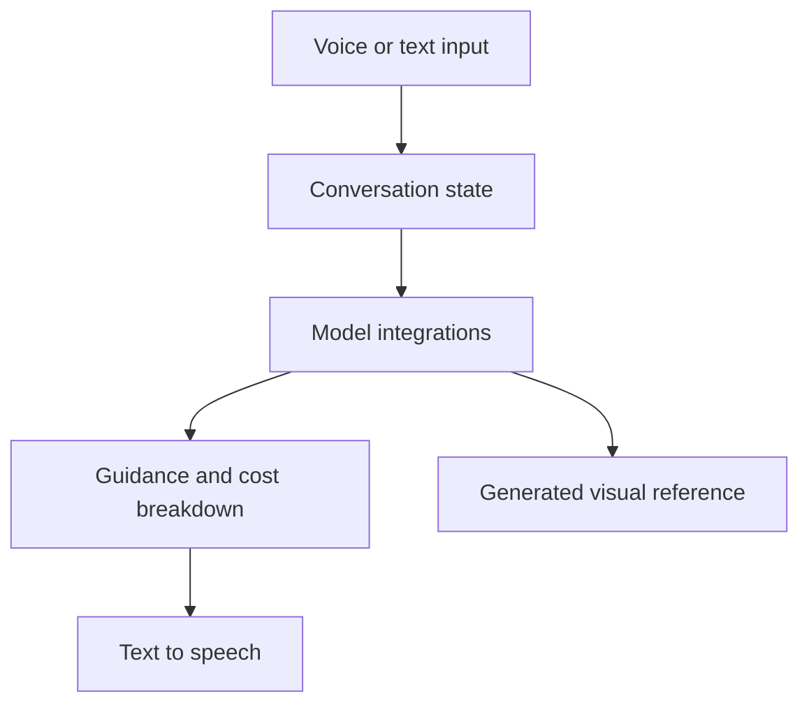

# Hackathon Outcome

SourceVoice produced a working four-hour demonstration of voice-assisted English and Mandarin interaction for injection-molding procurement.

## Demonstrated Flow

1. Accept a manufacturing question by text or browser speech recognition.
2. Send conversation context to model APIs.
3. Present manufacturing considerations, a cost breakdown, and negotiation prompts.
4. Convert a response to speech through ElevenLabs.
5. Generate a visual reference through the configured image model.

## Technical Outcome

The implementation combined Next.js, TypeScript, Tailwind CSS, Zustand, browser speech recognition, Claude, Gemini, and ElevenLabs. The demonstration showed how those services could be composed in one procurement-oriented interface.

## Evidence Boundaries

The hackathon did not establish model accuracy, translation quality, cost-estimate precision, response-time targets, user satisfaction, repeat usage, savings, market size, or commercial outcomes. No award or judge endorsement is claimed. Generated advice and images require review by manufacturing and language specialists.

## Future Evaluation

- Compare estimates with documented quotations and final invoices.
- Review translations and terminology with bilingual specialists.
- Measure task completion and comprehension with a defined participant sample.
- Test browser support, accessibility, latency, provider failures, and data handling.
- Determine whether visual references communicate intent without being mistaken for engineering drawings.

[Back to overview](../README.md)
