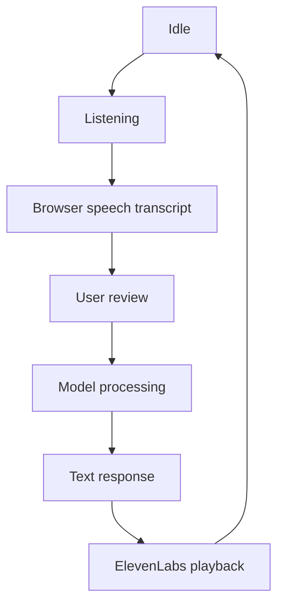

# Voice Interaction

## Prototype Flow

The interface provides recording, processing, playback, retry, and text fallback states. Browser speech recognition handles transcription, while ElevenLabs provides text-to-speech output.

## Limitations

- Browser, microphone, network, language, accent, and background noise affect recognition.
- Transcripts and synthesized speech were not benchmarked during the hackathon.
- Users should review transcripts before relying on technical terms, quantities, or prices.
- Text input remains the fallback when voice services are unavailable.

[Back to overview](../README.md)
