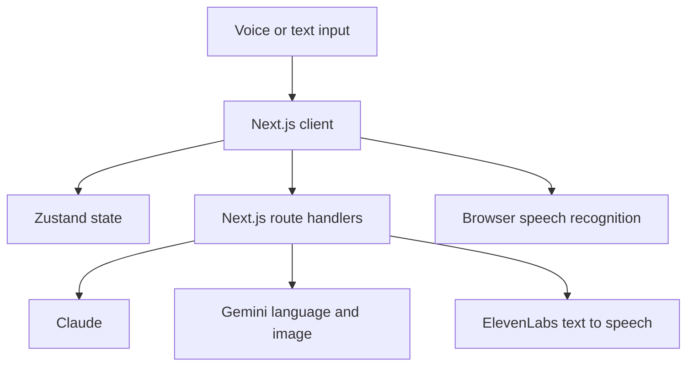

# SourceVoice Architecture

## System Overview

## Client

The client presents conversation, voice controls, cost considerations, negotiation prompts, and generated visual references. Zustand stores conversation, voice, negotiation, and visualization state.

## Server Routes

Next.js route handlers isolate provider credentials and translate application requests into provider-specific calls. The documented routes cover chat, text to speech, and image generation. Browser speech recognition runs on the client; it is not a server-side transcription service.

## Voice Flow

1. The browser captures speech and produces a transcript.
2. The user can review or replace the transcript with text.
3. The client sends text and recent context to a route handler.
4. A model returns guidance and structured cost considerations.
5. The client can request speech output and a visual reference.

## Deployment Status

The hackathon build was deployed for demonstration. That deployment does not establish availability, global latency, capacity, persistent storage, automated release controls, or operational monitoring.

## Security and Reliability Boundaries

Provider keys should remain server-side, and requests should be validated. Authentication, authorization, retention controls, audit logs, abuse controls, privacy review, security testing, and operational recovery were not established by the four-hour prototype and are future requirements for consequential use.

## Related Documentation

- [API design](api-design.md)
- [State management](state-management.md)
- [Voice interaction](../features/voice-interaction.md)
- [AI integration](../features/ai-expert-system.md)

[Back to overview](../README.md)
