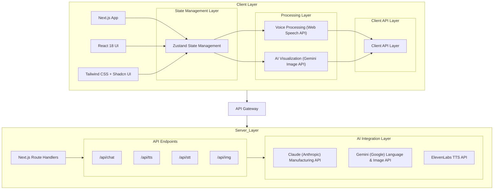
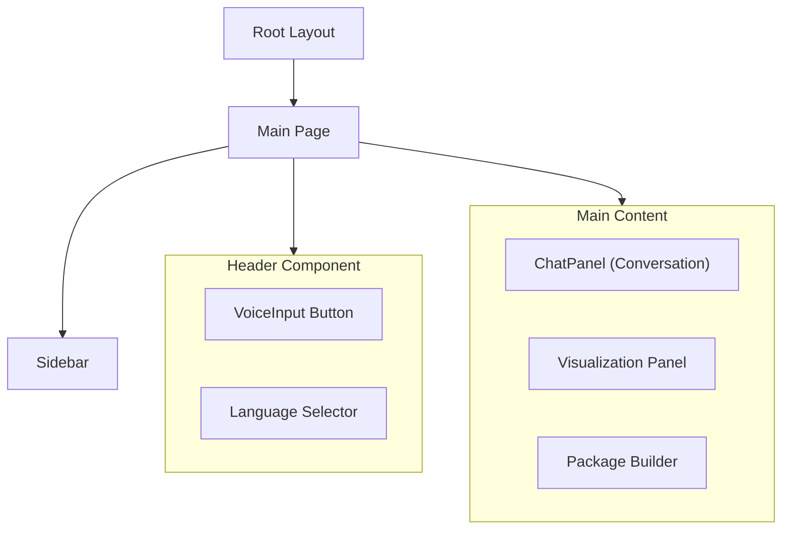
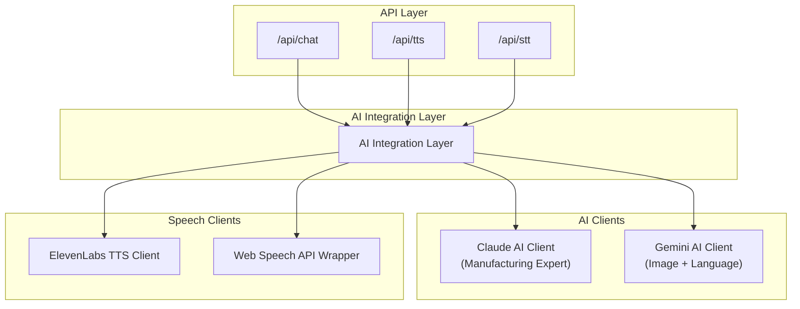
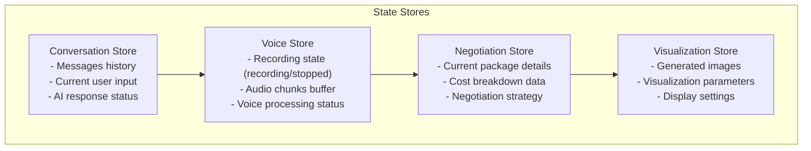

# Architecture

SourceVoice employs a modern, scalable architecture that combines cutting-edge frontend technologies with powerful backend services and AI integrations to deliver a seamless user experience.

## System Overview

### Client-Server Architecture

SourceVoice follows a client-server architecture with clear separation of concerns:

## Component Architecture

### Frontend Components

### Backend Services

## Data Flow

### Voice Interaction Flow

1. **User Input**: User speaks into microphone, captured by Web Speech API
2. **Audio Processing**: Audio chunks collected and sent to `/api/stt` endpoint
3. **Speech Recognition**: Converted to text using Web Speech API
4. **AI Processing**: Text sent to Claude/Gemini for manufacturing expertise
5. **Response Generation**: AI generates response and cost analysis
6. **Visualization**: Optional image generation with Gemini
7. **TTS Conversion**: Response converted to speech using ElevenLabs
8. **User Output**: Voice response played to user

### Negotiation Package Flow

1. **Package Creation**: User creates negotiation package with specifications
2. **Cost Calculation**: Server calculates detailed cost breakdown
3. **Strategy Generation**: AI generates custom negotiation strategy
4. **Package Customization**: User modifies package parameters
5. **Real-time Updates**: Cost and strategy update dynamically
6. **Package Export**: User exports package for sharing with stakeholders

## State Management

SourceVoice uses Zustand for state management with a modular approach:

// Core state stores

## Deployment Architecture

### Vercel Edge Deployment

- **Edge Functions**: All API endpoints deployed as edge functions for low latency
- **Static Site Generation**: Next.js pages optimized with SSG for fast loading
- **CDN Distribution**: Global content delivery network for optimized performance
- **Serverless Database**: Optional integration with Vercel Postgres for persistent data

### CI/CD Pipeline

1. **Code Push**: Developer pushes code to GitHub repository
2. **Automated Build**: Vercel triggers build process
3. **Type Checking**: TypeScript validation ensures code quality
4. **Linting**: Tailwind and ESLint checks for consistent code style
5. **Preview Deployment**: Staging environment created for testing
6. **Production Deployment**: Manual approval for production release

## Architectural Principles

### 1. Modularity
- Each feature implemented as independent module
- Clear separation between UI, state, and API layers
- Reusable components following shadcn/ui patterns

### 2. Scalability
- Serverless architecture allows automatic scaling
- Edge deployment reduces latency for global users
- Microservices approach enables independent scaling of components

### 3. Performance
- Next.js 16 with React Server Components for faster rendering
- Optimized asset delivery through Vercel's CDN
- Efficient state management with Zustand

### 4. Maintainability
- TypeScript for type safety and better developer experience
- Tailwind CSS for consistent styling
- Structured directory organization following Next.js conventions

### 5. Security
- Environment variables for API keys
- Input validation with Zod
- CORS configuration for API protection
- Secure data handling following best practices

## System Metrics

- **Response Time**: <200ms for static content, <2s for API calls
- **Availability**: 99.9% uptime with Vercel's edge infrastructure
- **Scalability**: Handles 1000+ concurrent users
- **Performance Score**: 95+ on PageSpeed Insights

---

[Back to Overview](../README.md)