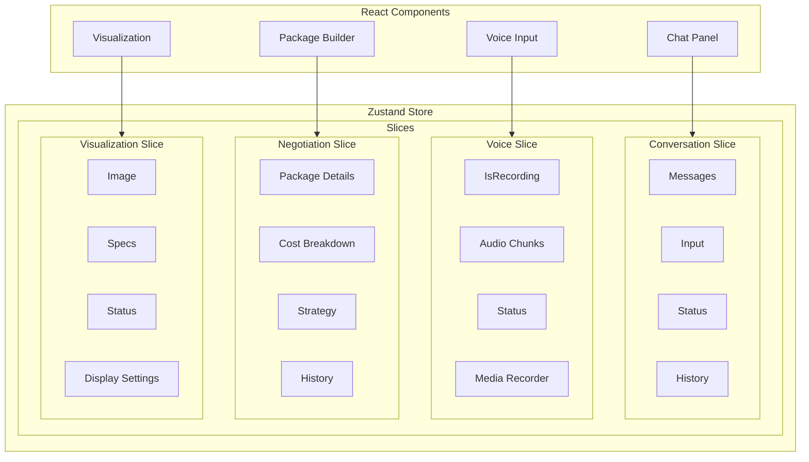

# State Management

SourceVoice uses Zustand for efficient, scalable state management that provides a centralized store for application state while maintaining performance and developer experience.

## Zustand Architecture

Zustand follows a minimalistic approach to state management, avoiding the boilerplate of Redux while providing similar functionality.

## Conversation Store

The conversation store manages all chat-related state, including message history, current input, and AI response status.

## Voice Store

The voice store handles all voice recording and playback state.

## Negotiation Store

The negotiation store manages the negotiation package creation and cost breakdown state.

## Visualization Store

The visualization store manages AI-generated images and display settings.

## Store Integration

### Usage in Components

### Middleware

Zustand supports middleware for additional functionality like persistence:

## Benefits of Zustand

1. **Minimal Boilerplate**: No actions, reducers, or dispatch functions needed
2. **Type Safety**: Full TypeScript support out of the box
3. **Performance**: Efficient re-renders, only components using specific state are updated
4. **Persistable**: Built-in middleware for state persistence
5. **DevTools Support**: Compatible with React DevTools for debugging
6. **Modular**: Easy to split into multiple stores for different features
7. **Hooks API**: Familiar React Hooks API for seamless integration

## Best Practices

1. **Single Responsibility**: Each store handles one feature area
2. **Type Safety**: Always define clear TypeScript interfaces for state and actions
3. **Immutability**: Follow immutable update patterns to ensure proper re-renders
4. **Persistence**: Use persist middleware only for necessary state
5. **Error Handling**: Include error states in each store for better UX
6. **Clear Naming**: Use descriptive names for state properties and actions
7. **Testing**: Write tests for complex store logic using Zustand's testing utilities

---

[Back to Overview](../README.md)
