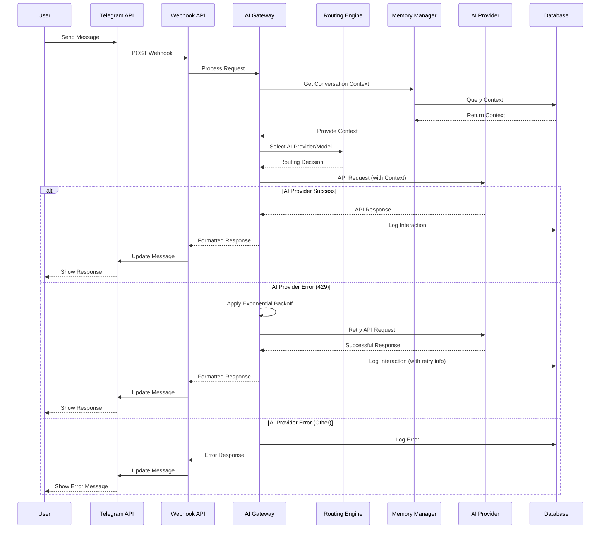

# Data Flow Diagram

## Overview

This document illustrates the flow of data through the AI assistant system, from user input to AI response. The diagram shows how each component interacts with data and passes it through the system.

## Data Flow Diagram



## Data Flow Details

### 1. User Input

- **Data**: User message text, chat ID, user ID
- **Format**: Telegram API webhook payload
- **Security**: Request validated for authenticity

### 2. Webhook Processing

- Parse incoming webhook payload
- Validate request source
- Extract relevant information (message text, user ID, chat ID)
- Call AI gateway for processing

### 3. Context Assembly

- Retrieve previous conversation history from database
- Assemble context based on conversation length and relevance
- Truncate context to fit within AI model token limits
- Prepare formatted request for AI provider

### 4. Routing Decision

- Analyze message content and context
- Select appropriate AI provider based on request type
- Choose optimal model within selected provider
- Consider factors like cost, performance, and capabilities

### 5. AI Provider Interaction

- Format request according to AI provider API specifications
- Send request with appropriate authentication
- Handle rate limits with exponential backoff
- Process response or handle errors

### 6. Response Processing

- Parse AI provider response
- Format response for Telegram
- Extract metrics (token counts, response time)
- Prepare data for logging

### 7. Database Logging

- Store user message and AI response
- Record metrics (token counts, response length)
- Save conversation context
- Log any errors or retry attempts

### 8. User Response

- Send formatted response back to Telegram
- Handle timeouts and delivery confirmations
- Provide appropriate error messages if needed

## Key Data Structures

### Interaction Data

```typescript
interface Interaction {
  id: number;
  userIdentifier: number;
  conversationContext: number;
  userInput: string;
  aiOutput: string;
  modelUsed: string;
  timestamp: Date;
  responseLength: number;
  inputLength: number;
}
```

### Context Data

```typescript
interface Context {
  messages: Array<{
    role: 'user' | 'assistant' | 'system';
    content: string;
  }>;
  userIdentifier: number;
  conversationContext: number;
  lastInteractionTime: Date;
}
```

## Error Handling Flow

1. **Initial Error**: AI provider returns error (e.g., 429 Too Many Requests)
2. **Retry Logic**: Exponential backoff with jitter applied
3. **Retry Attempts**: Up to 3 retry attempts
4. **Final Response**: Either successful response or error message to user
5. **Logging**: All attempts logged to database for analysis

## Performance Considerations

- **Timeout Management**: API timeouts set to 60s to accommodate complex AI responses
- **Context Truncation**: Automatic truncation of old messages to manage token limits
- **Database Optimization**: Indexes on frequently queried fields (conversation context identifiers, timestamps)
- **Asynchronous Processing**: Non-blocking operations where possible

## Security Considerations

- **Request Validation**: All incoming requests validated for authenticity
- **Data Encryption**: Sensitive data encrypted in transit and at rest
- **Rate Limiting**: Protection against abuse and DoS attacks
- **Input Sanitization**: Prevention of injection attacks

This data flow diagram provides a comprehensive view of how information moves through the system, highlighting the key components and their interactions. Understanding this flow is essential for debugging, optimizing, and extending the system.