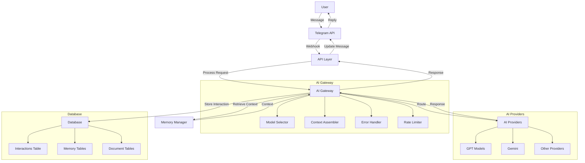

# System Architecture

## Overview

The AI assistant project follows a modular architecture with clear separation of concerns, allowing for independent scaling and maintenance of components. The system handles user interactions through a messaging platform, routes requests to appropriate AI providers, and maintains conversation context.

## Architecture Diagram

## Component Details

### API Layer

- **Responsibilities**:
  - Handle incoming webhook requests from Telegram
  - Validate request authenticity and security
  - Parse user messages and format AI responses
  - Manage request timeouts and error responses

### AI Gateway

- **Responsibilities**:
  - Manage communication with multiple AI providers
  - Select appropriate AI model based on request type
  - Assemble context from previous interactions
  - Handle rate limits and retries with exponential backoff
  - Log interactions and metrics

### Routing Engine

- **Responsibilities**:
  - Determine appropriate AI provider and model for each request
  - Apply routing rules based on message content and context
  - Optimize for performance and cost

### Memory Manager

- **Responsibilities**:
  - Maintain conversation context across interactions
  - Truncate context to manage token limits
  - Store and retrieve user-specific facts and preferences

### Database Layer

- **Responsibilities**:
  - Store all user-AI interactions
  - Maintain conversation context and history
  - Track usage metrics and performance
  - Support analytics and debugging

### Text Extraction

- **Responsibilities**:
  - Extract text from various document types
  - Process extracted text for AI consumption
  - Store extracted content in database

## Data Flow

1. **User Input**: User sends a message through Telegram
2. **Webhook Processing**: API layer receives and validates the request
3. **Context Assembly**: Memory manager retrieves relevant conversation history
4. **Routing**: Determines appropriate AI provider and model
5. **AI Request**: Formatted request sent to selected AI provider
6. **Response Processing**: AI response is processed and formatted
7. **Storage**: Interaction logged to database
8. **User Response**: Formatted response sent back to user via Telegram

## Scalability Considerations

- **Horizontal Scaling**: API layer can be scaled independently to handle increased traffic
- **Provider Isolation**: Failure of one AI provider doesn't affect others
- **Database Optimization**: Indexes and query optimization for performance
- **Context Management**: Efficient context truncation to manage token limits

## Security Features

- **Request Validation**: Ensure requests come from legitimate sources
- **Data Encryption**: Secure transmission of sensitive information
- **Rate Limiting**: Prevent abuse and ensure fair usage
- **Input Sanitization**: Protect against injection attacks

## Monitoring and Logging

- **Interaction Logging**: All user-AI interactions are logged
- **Error Tracking**: Comprehensive error logging for debugging
- **Performance Metrics**: Track response times and throughput
- **Usage Statistics**: Monitor AI provider usage and costs