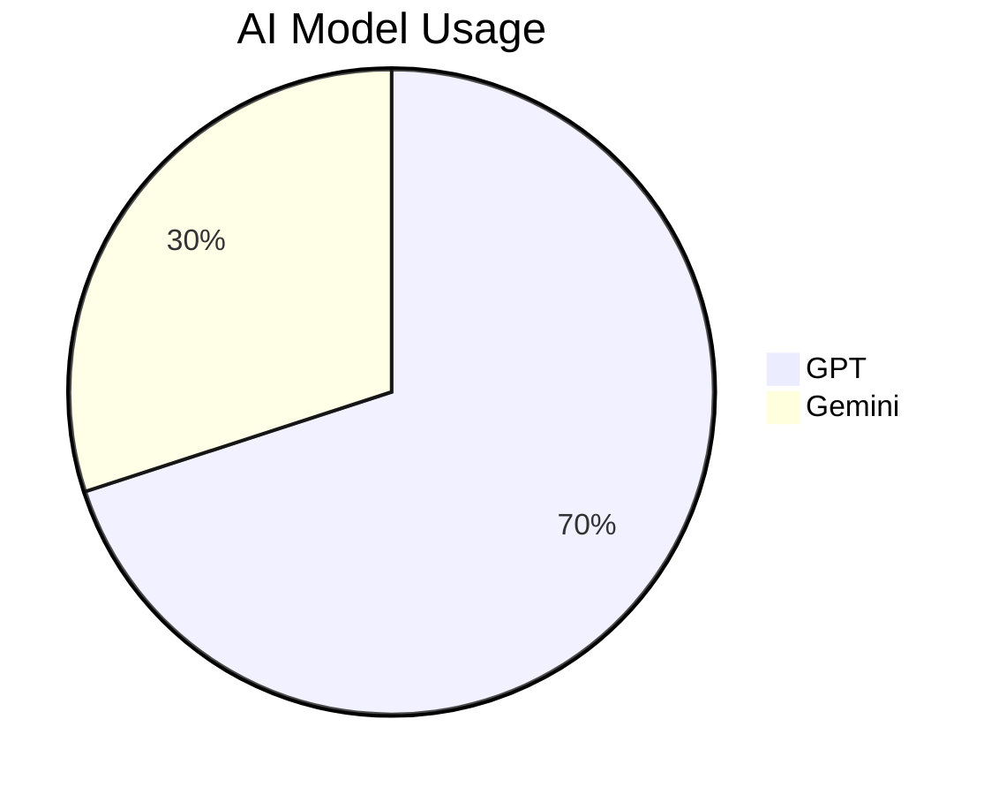

# Database Analysis

## Overview

The project uses PostgreSQL for data storage, with a primary table storing user-AI interaction data. This document provides insights into database design principles, data cleaning processes, and high-level analysis of stored data.

## Database Design Principles

### Core Data Model

The database design follows a normalized structure with clear separation of concerns. The primary interaction table uses a mix of standard data types and flexible JSONB columns to balance structure and adaptability.

#### Key Design Considerations:
- **Unique Identification**: Primary key for each interaction record
- **User Context**: Fields to identify users and their conversation context
- **Message Content**: Storage for both user inputs and AI responses
- **Model Information**: Tracking of which AI models were used
- **Timestamps**: Multiple timestamp fields for auditing and analysis
- **Flexible Data**: JSONB columns for storing variable structure data
- **Environment Separation**: Ability to distinguish between different deployment environments

### Indexing Strategy

The database uses strategic indexing to optimize query performance:
- **BTREE Indexes**: Applied to frequently queried fields for fast lookup
- **JSONB Indexing**: GIN indexes for efficient querying of semi-structured data
- **Composite Indexes**: Combined indexes for common query patterns

## Data Usage Analysis

### Column Usage Patterns

Analysis revealed distinct usage patterns across different data categories:

#### Core Required Fields (Low/No Nulls)
- User identification and conversation context fields
- Message content and AI response storage
- Model selection and timestamp information
- Basic analytics metrics

#### Optional Fields (High Null Percentage)
- Integration-specific identifiers
- Detailed token usage metrics (not consistently available)
- Full provider response data (not consistently stored)
- Advanced analytics and routing information

### Data Distribution

The database contains a significant volume of interaction records with:
- Multiple AI providers being used
- Varied message lengths and complexity
- Rich context information for conversations

## Model Usage Statistics

### AI Model Usage

### Gemini Model Migration

During the project, records were migrated from generic model identifiers to a more specific format to improve data consistency for future analysis.

## Data Cleaning Processes

### Test Data Removal

- **Objective**: Remove test messages from production database
- **Method**: Identified and deleted specific test records based on patterns and content markers
  - Targeted specific test message patterns for removal
  - Cleansed records associated with testing activities

### Contaminated Data Handling

- **Issue**: Some records contained contaminated AI responses with irrelevant content
- **Solution**: Nullified the affected responses while preserving the rest of the interaction data
- **Method**: Used pattern matching to identify contaminated responses and updated them appropriately

### Duplicate Message Analysis

- **Objective**: Identify and analyze duplicate test messages
- **Method**: Used SQL queries to find pattern-based test messages and common test phrases

## Data Integrity Measures

### Constraints

- **Primary Key**: Ensures unique identification of records
- **Not Null Constraints**: Applied to critical fields to prevent incomplete records

### Validation

- Input validation in application code ensures data consistency
- Database-level constraints prevent invalid data entry
- Regular data integrity checks performed during maintenance

## Performance Optimization

### Indexing Strategy

- **BTREE Indexes**: Applied to frequently queried fields for fast lookup
- **JSONB Indexing**: GIN indexes for efficient querying of semi-structured data
- **Composite Indexes**: Combined indexes for common query patterns

### Query Optimization

- Use of prepared statements to reduce query parsing overhead
- Efficient pagination for large result sets
- Selective column retrieval to minimize data transfer

## Future Considerations

### Schema Refinement

- Review and potentially remove unused columns with high null percentages
- Add more specific model information for better analytics
- Consider partitioning large tables for improved performance

### Data Retention Policy

- Implement automated data archiving for older records
- Define retention periods based on data type and usage
- Ensure compliance with data privacy regulations

### Enhanced Metrics

- Improve token count collection for better cost tracking
- Add response time metrics for performance monitoring
- Implement more detailed error tracking for debugging